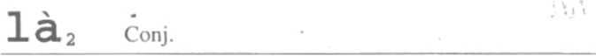
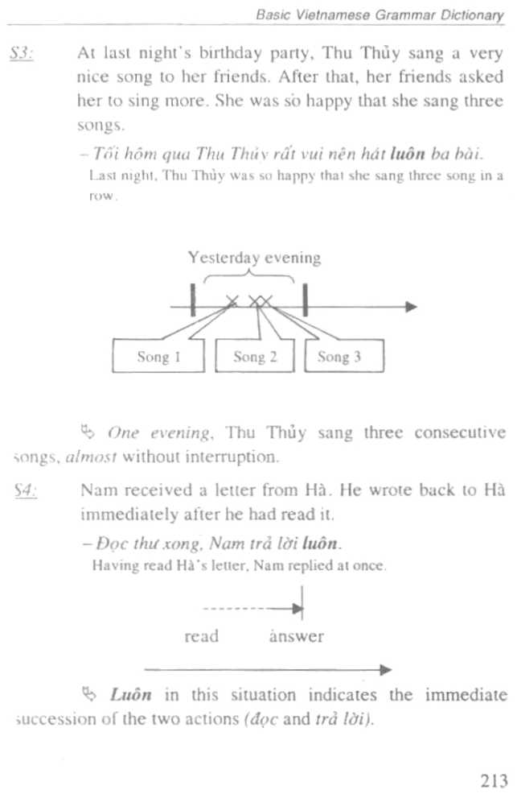
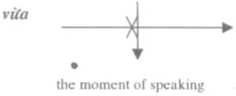
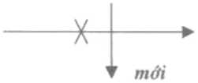
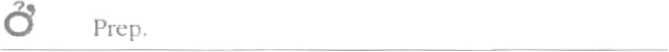

??

---

s 1:     Nam was driving too fast. He was stopped and fined by

the police.

Cf

\[la\] - Cảnh sát phạt Nam. The police fined Nam

\[lb\] -Nam bị cânh sát phạt. Nam was fined by the police.

In \[lb\], Nam is the object that undergoes (he punishment, in \[la\], Nam is the subject receiving punishment from (he police.

S2:     Nam went to work late. The director decided 10 dock

his salary.

Cf:

\[2a\]    - Ông giám dôc giảm lương của Nam. The director docked

Nam's salary.

\[2b\]    --- Nam bị (âng giám đốc) giầm lương. Nam\'s salary

was docked (by the director).

In \[2b\] lương (salary) is the object of the action giảm (to dock), and Nam is the person (hat undergoes this action. In many cases, the person who does the action may go unmentioned if it is not necessary to complete the meaning (See \[lb\] \[2b\]).

S3; Nam has just received his girlfriend s letter. His

classmates read it before he did.

Cf:

\[3a\]    - Bạn cùng lớp đọc thư ciia Nam. Num's classmates read

hts letter.

\[3b\]    --- Nam bi bạn cùng lớp đọc thư. Nam's letter was read by

his classmates

84:     Only one Vietnamese language dictionary is still in the

bookshop. Nam wanted to buy it, but a man took it before he did. He said:

- \[4\] - Tói bị người ta mua sách trước mất rồi.

The hook I wanted til buy had been bought by someone else.

In (he situations \[S3\] and \[S4\], the actions đọc (to read) and mua (to buy) cause unfavorable things for Nam. Thư (letter) is his letter, and sách (book) is a thing in which he is interested. Complementary example:

-  Tôi bị con khóc such dêm nên không ngủ dược.

<!-- -->

- 1 could noi sleep because my baby cned all night long.

  -  Tôi di trễ nèn bi người khác chiêm chồ.

I was laie so my place was occupied by another person.

85:     Nam is running a 40° c temperature.

- \[5\] - Nam bi sõt. Nam has a fever.

S'6. Nam was late to buy a first-class ticket. So he had to gel a second-class one.

- \[6\] -Nam bị ngồi ghê hạng hai. Nam had to go second class.

In the situations \[S5\] and \[S6\], bị is used to express a negative or unfavorable thing that the subject undergoes. In many cases (such as bị bệnh, bị đau, bị chết\...), bị can he omitted without changing the main meaning of the sentence.

BỊ, as a verb, is used to express that the subject undergoes something which is done/caused by the object (as an agent), and which is unfavourable to the subject.

\\>

RELATED EXPRESSIONS

- ♦ Hi belongs to (he verb group of được, bị, phải that expresses receiving or undergoing something favorable or unfavorable.

đượci - p. 139 phải2 - p. 309 mất - p. 243 COMBINATIONS

- •    \... bi + verb + bởi\...: This construction is often used in

press and official written texts. Ex.:

111   - Ông ta bị giết bởi ba kè lạ mật. He was lulled by three

strange men (The information focuses on three strange men.)

\[2\]   - Nó bị trừng phạt bởi nhĩĩng lỗi lầm ciia mình. He is

punished for his mistakes. (The information focuses on his mistakes.)

In Vietnamese language, a sentence with the verb bi must not always be regarded as a passive sentence. Rather, it is a subject-predicate structure sentence that indicates that the subject undergoes something by someone I something else.

• Eor some action verbs (he agent and the receiver are reversed when the verb is accompanied with bv. bị giết / giết, bị đứnh / đánh, bị phạt / phạt\... In this case the

Basic Vietnamese Grammar Dictionary sentence structure is changed, with the agent always placed after bị and before (he verb.

- (3\] -Anh ấy giết con gấu. He killed a bear

- \[4\] -Anh ấy bị con gâu giết. He was killed by a bear.

<!-- -->

- • Some words always preceded by bf, form idiomatic groups, such as: bị đạn, bị tên. bị thương (be wounded)\....

---

c ả \] Adj.

- SI: Tomorrow, Mầm Non school will go to Vũng Tàu,

everybody will go.

-  Ngày mai, cả trường đi Vũng Tàu.

Tomorrow, the whole school will go to Vung Tau.

In this situation, trường is considered as a unit (though it is a group of many parts, like teachers, schoolchildren, office employees). So it can go with the adjective cả.

- S2: Bình was on the street when it suddenly rained. He

was wet from head to toe.

- --- Bình bị ướt cả người. Binh is all wet. (soaked all over / wet to the skin)

\'■b Người here is considered as a unit (the body), so it can be combined with CỎ.

Ca, as an adjective, is placed before unit nouns (such as chiếc, quyển, nước, tỉnh, etc.) to indicate the whole of the unit.

RELATED EXPRESSIONS

- ♦ Cả and tất cả are both used to indicate the whole of a unit/ a group, but they have different nuances.

lất cứ -p. 355

- ♦ cả and toàn

Toàn is also used to indicate all of the parts of a group. Furthermore, toàn means of the same nature, not a mixture of different kinds of things. Toàn and CỎ can be interchanged tn some situations but not all:

Cf:

\[11 Toàn / Cả khu vực nùv bi CÚỊ) diện. There IS no electricity in this whole jrc;i

- \[2\] - Cả / \* Toàn nhà nó bị ngộ dộc thức án. His whole family

got food poisoning.

.                                                       \'■\* toàn p. 377

- ♦ Toàn bộ, toàn the XIC. also used to indicate all of the parts, all of the members of a group; but when they arc combined with nouns, they imply a subtle difference: cả can go only with unit nouns, whereas, toàn bộ can go not only with unit nouns but also with nouns of general meaning, such as cuộc dời (life), quyển sách (hook)\...

- ♦ Toàn thể goes with unit nouns of at least two syllables (usually referring people) such as giáo viên, bác sĩ, dân tộc. Cf:

<!-- -->

- \[3\] - Cả / \* Toàn bộ / \* Toàn thể nha đi vang. The whole

family is out.

(Nhà\' a monosyllabic word, here is considered as one unit) ♦

- \[4) -Cả I Toàn the I Toàn bộ công ty được nghỉ 3 ngày. The whole company has a three-day holiday (Cong ty is understood as one unit or one group.)

- (5\] --- Tôi đã đọc cả / toàn bộ / \*toàn thể quyền sách ây rồi. I

read thai whole book. (Quyển sách is a noun phrase that consists of two syllables, in which quyển is a unit noun)

cà~2~ Par.

- SI: Nam was drunk and hit many people, one of whom

was his elder brother.

-  Nam say rượu, tỉánh cả anh cùa mình.

Nam was drunk and hit many people, even his elder brother.

- 7c\> Normally. Nam respects his elder brother very much; the action đánh (hit) here is not normal, it exceeds the moral limit.

<!-- -->

- S2: Mr. Ba won the lottery. Even though he bought a

house and appliances, he still has enough money to purchase a car.

-  Ông Ra mua nhà. mua dồ dục và mua cả xe hơi.

Mr Ba boughl a house, appliances, and even a car.

The event mua xe hơi (buy a car) exceeds the imagination of the speaker.

Cả, as a particle, is used to express a degree that exceeds a scope or limit.

\[la\] - Họ muôn gặp cả anh và tôi.

They want lo see both you and me

\[lb\] - Họ muốn gặp cả anh cà tôi.

They want to sec both you and me.

\[ 1 c Ị -Họ muôn gặp cả anh lẫn tôi.

They want lo see both you and me.

• cả \... cũng\... ; kể cả \... cũng \...

(Mọi người đều dược đì. Cồn tòi. tòi có dược di không?

Everybody can go. As for me. could I go?)

\[2a\] - Cả anh cũng dược di. You also can go

\[2b\] - Ké cả anh cũng đưực di. Even you / you also can go

các Art.

- SI: There are 15 students in a class. The teacher steps tn

and greets them:

-  Chào các hạn. Các bạn có khỏe không? Hello. How arc you?

In this situation, the female teacher says hello to all 15 students who are present in the class.

- S2: Lâm has just graduated from a university. He went to

apply for a job at all the companies in the town, but he hasn\'t found a job yet.

-  Lâm di khdp các cổng ty ở thành phô dê tìm việc làm.

Lain went to all Ihe companies in the town to appls for a \|ob

Các, as an article, is used to indicate the whole definite group.

RELATED EXPRESSIONS

♦ các và những

Các and những refer to plurality:

- • Những: indefinite article, always followed by a noun with (required) a determinative phrase.

  - • Cức definite article, always followed by a noun with or without (not required) a determinative phrase. Cf:

\[la\] - Các sinh viên đều muốn đi Vũng Tàu. All the students want lo go to Vũng Tàu.

Ị 1b\] --- \*Những sinh vìèn dều muôn di Vũng Tàu.

A modifier must occur in \[lb\], For instance: foreign students, second-year students, good students \...

Cf:

\[2a\] - Các sinh viên này rất thông minh. These students arc very intelligent.

\[2b\] - Những sinh viên học giỏi sẽ được lĩnh học bổng. Good students will receive scholarships.

Các in \[2a\] refers to the definite group of students who are near to both the speaker and the listener.

Những in \[2b\] refers to a group of good students. This group is indefinite (because we don't know exactly who are good students).

\''C những 1 - p. 295 ♦ các và mấy (Mấy is used in spoken language.) \[3a I -Mảy anh dùng gì? (mấy các) Lit.What will you have?

\[3b\] - Anh củ biết mấy sinh viên đó không? (mây \~ những) Đo you know those students?

cal, Cn

- SI: Lan IS talking to Thu about a fncnd tmalc) she has

recently become acquainted with:

 Anh ấy có ba cái nhà. mật cái ở Dà Lạt, một cái ở Vũng Tàu và mật cái ờ Nha Trang. He has got three houses, one in Dalat, one tn Vung Tan and one ill Nha Trang.

In this situation, cái, classifying noun, used after a

number, unitizes the mass noun referring to things. If the prior context defines the mass noun, then in subsequent uses the mass noun following cái can be omitted.

- S2: Hearing that Tâm wants to buy a camera, Hai says:

-Tâi thấy cứa hàng T. đang bán mấy cái máy ảnh rất hiện đại.

I saw a few modern cameras in the T. shop.

Cải usually appears after the quantifiers like mấv,

vài, một số, nửa, etc, or after the articles like một, những, các.

- S3: In the clothes shop, Lan pointed at a shirt and sa'd to

the owner:

\[1J

 Cho em xem cái áo kia đi, chị. Show me that shin, please

\[2\]     - Cái nào? Cái này cô mặc hợp lắm đấy

Which one? This one goes well with yon.

In \[1\] and \[2\], the classifying noun cái is used to unitize the noun phrases defined by the demonstratives like này, kia, or the interrogative nào.

S3:     Lan's mother just came to the door when it started

pouring. She called Lan:

- \[4\] -Lan ơi! Lấy cho mẹ cái áo mưa. Lan! Give me Ihe raincoat.

In this situation, it is not necessary for cái to be used with a number; quantifier or demonstrative like in \[SI\], \[S2\] and \[S3\], The noun phrase cái áo mưa is understood when the listener (Lan) knows which one it is. In other words, the noun phrase cái áo mưa is singular and . defined in the specific context.

- S5: Hoa and Lan are talking about a film which has just

been shown on TV:

- \[5\] - Cái hay của đạo diễn lầ để người xem tự tưởng tượng

ra đoạn kết của bộ phim.

The creative talent of the director was that he gave the viewers the chance to imagine the end of his film.

Cái is used in this situation to nominalize a quality expressed by an adjective.

- S6: Hat and Hùng are talking about their lives. Hải

complains:

- \[6\] - Tôi còn rất vất vzỉ. Phái ỉo cái ãn. cái mặc cho cả gia

dinh. '

\] must still work very hard. I have to take care of food and clothes for my family.

In this situation, cải is used to noininaltze the verb, or in other words, to transform an action into thing. Here, it is understood that cúi ăn, cái mộc, etc is something to eat or something 10 put on (food, clothing, etc.).

-Ì Cái. as a unit noun, is used before a mass noun, unitizes the thing expressed by the mass noun which follows it. Cái is also used to nominalize a verb or an adjective.

RELATED EXPRESSIONS

♦ cái and chiếc, cây. bức. toil. căn. etc.

In many cases. cái can be used in place of the other unit nouns such as chiếc, cây. bức. etc. especially in spoken Vietnamese. Ex.:

- \[ 1 \] ---Anh tôi cho tôi cây/cái blit này. My older brother gave me this pen.

- \|2J   - Blic/cái bán (tồ này chi tiết turn brìc / cái bân (tồ kia.

This map IS more detailed ihan that map

- \[3\]   - Chiếc / cái xe này tôi mua năm ngoái. I bought this

motorbike last year

NOTE: Cai is only used in place of unit nouns referring to things (inanimate), but it is not used in place of con. a unit noun referring to animals (except for very small animals like cái sâu (a worm), cãi kiên (an ant), etc.

On the other hand, cái cannot be used in place of classifying nouns referring to substances like viên gạch (a brick), cục đá (a stone), lờ giấy (a sheet of paper), giọt nước (a drop of water), tâm vài (a piece of cloth), etc.

Cf:

\[4a I - Cục / \*cái xà phòng này giã 6()(XJ dóng. This bar ot soap costs SIX thousand dong.

\[4b\] - Anh chà đến nhà tôi 2000 viên / \*cái gạch. Take 2,000 bricks to my house.

\[4c\] - Anh cỏ giấy không? Cho ĩôi một tó/\*cái Do you have some paper? Give me fine shed.

COMBINATIONS

•    cái + restrictive noun phrase

Cf:

- \[1\] --- Chiều nay tôi đi mua áo đầm. I am going to buy robes this

afternoon.

(We cannot say \... cái áo đầm)

- \[2\] - Tôi mua cái áo đầm â\\ ở tiệm TÍTÍ. I bought that robe at the

TiTi shop.

(We cannot say \... áo dầm ấy\...)

The noun phrase áo đầm in \[1\] is the generic noun phrase (hat serves to indicate that this is not a shirt or áo dài, etc. That is why it does not require (he presence of the classifying noun cái, while the phrase áo đầm ấy in \[2\] is a resưictive noun phrase (hat indicates a defined thing, therefore, it does require the classifying noun cái to precede it.

- • cái thì\... cài thì\...

This construction is used to express a relationship of contrast between a things of the same category. Ex.:

- \[3\] - Sáng nay tôi ầi tìm mua vài cái quần jean, nhưng

chẳng mua được cái nào cá. Cái thì quá rộng, cải thì quá hẹp. This morning 1 looked for some jeans to buy, but I did not gel any. One was too big, the others were coo small.

thì - p. 361

c cl I 2 Em.

SỈ:    Nam asked Hùng to get the mathematics book for him.

Hùng didn't know which one. Nam said:

-  Cải quyển sách à trên hàn ấy. ít is the book on the table.

<!-- -->

- S2:     Hùng and Lan recall the first days when they started

going to the university. Lan exclaims:

-  Mình làm sao quên được cái ngày đầu tiên chúng mình vào đại họe.

How could ĩ forget the very first days when we started going to university^1^

In both of the above situations, cái\' is used freely in front of noun phrases which have a restrictive I determinative attribute that aim to point out, bring up a thing which distinguishes it from the rest / remaining ones.

Sỉ:     Hùng and Lan are talking to each other about a

classmate, Lan praises that person because he studies well and is intelligent. Hùng doesn't agree and says: - Cái thằng ây mà học giỏi gì! Someone like him couldn\'t study well!

- S4: Mr. Hòa has a pet dog. This dog doesn\'t obey him. He

says to his wife:

-  Cái con chó này ngu ìổni. The dog IS so stupid.

In \[S3\] and \[S4\], cái is used in front of the nouns, which refer to people or animals having distinctive attributes in order to express a despising or critical idea.

Cái, as an emphasizer, used in front of nouns which have restrictive / determinative attributes that aim to point out, bring up a thing which distinguishes it from the rest / remaining ones or expresses a despising or critical idea.

V1-\'

RELATED EXPRESSIONS

- ♦ cáiĩ and cáiì

Although it has the same origin as the classifying noun caij , the demonstrative cáỈỊ differs from cái I in that cái, only has an emphatic function. It points out a certain thing but doesn't aim to individualize that thing, as does the classifying noun cái/ and other classifying nouns such as con, quyển, chiếc\...

COMBINATIONS

- •    cái 2 + classifying noun / substantive noun

Cái~2~ can be placed in front of classifying nouns such as con. chiếc, tờ. bức\..., or in front of nouns that indicate materials / substances such as nước (water), sat (iron), đất (earth)\..., or in front of abstract nouns such as V kiến (idea), kết luận (conclusion), chinh sách (policy)\...

CỈ11 Adv.

Si Nam buys a pen for 10.000 VND, not more. He says:

--- Cây bút này giá chỉ 10.ÍXX) đồng. This pen costs only 10,000 VND.

In this situation, chỉ is used to express the meaning the price of the pen is limited to the level of 10,0(X) đồng and such a price is cheap.

S2 Nam says to Lan that he loves only her. not anyone else:

- 11 \]      -Anh chỉ yêu em. I love only you

  - \[2\] -Anh yêu chí một minh em. You arc the only one I love.

In this situation. Nani wants to say that Lan is his unique girlfriend. He does not love anyone else.

Chi. as an adverb, is used to express the limited extent of a thing / characteristic / action.

RELATED EXPRESSIONS

- ♦ Chi is (he most important word among the group of words expressing restriction: chỉ, có thôi, mới\... These words are opposite to the group of những, dến, mãi\... expressing the meaning much / high I far / expensive, etc.

CÓ - p. 77 thôi - p. 369 \* mởii - p. 257

COMBINATIONS

- • chỉ co\...

\[ 1Ị - Lớp này chỉ có 2 sinh viên. There are only two students m this class. \'

- • chỉ\... (có)\... thôi

<!-- -->

- 12\] -Anh ấy chỉ viết có một trang thôi. He wrote only one page.

  - •     chỉ\... mới\...

(31 -Chi tôi mới có thể thuyết phục anh ta. 1 am the only one who can persuade him

chinh Par.

- SI: Nam points at a photo of a man and says lo Hà:

  - --- Đtỉv chính là hô tôi. This is my father, himself.

Chính here is used to emphasize là bố tôi.

- S2: When entering Nam\'s house, Hà saw a very beautiful

picture, he asked: \"Who painted this picture?\"

\[ I a I     - Chinh tôi vẽ hiỉc tranh đó. I painted It myself

\[lb\]     - Hức tranh đó do chính tôi vẽ. The picture was painted by

me, myself.

Chính here is used to define more clearly and emphasize the idea that Nam painted it. not anybody else.

Chính, as a particle, is used to define clearly the noun which follows it.

RELATED EXPRESSIONS

- ♦ chinh, ngay and đúng

Chính, ngay, thing, placed before expressions of lime or place, can be interchangeably used, even if their meanings are slightly different.

Cf:

\[la\] - Trận dành dó xảy ra chính nưi dây.

The battle took place right here, (to emphasize "here\")

\[lb\] - Trợn đánh đo xày ra ngay nơi đây.

The battle took place right here (nowhere eke)

\[ lej - Trận ddnh đó xả\\ ra đúng nơi (lây.

The battle took place here, righi Ln this place (unnmtakunly, exactly/

in \[la\], the speaker wants to define nơi đây (this place), to emphasize the importance of nơi đây (this place), rather than to assert the e,\aci location of nơi dây. If the speaker IS an historian who looks for vestiges of a battle, he would say \[lb\]. C\'f:

\[2a\] - Chính gỉào sư Lãm (ìa mời tồi. Prof. Lâm himself invited me (Prut, liny an import a at person, no one else mvitcd me.)

(2bl - Ngay giáo sư Lâm mơi tai.

\[2c\] -Ngay (cà) giáo sư Lảm cùng mìn tơi. Even Proi. Lãm invned me (Many people, including Prof. Lâm, invited me)

\[2d\] -Đĩíng giáo sư Lâm mời ưìt.

It is (rue that Prof I am invited me, (That \>s the truth.)

^27^ ngơyi - p 273

cho, Prep

SI; Lan lives in Hanoi. Nam writes a letter to ask about her

-Nam viêí ỉhưcho Lan. Nam Willes a Icitci UI Lan

In this situation, Nam is the subject of the action of writing the letter (Nam does the action of writing the letter), meanwhile. Lan is the receiver of the letter.

S2:     Nam wrote Lan a letter. He was busy so he asked Hà

to post it:

--- Nhờ anh gửi thư cho tôi. Could you post the letter for me. (for Nam\'s benefit). (Lit.: Nam asked Hà to help him post the letter.)

Mc\> Tn this situation. Hà is the subject of the action post the letter (Hà gives help to Nam). Nam benefits from this action, and he docs not receive the letter (but Lan).

SJ:     If we exercise everyday, our health will improve.

--- Tập thể dục tòt cho.sức khỏe. Physical exercise IS good for (your) health.

& In this situation, the action tập thể dục (physical exercise) has its effect upon sức khóe (health).

\[ I \]      - Cuốn sách này rất hổ ích cho các sinh viên. This book

is very useful for students.

- \[2\] - Ông Tân làm giám đốc thì thật là không may cho

còng ty chúng ta.

Il will be bad for our company if Mr. Tân becomes the director.

- S4: Tâm is going to the United States to study. His mother

advises Tâm:

-  Con phả i cố gắng học cho tốt nhé ĩ You will do your best at school, nght?

fLit. You must try to study well, right?)

\^t\> In this situation, the state tốt (good) is the purpose, the degree or the requirement that the action học (to study) has to meet. Complementary example:

- \[3\] - Học cho xong bài này mới nghỉ. Finish this lesson first,

then rest!

- \[4\] --- Anh tỏi dạy tiếng Anh cho tôi. My elder brother ÍS teaching

English to me.

- \[5\] -Ăn di cho nóng. Eat It while II IS hot

"---. .. .. .           Ì

Cho, as a preposition, is used to indicate the object that receives the effects \[S1 \] or benefits from an action \[S2J. Also, cho indicates the object that undergoes the effects from an action I S31 or it indicates the purpose, the degree or the requirement that an action has to meet IS4\].

RELATED EXPRESIONS

- ♦ cho and đến: In \[SI\], the preposition cho can be replaced with đến However, den expresses the target / direction of the action but not Ils object. Cf:

\[la\] -Anh ấy gửi tiền cho tôi vào ngày 15. He sends money lo me on the 15\*.

\[1b\] ---Anh ấy gửi tiền đến tỏi vào ngày 15. He sends money to me on the 15\*.

- ♦ cho and giùm / giúp I hộ: Cho when followed by a beneficiary, can be replaced by giúp/giùm /hộ.

\[2a\] - Anh ây sửa xe hơi cho tôi. He repaired the car for me.

\[2b\] - Anh ây sủa xe hơi giúp /giùm / hộ lôi. He repaired the car for me.

NOTE: When following some verbs (such as trao. gửi, giao, dưa, mang, mua, bán), cho can introduce a recipient (a receiver) (S1Ị or a beneficiary \[S2\]. However, when cho comes after many others (giữ, lau, đánh. dập. nấu\...) the object usually receives a benefit / disadvantages from the action of the agent \[S3\], Cf:

13\]   --- Anh ắy mang áo mưa chõ tôi. (He brought his raincoat to me

so that I could wear it.)

\[4\]   --- Anh giữ xe cho tôi nhé! Watch my bike, OK? (the fact that W)U

w tilth my hike IS helpful to me)

In \[3\], tôi (I) can be understood as the recipient (the receiver) of something or the beneficiary. Sentence \[4\], tôi (I) can only be understood as the beneficiary.

COMBINATIONS

• cho / làm cho ỉ khiến cho + X can be used to express a result. X is a proposition that indicates a result that happened due to what has just been mentioned. Ex.:

\[1\]   --- Nd (in Ở thê cho người ta ghét. His conduct fills everybody

with hate.

{2\] -Nó lười học làm cho bô mẹ buồn.

His laziness in schoolwork fills his parents with sadness.

- \[3\] -Nó cười đùa to tiếng khiên cho mọi người khó chịu.

His boisterous laughing makes everybody uncomfortable.

- • cho nên nên

<!-- -->

- \[4\] - Hà làm việc chăm chí cho nên dược khen. Hà worked

hard, therefore she won praise.

- • cho được I cho bằng được: These clusters are used to indicate a requirement of something that must produce a good result, must be successful, especially to show high determination / effort.

\[5J - Phải gặp cho dược anh ấy tòi mới yên tâm. I will feel assured only if I meet him.

\[61   - Cô ây đã thích Ciiì gì là cô ày mua cho bằng được.

She likes it so much she will buy 1! at any cost.

- • cho rồi I cho xong / cho qua: These clusters express a reluctant attitude of acceptance of an action or state just

Basic Vietnamese Grammar Didio nary mentioned in order ÌO avoid a difficult or worse situation. The speaker doesn\'t need to know what real result will happen (or not happen).

- \[7\] ---Nêu biếtphim dở the này thì tôi ở nhà cho xong.

If 1 had known the film was so boring, I would have stayed home.

- \[8\] -Anh nên đi cho rồi, (đừng đợi anh ấy nữa!)

You should go right away (now)! (Don't wail for him any more) \[91   - (Đứa bé hỏi mẹ nó gì dó) Vi đang bận nên ba trả lờỉ

cho qua

(The child asked his mother something). Because she was busy, she answered with I ndj it ere nee Ì humedly (She did not care much how she answered)

cho~2~ Par.

SỈ:    Nam and Binh have been drinking coffee. Nam wants

to pay the bill (for both of them). He said:

- --- Đê tôi trà tiền chơ. Let me pay the bill!

In this situation, Nam used cho to suggest that he will pay the bill and hopes that Binh will agree with him, 82:      It is time to pay the house rent, but Ha is still waiting

for her salary. Hà entreated her hostess:

- --- Tôi chưa có íương. Xin chị thông cảm cho.

! haven't received my salary yet. I beg your pardon.

In this situation, Hà hoped that the hostess would sympathize with her. So she used cho.

- S3: When seeing Lan with a very short skin, her mother

said:

- --- Con mặc như thê người ta cười cho (ỉấyĩ If you wear thai, you will be laugh at

Ln this situation, Lan\'s mother wanted to warn Lan (the listener) that a bad thing could happen to her.

- S4: Nam drives too fast. I Là says:

  - --- Di chậm chậm thôi, cảnh sát phạt cho đây. Dnve slowly or you will be fined.

Ln this situation, Hà warns Nam of a bad thing that may happen: he fined by the police.

Ộ Cho. as a particle, is used to suggest or to express hope that the speaker wants to do something himself instead of the listener doing it I s 1J. Il is also used to indicate an unfavorable consequence, caused by the listener himself, that may happen to him \[S3\], \[S4\], \\/

COMBINATIONS

• không X cho lắm (This construction is used to lighten a negative evaluation expressed by X.)

Cf:

\[la\] - Phim này không hay. This film is not exciting.

ị lb\] - Phim này không hay cho lắm This film IS not so exciting (This negative IS lighter than in I lap

NOTES;

- • Ch02 is used in spoken language.

- • Cho as used in \[S3\], \[S4\] usually occurs after only some verbs like: mung I chưởi / đánh I độp I giết / cười \... + cho.

chứ1 Conj.

.9/. Nam lost a shirt. Hà asked him: "You lost your yellow shirt, right?''. Nam replied:

- --- Không, cái áo đó màu trũng chứ không phiu màu vàng.

No, that shirt is white, not yellow.

In this situation, Nam asserted that it was cái áo màu trắng (the white shirt) he had lost and, at the same time, he rejected cái áo màu vàng (the yellow one}.

- S2:     Nam thought that Paul was from France, then asked:

\"Where is your home town, Paris or Lyon?" Paul answered:    .

- --- Tôi là người Anh chứ không phải người Pháp đâuỉ I am English, not French.

In this situation, Paul knows that Nam thinks that he is French. Paul used chứ to assert that he is English, and at the same time to refute that he is French.

Í-z-'-

Chứ, as a conjunction, is used to confirm something which has just been said, and at the same time, to reject the contrary idea. (That idea may be stated explicitly, or implicitly.).

RELATED EXPRESSIONS

♦ chứ and mà

Cf:

- 11 a\] - Tôi học tiếng Hoa chứ không học tiếng Thái.

I study Chinese language, not Thai language.

\[lb\] - Tôi học tiêng Hoa mà không học tiêng Thái.

- 1 study Chinese language, and not That language.

CT:

\[2a\] - Chiều hôm qua tôi ở nhà chứ không đi chơi.

I stayed al home yesterday afternoon, not go out.

\[2b\] - Chiều hôm qua tôi ở nhà mà không đi chơi.

I stayed at home yesterday afternoon and did not go out

The sentences \[lb\] and \[2b\] are used to explain, to justify, or to bring out a matter. That is why:

- • \[lb\] may be continued with\... because Chinese is easier /is widely spoken. And

- • \[2b\] can be continued with: \.... it is because that I had a bad headache.

mài - p. 229

COMBINATIONS

- • In conversations, a pronoun can occur after chứ: chứ (+ noun +) gì, chứ gì, chứ ai, chứ sao, chứ làm sao, chứ mấy, chứ

Basic Vietnamese Grammar Dictionary

- • đâu\... to assert that: that is certain, and that it must not be otherwise.

(1 \] A: - Cái áo dó màu gì ? What color IS that shirt?

- B: - Cái áo dó màu trắng chứ màu gì! That shirt IS white.

(» For sure the shin is white.)

- \[2\] A: - Người tư làm gì mà đông thế? What happened to cause this crowd?

B: - Dụng xe chứ gì! A traffic accident, of course!

- \[3\] A: --- Ong Nam lên làm giám đốc à ? Ml. Nam was promoted to be the director?

<!-- -->

- B: --- Ong la chứ ai\' Him. Who else? (Lit Him and nobody else\')

<!-- -->

- (4\] A: - Nó giỏi tiêng Pháp thụt! He speaks French really well!

  - B: - Chứ sao\'. Nó sông ở Pháp ba năm thì phải giỏi chứ sao\' Of course! He lived in France 3 years, so he must be good!

- \[5\] A: --- Anh còn nhớ cô Lan không? Do you Mill remember Ms. Lan .'

<!-- -->

- B: - Tôi vần nhỡ chứ làm sao quên dược! I still remember (her). How can 1 forget\' (a For certain 1 remember.)

<!-- -->

- 16\] A: - Cái áo này bao nhiêu? How much IS this shin?

  - B: - Mười ngàn chứ mấy! Only 10.000 dong\' (» only 10,000 dong, not more)

(71 A: - Anh tìm thấy ông ta ờ dâu thê ? Where did you find him?

B: - Tôi tìm ở quán bia chứ dâu! I found him at a bar ! (nowhere else)

When combined with nữa the above-mentioned combinations will retain (heir same meanings.

•     \... chứ sao lại \...?

\[8\] -Anh phái cô gắng nhiều hơn chứ sao lại chớn nan như thế? Why are you so disappointed / upset? You must try harder ( Advice for a disappointed person to lake action and do something about his situation I

- • \... chứ không phải\...

\[9a\] - Anh tel làm việc đó chứ không phủi tòi.

He did that Work, noi me. (rejection of an idea.)

\[9b\] - Anh ta chit không phải tôi làm việc (ló.

He. not me. did that work

- • \... chứ còn gì nữa!

\[ 10\] - (Chúng tòi về dược chưa?) - Hét giờ thì về chứ còn gì nữa! (May we go home now?) It goes without saying, the time IS over, sojusl go home!

•    \... chứ không \...

11 11 - Tôi hièt tiêng Anh chứ không biết tiêng Pháp.

I know- English, nol French

•     \... chứ không (\...) thì\... » nếu không (\...) thì\...

- \[12\] - Nhanh lên, chứ khủng thì trề dày!

Hurry up. otherwise you will he lute!

- • thà (A) chứ không (B).

<!-- -->

- \[13\] - Tôi thà ở nhà mật mình chứ không di chơi vài anh ta.

I will stay at home alone rather than go out w ith him

(l'd rather stay home alone than go out with him.)

- • \... chứ thật ra \...

Chứ in some situations can combine or can be replaced with thật ra. Cf:

\[ 141 - Ông ây ra về nghiêm khắc chứ / chứ thật ra / thật ra ông ây rất thương nó.

He makes believe that he IS strict But in fact, he is very fond of his son. (This expresses countrast )

In this situation, chit / chứ thật ra express the reality of what is really true, despite the fact that it seems contrast to what was mentioned before, or seems opposite to what everybody usually thinks.

chứ~2~ Par

- SI: Nam and Bình havenÌ met for a long time. Nam asks

Bình about things:

-Anh vân khóc chứ? Còng việc lốt chứ \' Cìtu (lình rm; ớ lỉõ chứ?

Y\<i\|i arc Mill line, right? The Work IS good. right \* Your house is still Ihere. right •

\'b hl this situation. Nam thinks that Bình IS line, that his work IS OK. and his family is still al the same place. In order to verity what Nam thinks, he used questions with chứ S2:     This morning Hoa looked (ired when she came to the

office. Lan asked anxiously:

-  Em khóe chứ? Em không bị bệnh chứ? Are you SUIC you are alright? You aren\'t sick, arc you?

In this situation. Lan wants to hear from Hoa that she is vần khỏe (still fine), that she is không bị bệnh (not sick). NOTE: This use of chứ in a question must not be used with superiors who are older or in higher social position (with superiors we must use chứ ạ).

- S3: Btnh borrowed a book from Nam for a long lime. Nam

asked:

-Anh cớ nhớanh còn mượn lôi một cuốn sách không?

Do you remember that you arc still borrowing my book '

-  Nhó chứ\\ Tôi sè trả khi nào tôi đoc xong Đừng lo! Of course I remember' 1 will return it when I am finished with n. Don\'t worry!

In this situation, chứ is used to emphasize what has just been affirmed.

- S4: Hà and Nam are speaking negatively about the

director. When seeing him approaching. Hà says:

--- Nói khẽ chứ! Will you lower your voice / lone down?

- S5: Entering a clock shop, Nam asked Hà:

  -  Dồng hồ Seiko cùa Thay Sĩ tối Iđm. phủi không?

The Seiko watch from Switzerland IS very good, isn\'t it?

-  Dồng hồ Seiko là của Nhật chứ!

Seiko IS a Japanese watch\'

\'b In this situation, chứ is used to assert that Hà is right, and, at the same lime, to reject the wrong sentence from Nam.

Chứ, as a sentence final particle, is used when the speaker wants to confirm his thought, or wish that something will happen. \[SI.S2\], to lay stress on what has just been asserted \[S3\], to require, to remind something \[S4\|, or to reject, to object to something \[S5\].

RELATED EXPRESSIONS ♦ chứ and mà Cf:

\[la\] - Cây bút này cíia anh Nam chứ?

This pen belongs to Nam (doesn\'t It?) (assertion / question) \[lb\] - Cày bút này của anh Nam chứ!

(No.) This pen surely belongs to Nam! (reject what was spoken before)

\[ 1c I --- Cây blit này cứa anh Nam mà!

(No.) This pen surely belongs to Nani! (an explanation)

Cl:

\[2a\] - Cô av là người M\\ chứ? She IS an American (isn\'t she?)

I assertion / question) \[2b I - Cứ ây lư nu ười Mỹ ch li\"

I No. I She IS an American! (rejection of what was spoken before) \[2cI -Cfi dr lư người Mỹ mà!

(No.) She IS an American! (an explanation)

The sentences \[ la\] and \[2a\] have (he meaning of asking a question in order to confirm that what the speaker thinks is correct.

The sentences \[lb\] and \[2b\] express rejection of what was spoken before.

And the sentences \[lc\] and \[2c\] have the meaning of explaining / justifying something or persuading someone.

■^r^\' mà (I - p. 241

COMBINATIONS

- • \... đi chứ!

ị 11   --- Nói đi chứ: Speak! (Speak up!)

- • \... được chứ?

Ị2\]   --- Tôi làm như thè được chứ? Can I do It thai way?

- • \...chứ Ợ?

\[3\]   - Ông khòe chứ ạ ?

(Sir!) Arc you well? (when speaking with a suịXírior)

CO

Par

- SI: Nam bought a pen lor 10.000 VND. and thought It was

cheap He said

-  Ciix hilt mix KĨU có 10.(mH) tlồiiỊị. Tills pen cost only 111.000 VM)

\'■b In (his situation, the price of the pen is lined at lO.tXX) VNI). Not much.

f\'                                                    ^11 1^                                                             \...\..... ■ ■                                               ^1^                                                                \'

CÓ. as a particle, is used to express a small quantity

or low cost of something (according to the speaker).

RELA i l l) EXPRESSIONS

- ♦ co as a particle with CÓ as a verb

Cl

I la I I t'i nập õ/n,\' ũ \\ co một \\ iti lũn. I mcl turn only several limes I \|h\| - Till có Ịỉiip ơnh ũ\\ một vùi Ilin. I did meet him several times

In 11.11. co. as a particle, expi esses a fixed level (limited), while. CÓ. as a verb, in I lb\| expresses the existence of an action or slate.

- ♦ co and chi

Chi can be used to express a limited field and in many cases it can be interchanged with CÓ. Cf:

\[2aI - Nti ủn chi một bứt erfm. He ale only one howl of nee.

I no morel

12b\| - Nii ỠII có một bút Cirnt. He .lie only one howl of nee (not

much, according to the speaker I.

Nil chi ci fl erfm. He only cals lice, (not anvihing else)

12e\] ---Chỉ / \*cớ nó ủn cơm. Only he eats nee (nobody else) (31   - Suốt ngáy nó chỉ I \*CÓ học. All day long he only studies.

chi - p 45 ^\#^ thâi - p. 369

COMBINATIONS

• chi\... CÓ \... (thôi)

I lit\] --- Anh til chì biết có công viịc. He IS interested only in his work (nothing else)

- 1 lb\| -Anh tu chi biết có công việc thôi. He IS interested only in his work (nothing else)

- 12 \]   - Suốt ngày nó chi có di học. All day long he only studies.

(He does only one thing)

• co\... thôi

131   - Tét tôi dược nghỉ có bu ngày thôi. 1 have only three days oft

for Tet holiday, (not many days).

- • CÓ \... chứ mây.\' ì chứ bao nhiêu

\[4\|   --- lỉài kiếm tru toán, lôi dược có ndm diem chứ mây!

- I got only 5 points on the math test, not inorc. (not many, low score)

<!-- -->

- \[5\] - Mỗi thững, tôi kiếm dược có vai trdm chứ bao nhiêu!

  - 1 cam only 200,000 dóng monthly, not more (not much, low salary)

con Cn.

Sì:    Hà and Nam were talking about animals. Hà said to

Nam:

 Tôi rất thích chó. Nhà tôi có nuôi ba con chó.

1 like dogs very much. My family has three dogs.

As Hà said so. Nam said:

--- Tôi dang muốn mua mấy con để giữ rẫy cà phê.

- 1 want lo buy some (dogs) thai will watch over my coffee farm Similar to other classifying nouns (cái, chiếc, bức\...), con is used after cardinal numbers (một, hai, ba. bon\....) or quantifiers ( mấy. vài, cd,\...) in order to unitize the mass nouns that refer to animate things mentioned later.

<!-- -->

- S2: Nam and Hà went to the zoo. They were watching the

monkeys eating fruit. Hà pointed at a monkey and said to Nam:

-  Con khỉ đang ỉín trái chuôi ờ (lằng kia trông dề thií(fng quá. Mình thích con khỉ dó The monkey over there that IS eating bananas looks very cute I like that monkey. .

In (S2Ị. con occurs before the mass noun (which indicates an animal) defined by a distinctive modifier dang ăn chuối (eating bananas) or a demonstrative word (này, kia, dó\...)

- S3: Hoa and her mother are silling in the house. Suddenly.

Hoa\'s mother hears the dog barking, she says to Hoa: - Con ra ngoài xem sao mà con chó sủa dữ thê.

Hoa, go out to see why the dog is barking so much

In this situation, con appears before the noun chó without the corresponding conditions mentioned in the situations \[SI\] and \[S2\] because, in this context. Hoa knows which dog her mother refers to, that is to say, the noun phrase con chõ (the dog) is defined by the communicative context.

\' ■

Con. as a classifying noun, placed before a noun indicating animals, refers to each individual member of that group of animals.

.-----

R E L A TE I) E X p R ESS IONS

- ♦ Classifying noun coil and other words with the same origin. Ct:

<!-- -->

- 111   - Tôi cỏ hili con: một gúĩ, một trui. Năm Iitiy con chị lo

tuôi còn thằng em 6 tuồi. 1 have t\V(\' children \>inc daughlci and one son This year, the older sister IS ten years old and her brother IS SIX years old.

hl the example above, the first con is understood as child in relation to his / her parents whereas the second con is a noun, which refers to the female gender irrespective of the attitude of the speaker. (Similarly, thằng refers to male gender irrespective of the attitude of the speaker.)

\[21   - Nhú tôi có hưi con chó con My family has two puppies

In this example, the first con is a classifying noun, and the second con is a common noun, it refers to an animal which was born directly by another animal.

♦ con and cái

Con and cái are classifying nouns; con refers to each individual member of a group of animals But cái refers to each individual member of a group of inanimate things.

•                    cáii-p. 35

COMBINATIONS

• cái + con

To indicate clearly and to show (at the same time) the idea of not being pleased with the animal mentioned before, the speaker can use the demonstrative cái in front of the classifying noun con. Ex.:

\[ 1 \]  - Cải con chó nhà anh đã cán con mèo của tôi. Your dog

has bitten my cat.

cảiĩ---p. 43 • con + mắt /tim /đường \...

The classifying noun con also refers to an individual unit of some inanimate things, which arc seen as animals because their activity or forms are similar to those of animals. For example: con miit (an eye) con tint (a heart), con tàu (a ship), con đường (a road, a way), con sóng (a river), con thuyền (a boat), con tàu (a ship / train) etc.-Ex.:

\[2\] - Con sông này bát nguồn từ đáu vậy? Where does this over originate?

\[31  - Tôi hị đau mắt. Con mắt phải của tôi sưng húp lên.

I have sore eyes My right eye is swollen

còrìt V

- SI: After the war. among Binh's friends, some live in

Hanoi, some in Hue, and some are dead. He says:

-  Sau chiến tranh, bạn tôi kỉ còn người mất. After the war, of al) my friends, some are still alive, others have died.

<!-- -->

- S2: After receiving his salary. Nam went to drink beer with

his friend. Back home, he says to his wife:

-  Xin lỗi. anh chỉ còn 100.000 đổng! I apologize. I have only 100,000 VND left.

Còn. as a verb, expresses a stale or action still in process \[SI\] or expresses a continuous state in which something is not yet finished IS21.

■/

RELATED EXPRESSIONS

- ♦ CÓ is a verb that generally indicates the existence of a Slate or action, \'rhe difference between co and còn is that co does not imply continuation of a previous sale or action.

- ♦ Còn is the opposite of hết (as a verb). Còn hết is the diminutive / shortened form of the construction còn hay hết. - Tiền còn hết? Is any money left, or IS II all gone?

- ♦ Also, nữa indicates the continuation of a state or action, but it is as an adverb placed after a verb

COMBINATIONS

- • \... còn hết? (còn hay hết)

\|1\]   - lìáo Tuổi Trể hôm nay còn hết? Arc any of today's \"Tuổi

Trẻ" newspapers left?

- • \... còn lại \...

<!-- -->

- \[2\] - Con cái đà đì làm xa. nhà chi còn lợi hai vợ chồng

già. All the children arc away at work, only this old couple remains at home.

- • còn nữa \...

<!-- -->

- \[3\] -Anh tư gửi cái này cho chị. Còn nữa. anh ta nói sẽ gọi diện cho chị. He gives you this. Another thing, he says that he will call you.

- (4\] - Tôi không còn tiền nữa. 1 have not had money any more

• ngoài (\...) ra, còn \...

\[51 -Ngoài số tiền nùy ra. nõ còn một sô vàng rất lớn.

Besides this amount of money, he also has a great deal of gold

r ngoài --- p. 283

con2 Adv.

- SI: Nam made an appointment with Lâm at 9 a.m. at his

home. When Lâm arrived, Nam was sleeping.

-  Khi Lâm đến, Nam còn ngủ.

When Lâm arrived. Nam was still asleep

9g Lám arrived

I ►

-►

Nam was asleep

- S2: Nam tells Hà that Mrs. Mai is 50 years old. but Hà

thinks that she looks as young as a 30-year-old woman. Hà says:

-  Hit Mai trông còn trè. Mrs. Mai still looks young

moment of comparison

young

old

- S3: Mrs. Mai has just opened a \"phở\" restaurant. After one

month, there weren't many customers. She said hopefully:

-  Khách còn ít. có lẽ vỉ người til chưa biết. Khàng sao! There arc as yet very few customers. Maybe people don\'t know about It yet II doesn't matter\'

Còn, as an adverb, placed before a verb/adjective expresses continuation of an action, a stale or a quality (that is not finished vet. or does not come up-to-standard or does not meet the requirements.)

RELATED EXPRESSIONS

♦ còn. vẫn and CIÌ

Cf:

I I a I - Dã 12 giờ (lent, anh úý còn thức. It's already midnight He IS still awake

\[lb\] - Dã 12 gib liêm, anh ày van thức. It's already midnight. He is still awake

I lc\| - Dã 12 giờ (ỉêm, anh ày cứ thức, it's already midnight He IS still awake.

All three of these sentences express continuation of the slate awake (thức), but they imply different meanings:

\[la\] denotes only that he did not go to bed yet, that the state thức (awake) is in process, and will end.

In \[lb\], the stale thức (awake) continues although it is already late (he should have gone to bed)

In \[1c\], the state thức (awake) continues, and he is still awake without, for example, taking his doctor's advice.

vẫn - p.397

cử - p. 103

COMBINATIONS

- • còn \... (thêm)\... (nữa) (thêm and nữa usually go together, hut not necessarily.)

\[ 11 --- (Anh chưa di à?) --- Chưa, tôi còn ở đây thêm ba ngày nữa

(Didn't you go yet?} - Not yet. I am still here for three more days.

- • ngoài\... còn \... I ngoài ra. còn \...

\[2aJ -Ngoài uống bia, nó còn uống rượu (nữa). Besides beer, he also drinks alcohol

\[2bl - Nó Uống bia rất nhiều. Ngoài ra. nó còn uống rượu

(nữa).

He drinks too much beer. Besides that, he also drinks alcohol.

CÒIÌ3 Conj.

- SI: There are three people in Van's family. Her father is a

doctor, her mother is a housewife.

-BốVân là hác sĩ. còn mẹ Vân là nội trợ.

Van's father is a doctor, and Van\'s mother is a housewife.

- 52: On Sunday. Lan's family went out, but she had to slay

at home to prepare for her examination.

-Cà nhà di chtrì còn Lan thì phải ở nhà học thi.

AU of Lan's family went out. but as lor Lan, she had to slay at home to prepare for her examination.

Còn, as a conjunction, indicates that after còn is a different situation opposite to (or different from) what has just been said before.

RELATED EXPRESSIONS

♦ còn, vũ

Cf:

\[ 11   - Tôi học ỉiếtlịỉ /v.v« và / \*cồn liêng Hoa. I study Russian and

Chinese

121   - Cảnì lỉn anh. tâi khiỉe. Còn / \*V\'« anh? Thank you. I am

line, anti you?

\[3\] -Nghỉ hè. tôi di Dà Lạt còn ỉ ? và vợ tôi đi Nha Trang. For Slimmer vacation. í go lo Dalal, but my wife goes to Nhatrang. Và is used to link IWO things or objects of (he same nature. Còn is used to indicate a different situation in contrast lo the previous situation. Thus, còn and Vd are not interchangeable. However, in the following situation còn and và are interchanged, and the meaning, subsequently. IS also changed.

ị 4a) - Tôi học ỡ Dại học Kinh tê và vợ lòi học ờ Dại học Mỹ thuật. Nhưng chúng tói quen nhau ớ hồ bơi. I studied at the Economics College, and my wife al (he line Arts College Bill we met al a swimming pool.

\|4b\] - Tôi hoc ử Đại học Kinh tê còn vợ tói học ờ Đai học Mỹ thuật. Chúng lôi quen nhau ở hồ bơi. 1 studied ill Ihc Economics. College. As foi my wife, she studied al the Fine Arts College. But we met al a swimming poo!

In (4a). the speaker answers »\<J because he wanted lo tell about his wife and himself, without implying any contrast. However, in spoken Vietnamese, this is not a common expression ♦ còn and nhưng

Cf:

\[5\]   - Trời mưa. nhưng / \*còn nó di chơi. ít rains bui he goes out

anyway

\[6 J - Tôi bảo nó ở nhò học bài, nhưng / \*còn nó đi chơi. 1 asked him lo stay al home to study, but he still went out

\[7\] ---Đồng hồ này. kiểu (king đẹp, còn /nhưngchát lượng thì tệ lãm. The model of this watch IS beautiful, but Its quality is bad In 151, \|6\], nhưng indicates an action that does not conform to the situation, or is contrary to what should have happened \[6\], It is not replaceable by còn.

In 17\], nhưng expresses a contrary idea to what was mentioned before. In this situation, nhưng may be replaced by còn. but the meaning is a little changed.

COMBINATIONS

• không chỉ\... mà còn \...

\[ 11   - Tòi không chỉ biết nõ mà còn biết cả gia dinh nó nữa.

I not only know him bill also his family as well.

• không những \... mà còn \...

\[2\] - Không những ông ta mời tôi mà còn mời ba người khác nữa. He not only invites me but three other friends as well.

• thà (A) còn hơn (B) (Both A and B are bad. but we accept A which is considered belter than B)

\[3J  - Thà tôi sông dộc thân còn hơn lây anh ta.(or Tha sông

dộc thân còn hơn.) I would rather remain single than get married to him. (Il IS belter to be single than. )

Cũng Adv.

- SI: Nam confides to a friend:

  -  Mẹ tôi nói, năm nay, tôi phải lập gia dinh. Tôi yêu Lan, anh biết rồi. Nhưng tôi cũng yêu Xuân. Thật tình, hiện giờ, tòi không biết phải làm sao? My mom said that this year 1 have to gel mamed. As you know. I love Lan. But I also love Xuân. Truthfully, now, I don't know what to do?

In this situation, there is the same action of a subject towards two different objects.

- S2: At a party, Nam saw Bình, his friend, preparing to

home go. Nam said to Bình:

-Anh di về. tôi cũng di về. If you\'re going. I\'ll go too

'b In this situation, there is a similarity between an activity of the subject compared with the activity of another subject.

- S3: Bình confides to a friend:

  -  Tôi chỉ muốn mua hùng cùa cô Lan thôi. Hán mắc tói cũng mua.

  - 1 only want lo buy goods from Miss Lan Even if they are expensive. I\'ll still buy them

In this situation, the condition, which is brought up, isn't typical (selling at a high price), but every thing still occurs normally.

- S4: Thu and I .an talk to each other about little Hùng:

  -  Chị nói là nó không hề giông ba ná à? Tôi thây nó cũng giống dây chứ.\'

Did you say that he doesn\'t resemble Ins father at all? 1 think he IS quite like him!

\$c\> In this situation, Thu thinks that little Hùng rather resembles his father.

55; Lan is going to get married. She confides to a friend:

-  Sắp lập gia dinh, mình tháy vui nhưng cũng thủy buồn.

Being about to get married. 1 feel happy but also sad

In this situation, the Slate of happy and sad feelings of Lan occurs al ihe same lune.

Cũng, as a adverb, indicates an action of a subject oriented towards many different objects that are identical \[SI\]; indicates the similarity of an activity, state, property\... of a subject compared with another subject \[S2\|; indicates a normal action, even though the situation is not norAtal \[S3\]; cũng also indicates the relative properties of a state / activity I ability \[S4J or indicates the properties of different slates/ activities which occur at die same time \[S5\].

COMBINATIONS

- • cũng vậy

Used to talk about thp similarity in comparison with something which had been mentioned or known before. Ex.: \[I\]   - Cấc hạn tôi. ơi nỡy đều thich hiơ. Tôi cũng vậy. All m\>

friends like beer So do I

- • cũng dược

Used to express relative agreement. (It is not the first preference, but It is OK. I Ex.

-  Hôm nay ch Dà Lạt lờ tốt nhát nhưng tới không thê thu xếp cõng việc dược. Ngủy mai chúng ta di nhé! It's best to go to Đà Lal today bul I can\'t arrange my work . We'll go tomorrow, right!

<!-- -->

- \[2\]   --- Ư. ngày mui cũng dược Yes. tomorrow IS also all nghi.

• cũng như\... / cũng \... như \...

Used to talk about the similarity of something when comparing it with another thing. Ex.:

- \[3I --- Cô em dề thương cũng như cỏ chị. The younger Sister is as lovely as the older sister is. .

- \[41   - CỜ cm cnng dễ thương như cỏ chị. The younger sister IS

lovely, as is the older sister.

• Cling nên

Used to express a guess about something which could possibly happen.

Ex.:

- \[5\] - Sồng ờ vùng cao không quen, máy ngày nay, anh ây bị

  - bệnh rồi cũng nên. Not getting used \<0 living in the highlands. I\'m afraid he might probably have fallen sick now

CÚ' Adv.

st:     Lan always goes to bed al 9 o\'clock, whether in

summer or winter, w hether she is ụred or fine.

-  cư V giờ lối cô âv di nglì. She goes lo bed at 9 o\'clock, as a rule (Lit Always al 9 o\'clock, she goes to bed )

In this situation, 9 o'clock IS always the definite point of time at which I.an goes to bed. and she docs not change under any circumstance

- S2: Nam and Ha ride to Vung Tail by bicycle leaving at 6

  - a.m. They intend to arrive in Vung Tau at 6 p.m. But after 2 hours, they had already gone 40 kilometers (a speed of 20 km/h). Nam says:

  - -Cứ tốc dộ nùy, 12 giờ trưa chúng ta sẽ dẽn Vũng Táu. Continuing at this speed, we will arrive at noon.

\'b Ho Chi Minh City is 120 km from Vung Tau. At a speed of 20 km/h, Nam can be sure that it will take six hours to arrive in Vung Tail. In other words, the speed of 20 km/h is a condition that must be maintained in order for them to arrive in Vung Tail al noon. Complementary example:

-  Anh cứ di tilling đường Nguyen Huệ. anh sẽ thây còng ty Bahasa.

Keep going straight on this street. and you will see Fahasa Co.

(\* You follow Nguyen Hue slrect. + neither turn left nor turn right ♦ don't worry + don\'t concern yourself about anything else)

- S3: It was raining, and Nam was ill. So Ha recommended

that Nam not go to school, but Nam still went. Ha says ị la\] - Tôi khuyên Nam nghỉ học. nhưng Nam cứ đi học.

I advised him lo stay home, but Nam still went to school

I lb\] - Trời mưa mà Nam cứ dì học. It was raining but Nam still went to school.

I lc\] - Nam hl hỹnh, nhưng Nam cử di học. Nam was ill. but he still went to school

In this situation. Nam went to school under unfavorable circumstances (it was raining. Nam was ill). But for Nam that doesn\'t matter.

- S4: Nam came to the office to ask Mr. Thu about his

salary. Mr. Thu invites him:

-  Anh cứ ngồi! Cứ tự nhiên! Cá gi cắn anh ctì nói! Please sit down, make yourself at home, and don\'t hesitate to say what you want!

\'b In this situation, the director Thu encourages Nam to speak, and not to be shy. or to worry.

Complementary example:

Basic Vietnamese Grammar Dictionary

UI - (Có tiếng gõ cứa} Ai dò? Cứ vào!\... Anh cứ ngồi! Someone knocks al the door. Who's thill\'^1^ Plca.sc Lumc m! Please SH down' (invitation)

- \[2\] -Nhtĩng em nào chưa hiếu cứ hỏi, dừng ngại gi cdỉ Those who don t understand yet can go ahead and ask a question. Don't hesitate, (encouragement)

- \[3\] - Ông không dồng ý à? Ông không dồng ý, tôi cùng cư làm! \\ OU don t agree? 1 will do li anyway. (defying someone)

Cứ, as an adverb, is used to indicate a certain condition (an action or state) that, if met. will accomplish a particular result (regardless of any other factor) \[SI\], JS2\] or. to express the continuation of an action, stale under any circumstance \[S3\]. Cứ is also used to invite (friendly I. to give an order, to propose, to encourage or to defy \[S4\],

RELATED EXPRESSIONS

♦ cd and hề

Cf.

\[la\| - Cd 9 giở là ròi di ngủ. Always at 9 o'clock I go to bed. (\...regardless of other factors).

\[lb\] - He 9 giờ lã tôi di ngủ. Always al 9 o\'clock 1 go to bed.

(It IS a habit but sometimes there are exceptions.)

Hề also expresses the absolute relationship (cause-effect), but It does not imply an action regardless of other factors.

♦ cd and van

Cf:

\[2a I - Num hi ho. tìác st cấm Num hút thuốc, nhưng Num cử hút. Nam has a cough. The doctor prohibits him from smoking, but Nam smokes anyway

\[2bI - tide câm hút thuốc. nhưng Nam vẫn hút. Í2c\] -Nam hi ho nhưng Nam vẫn hút thuốc.

In \[2a\], Nam continues to smoke in spite of the advice of the doctor. In \[2b\] and \[2c\], Nam keeps smoking although ihis action is not good for his health, Van expresses the idea of continuation without any change, but it also implies regardless of any situation, the same as cd in \[2a\],

vẫn - p. 379

COMBINATIONS

- • cd\... là \... expresses an absolute cause - effect relationship.

ị 11   - Cứ trời mưa là con dường này ngập nước.

Whenever It rains, this road gets flooded.

Besides expressing an absolute cause - effect relationship, cd \... là \... can be used to express habit, repetition. \[2Ị    - Cd có tiền là nó uống níỢu. Whenever he has money, he

drinks alcohol

- • cd ngày ngày / chiều chiều I dèm đêm (every day, afternoon, night.)

<!-- -->

- \[3\]   - Cd chiều chiều cò ấy lại ra cửa chờ chồng về.

Every afternoon, she Stands al the door walling for her husband

- •     \... vần cd\... I cd\... van \...

\|4\]   - Tôi khuyên Nam nghi học. Nam van cd di học.

1 advised Nam to take off from school. Nam goes anyway

• nhưng / mà (\...) van cd\...

- \[5\] - Tôi dã nói rồi mà cô ây vần cứ không nghe.

I told her. but she would not listen to me.

- \[6\] -Nam không thích nhu\'ng van cd nghe lời cô ây.

Nam does not like what she says but listens to her anyway.

- • (nhưng) cứ phải\...

lỉé Mt thích cây kem quá nhưng cứ phải từ chòi Little Ml likes ICC-cream very much, but must refuse II.

- • \... CIĨ việc \... (often used in spoken language)

181   - Có ai gọi điện thoại cho tôi. anh cứ việc trỏ lời không

biêt tôi ớ (lâu nhé! If someone calls for me, answer him that you don\'t know\' where I am, OK '

- • cứ + noun + mà + verb

The noun is the foundation, basis, or direction of the verb. \[91 ---Cứ nguyên tác mà lùm. Keep following this principle\'

- • Cứ thế!

Cứ thê means continue to do the action in the same way (manner). Don\'t be concerned about anything else, don\'t be worried, don\'t change \...

110\] - Tot dấv! Cứ thế.\' Cứ thê mà làm! That's good Go right ahead!

đầ Adv.

57; Hoa saw a beautiful hat. She wanted to buy it. Her husband said:

-  Mũ à ? Tuần trước em đã mua một cái rồi mà!

A hat? You bought one last week!

\'b In this situation, dã is used to indicate that the action mua (buy / bought) is completed.

- 52: Mr. Năm had been a driver. This year he is 80 years

old and cannot drive anymore.

-  Ong Ntìm dã giá. không lái xe dược nừa.

Mr. Nâm IS already old and cannot drive anymore

DÕ here indicates that the state of being giò (old) exists from before the time of speaking, and the fact is that Mr. Năm IS now an old man.

- S3: John is going back to his homeland, He is very

homesick, he says:

- -Giờ này tuần sau tôi đã ờ nhà rồi.

I will have arrived home by this time next week.

Dã here indicates the event which is completed before the point of by this time next week..

Dã, as an adverh, is used to indicate what happened before a certain point of lime (normally, this point of lime, if not marked by a specific time, will be considered as the present time.)

RELATED EXPRESSIONS

♦ đã and rồi

Dã. rồi both indicate an event, a stale or an action that is completed before a certain point of time. They can be used interchangeably or as a combination đã \... rồi. However, their meaning is different:

• Rồi is used to emphasize (he completion of an event that seems farther away in the past.

Cf:

(la\] -Ăn cơm chưa? -Ản rồi. Have you eaten? - I have. (The action (bl (cat) came to an end).

\[lb\] - Ản cơm chưa ? - Dã ủn. Did you cal? - 1 did I the action dll tent) IS done)

- • Rồi usually goes with certain adjectives (đẹp. ốm. giò. ngon\...) to indicate a quality or stale.

Ci:

- \[2a\] - Miu như the nà V ngon roi. Lil. Cooking like this IS lasiy aheady

- \[2bJ - \* Nâu như thê này đã ngon.

<!-- -->

- • Dã can also be combined with these adjectives (dẹp. ốm. già. ngon\...), but this W\'ay of speaking expresses a different meaning from the construction adjective + rồi:

Cf:

- \[3a\] - Nấu như thế nãy. dôi với tôi đã là ngon lắm! Cooking like this, according to me is very good! (lit.) (no additions / requirements.)

- \[3bI - Nâu như thế này. đối với tôi là ngon lắm rồi! Cooking like this, according to me IS Very good! ( the requirements are satisfied)

roti - p. 327

♦ dã.dang

Because dã expresses the reality of the event, in many cases it can be replaced with dang.

Cf:

\[4a\] ỉỉây giờ đang là múa mưa. Il IS now (he rainy season

14b\] - Bây gi(f dã là múa mưa. Il IS ahead) the rainy season

In \[4a\], the rainy season started before the lime of speaking, and ii is already a reality.

In \|4b\], ihe rainy season IS in process, and at this point in time, it has not ended yet.

\* dang - p. 119

NOTES.

- • In Vietnamese language, đã is not used to express past lime (tense), therefore it is necessary to choose carefully when to use (or not to use) đã when translating from Vietnamese to English or vice versa.

Cf:

\[5a\] -Anh khỏe không? ---Cảm ơn. tôi khỏe. How arc you?-Thanks, Pin fine

Ị5bI -Anh dã khỏe chưa? - Cảm ơn. tôi đã khởe.

Are you feeling belter? - Thanks. 1 feel belter. (Before I was not well, but now I am no longer ill)

16a\] - Ông đy là giám đốc. He IS a director.

\[6b\] - Ong ây dã là giám dốc. He became (and now IS) a director.

- • To determine time, we often use words indicating time like hâm qua (yesterday), tuần trước (last week) \... (especially when the context is not clear) without using dã. Cf:

\[7a\] - Tối hôm qua. tôi dá gọi cho cô ấy. 1 did call her yesterday evening

\[7b\] - Tôi hòm qua tôi gọi cho cô ây. - 1 called her last evening. \[7c\] - (Anh gọi cho cô ây chưa?) - Tôi dã gọi, nhưng không có ai trà lời. (Did you call her yet?) - Yes, 1 did. but nobody answered.

Dã is used to indicate the reality / status quo, while the words indicating time cannot be substituted for đã. In many situations, đã cannot be exchanged for time words (for example, when đã is followed by a verb indicating a slate or quality). Cf:

\[8a\] - Tôi dã yêu anh ây. I have been / am in love with him.

\[8b\] - 7\'háng trước tỏi yêu anh ây. I loved him last month.

\[9a\] --- fíò tôi dã yếu lắm. My father has been / IS very weak.

\[9b\] --- Năm ngoái hô tôi yếu lắm. Last year, my father was very weak

đang Adv.            .

- SI: Tom came lo Vietnam to study Vietnamese for 6

months. He completed 2 months and still has 4 months left to study.

-  Tom dang học tiếng Việt. Tom IS studying Vietnamese.

In this situation dang indicates an action that began in the past and continues to the moment of speaking.

- S2: Last night, Nam went to bed at 10 o'clock. Al 12

midnight the phone rang.

-  Hôm qua. Nam dang ngủ thi diện thoại reo.

Last night Nam was sleeping when the phone rang.

\'b In this situation, diện thoại reo (the phone rang) while Nam was sleeping. Note: Although the event happened hôm qua (yesterday), we do not say dã dang.

- S3: A few days later John goes back to his home country.

He is thinking that next week he will be eating dinner with his girl friend.

-  Có lẽ giờ này tuần sau mình đang ăn tối với cỗ ấy.

Maybe at this time next week I will be eating dinner with her.

At this time next week the event ăn tối (eating dinner) will be happening, therefore use dang.

NOTE: sẽ dang is not used.

Dang, as an adverb, indicates an event or state that is currently taking place, that is not yet completed at a certain point of time nor during a certain period oftime.

RELATED EXPRESSIONS

♦ đang, đã, sẽ

Dang indicates an event, state in process which is not yet completed al a certain point of lime.

DŨ indicates an event, stale that has already begun. Perhaps ihe event, stale is already completed or perhaps stills in the process and not yet completed al a certain point of time.

Sẽ indicates an event, stale which will occur in the future or after a referenced / specific point of time. Cf:

\[la\] --- Hây giờ dã là niùa xuân. Now It IS spring lime, (spring season has begun, continues and IS noi yel finished.)

\[Ib\| - Hãy giờ dang là mùa xuân. Now II IS spring lune, (spnng season Is now occurring.)

I Ic\] - Tháng sau sẽ là mùa xuân. Next month It will he spring time.

r dã - p. Ill

\" sẽ - p. 343 ♦ dang, còn and vẫn

Cf:

\[2a\] --- Nó dang ngủ. He IS sleeping, (the State of sleep continues at the lime ol speaking.)

- 12b\] --- Nó còn ngli. He IS still sleeping, (not yet wake up. or a slate or sleeping not yet completed.)

- \[2c\] - Nó van ngu. He is still sleeping (the state of sleep continues in spite of inconvenient conditions, not normal, F.X.: ven noisy, loo late.) cònỵ - p. 89 ^l^\> vẫn - p. 397 dayx De. Pro.

<!-- -->

- SI: Nam introduces Mr. Johnson to his classmates:

  -  Dây là ông Johnson, người Mỹ. This is Mr. Johnson, an zXmencan.

\'b Đây, a demonstrative pronoun, is used to show that the person or thing mentioned is near the speaker and the listener.

- S2: Nam entered a pub. Seeing an empty chair, he asked a

person who was sitting nearby:

-  Tôi ngồi dây có dược không ạ ? Is ÍI all right if I sit here?

\'b In this situation, đây is used to indicate a place near both the speaker and the listener.

Si:     Nam bought a ticket to go to Nha Trang. The

salesperson handed him the ticket and said: - Vé của anh dây! Here\'s your ticket! (lit Your ticket IS here!) \<b Dây in this situation is placed at the end of the sentence, and is used to indicate close proximity when the speaker gives / points out something to another person. It can be understood like a syntactic - reversed case. In the sentence: Dây là vé cùa anh, the speaker focuses on the position dãy (here), not kia (there). It can be analyzed vé cùa anh (your ticket) IS the topic, and đây (here) is the comment, explanation.

S4. Tail put a jar of perfume in his pocket. His wife saw it and asked:

 Cái gì đây ? What\'s this\'\'

Like in \[S3\], we can understand Cái gì (tây? (what's this?) is a syntactic-reversed case of the sentence Dày là cái gì? (This is what?). This is similar to interrogative questions which have the Wh-qucstion at the beginning of the sentence such as: Ai đây? (Who's there?). Hao nhiêu làu? (How long?). Con gi kia? (What's that animal?)

Dây. as a demonstrative pronoun, is used to show that a person / thing / place (which the speaker mentioned) is near both the speaker and the listener.

sJ

RELATED EXPRESSIONS

♦ Đày is one of the demonstrative pronouns: dây I đó. kia I ấy.

đấyi - p. 131

kiai - p. 161

\* dyi - p. 11

The relationship between the speaker, the listener and the thing which is mentioned is expressed -by using thc~(~ following pronouns:

<table data-border="1">
<colgroup>
<col style="width: 20%" />
<col style="width: 20%" />
<col style="width: 20%" />
<col style="width: 20%" />
<col style="width: 20%" />
</colgroup>
<tbody>
<tr class="odd">
<td rowspan="2">
Position

De. Pro.
</td>
<td colspan="2">
The speaker
</td>
<td colspan="2">
The listener
</td>
</tr>
<tr class="even">
<td>
near
</td>
<td>
far
</td>
<td>
near
</td>
<td>
far
</td>
</tr>
<tr class="odd">
<td>
đây
</td>
<td>
+
</td>
<td></td>
<td>
+
</td>
<td></td>
</tr>
<tr class="even">
<td>
đây / đó
</td>
<td></td>
<td>
+
</td>
<td>
+
</td>
<td>
(+)
</td>
</tr>
<tr class="odd">
<td>
kia / ây
</td>
<td></td>
<td></td>
<td></td>
<td>
+
</td>
</tr>
</tbody>
</table>

♦ đây and này

Both đây and này as pronouns indicate a thing which is near the speaker and the listener. However, này can be used only as a subject when making a list, although this function is seldom used, Cf:

\[ 1 \]   - Này / Đây lù chi ruộr~t~ này /dây là em dâu.

\[2a\] - Tôi đã từng sống ở đây / \*này ha năm. I lived here for thicc years,

\[2b\] -Tỏi đã từng sông ở nơi này ha nám. I lived at ibis place for three years

\[3J -Xin giới thiệu với các hạn. đây / \*này là anh John. I d like to introduce (my friend } to you, here is Mr, John,

Này in \[2b\] is not correct because này can be used only in the position of subject, not in the position of complement. In \[2b\]~5~ này is a demonstrative adjective; it is not a pronoun. Cf:                                                          ,

\[4a\] - Căi gì dây ? What's this?

\[4b\] --- Cái gì kia? What's that? I What's that over there? \[4c J --- Cái gì đấy? What's that? / What\'s that over there?

đây~2~ Par

Sỉ:     Tân went out drinking beer with his friends and spent

all his salary. He worries and asks himself: - Hây giờ biết nói làm sao với bà xã đây ?      \'

What can I tell her (my wife) now?

\'b In this situation, dây, as a particle, is used to express the speaker's anxiety or worry about something he does not know how / what to do.

- S2: Tân is frying fish while reading the newspaper. His

wife shouts:

-  Oi. Cli cháy khét hết rồi dây này! Oh, no! The fish IS burning\'

\'b In this situation, dây IS often combined with này (or nè) to emphasize or to indicate clearly the reality of the thing which has just been mentioned. In other situations, it is often used when the speaker wants to remind or to give a warning.

53; Tan's wife often complains because Tân earns little money. Tân often says to his wife:

-  Em dừng lo. Rồi dày chủng ta sê hết nghèo.

Don\'t worry, honey One day (In the near future), we won\'t be poor any longer.

'b ỉ)ây in this situation is used to emphasize the reality or certainty of the thing (according to the speaker) and is expressed by the proposition that follows đáy.

ỉ)ây, as a particle, placed in or at the end of a sentence, is used to emphasize the idea of anxiety or worry about something \|S1\] or to emphasize the reality or certainty of what has just been mentioned (S2\]. \[S3\]. The particle đây is often used in spoken language.

RELATED EXPRESSIONS

♦ The particle dây has the same root as the demonstrative pronoun đây, but the meaning and use is different.

Cf:

\[la\| --- Vé của anh dây! Here's your ticket! (pronoun)

\[lb\] - Anh Num dây là bạn cũ của tôi. Mr. Nam here is my old fnend. (particle)

\[ 1c\] --- Thôi, em di \\ề đây. Well I\'m going home now. (particle)

COMBINATION

Day in \[S3\] is only used in combination with certain phrases: rồi dây, lút nữa đây. mai đây. sau đây \... (in the very near future, a few minutes later, as following \...)

day~r~ Pro.

- SI: Mai's husband brings home many gifts. Mai picks up

one of the packages and asks: "What\'s this, honey?". Mai's husband answers:

--- Dấy là quà đặc biệt cho em. Em mở ra đi.

That is a special gifi for you. Open It!

In (his situation, đây is used to indicate something which is far from the speaker (Mai\'s husband) but near the

- • listener (Mai).

<!-- -->

- S2: Lan asks Nam: \"Which company does that building

belong to?" Nam answers:

--- Đây là trụ sở của công ty liên doanh VT.

That IS the head office of the VT joint-venture company.

In this situation, dây is a demonstrative pronoun used to refer to thing / person which is far from both speaker and listener.

- S3: On Sunday, Ba\'s family wants to go out for fun, but

they don't know where to go. Ba's wife says:

-  Mình di Thủ Đức đi! Ớ đấy, nghe nói có nhiều trò chơi mới lắm.

Basic Vietnamese Grammar Dictionary

Lei\'s go lo Thù Đức! I've heard that there are many new games there!

Dấy, in this situation, is used to indicate the place mentioned previously, i.c. Thu Duc.

- S4: After spending time in the hospital, Nam Slopped

smoking.

-  Từ đấy linh Niirn bỏ thuốc. Since then Nam stopped smoking

Đây, in this situation, indicates the point of time mentioned previously, i.e. after spending lime in the hospital. -

Day, as a demonstrative pronoun, is used to indicate a thing/ person which is far the speaker or mentioned previously. Dấy is also used to indicate die point of time which was mentioned previously.

RELATED EXPRESSIONS

♦ Day belongs to the demonstrative pronoun group đây, này. kia. ấy. But đây and dấy (or kia), besides functioning as the subject, can also function as an object of place.

\<ÍV\| - p. 11

- ♦ DÓ (Southern dialect) is a dialectical variation of đấy.

đấy~2~ De.

- SI:     Mai went to the market to buy a shirt. Lan held up a

blue one and asked the price. Tile salesman answered:

- \[1\] - Cái áo đây giá 100.000 đồng. Thal shirt costs one hundred thousand dồng.

In \[1\], đấy refers to áo which is far from the speaker.

S2; Mai pointed to a white shirt that was far from her and asked the price. The salesman answered:

- \[2\] --- Cái đây già 200.000 đồng. That one costs two hundred thousand đồng.

In \|S21, đây is placed after the pronoun cái to refer to the white shirt which is far from both the speaker and the listener.

Dă\'y, as a demonstrative, placed after a noun I pronoun, indicates a concrete thing which is far from the speaker (that thing can be near to or far from the listener).

RELATED EXPRESSIONS

Dấy is one of the demonstratives like này. ây. kia. nọ.

â}\'2 - p. 13 ^r^ kiai - p. 165

♦ đấy, dó and ây

Dó, a demonstrative adjective, is similar to ấy, therefore đó can take the place of đấy but day cannot completely replace đó.

Cf:

\[ 1J   -ịCái này giá bao nhiêu?ị - Cái dây Idó Iáy 20.000 dồng.

(How much does this cost?) - That one costs twenty thousand đóng. (tar .from the speaker).

\[2\]   - Hôm qua, tôi gập một người Người \*đây / đó / ây ỉà

hạn học cũ của tôi. Yesterday, I met a person. Thai person was my old classmate, (refers to what was mentioned be Io re h

đấy~3~ Par

- SI: Tân is writing a letter. His wife asks him:

--- Anh \\iêl thư cho ai đây ? Who are you writing Io \' Đấy in this situation is used to ask about the thing which is happening at the moment of speaking.

s 2: Seeing a very beautiful girl, Nam asked Bình: "Who is she?\" Bình answered:

- \[ 11- Cò ày ÌÌI thư ký mới day. She is the new secretary

- \[2\]- Cò ấy là cơn gái ông giám doc đấy. She IS the daughter of the director

Đây in f 11 is used to emphasize the reality of what is mentioned. In \[2\] it IS used to remind or warn.

S3,- Tán had finished washing clothes. His wife looked at (he clothes and said:

-  Anh giặt sạch rồi đấy. Nghỉ tay một chút đi!

They\'re clean already (what I can see clearly now). Take a rest!

Đây in this situation expresses the reality of the thing which has just been mentioned. It is often used to evaluate, to assess something.

(-\'i

Đấy, as a particle, is placed at the end ot die sentence or al die end of a part of die sentence. It is used to express the reality of the diing which has just been mentioned in order to ask \[SI\] or to remind, wam \[S2\], or to evaluate or assess \[S3\].

RELATED EXPRESSIONS

♦ To show the reality of something that is happening, we can use the particles thế, vậy, đó.

\[ 1 \]   - Anh dọc ỊỊÌ dấy / dó / thê / vậy ? What are you reading ? (I can

see \>t now. It can be near or far from the speaker.)

thếĩ - p. 359

vậyĩ - P- 407 ♦ Thế/ vậy cannot replace đấy / dó to indicate warning or to assess. Ex.:

\[2\]   - Cô ấy cớ chồng rồi đấy /dó / \*thẽ\'/ \*vộy.

She is already married (Do not do anything inappropriate IO her )

được, V

5/. Nam studies well, his teacher praises him. \[la\]- Thầy giáo khen Nam. The teacher praises Nam \[lb\] --- Nam dược thầy giáo khen. Nam IS praised by his teacher /

Nam receives a good thing (praise) from his teacher.

In \[ lb\], the speaker used dược to indicate that to be praised by the teacher is a good thing for Nam. Nam is the subject of the praise. In I la\]. Nam is an object of the praise.

- S2: Nam receives his sweetheart's letter. Nam is very

happy. Nam says to Hà:

--- Tôi được thư cùa cô ây. I received a letter (a good thing for me) from my sweetheart.

\'b In this situation. Nam is the subject who has received a letter, and that is a good thing for him.

- 53: Hà asks Nam: \"Why are you so happy today?" Nam

answers:

--- Tối nay tôi dược di chơi vởi cô ây.

Tonight. I am lucky enough to go out with her!

In this situation. Nam is the subject of the action di t hơi, and that is a good thing for Nam.

- S4: Hà asked Nam: \"Why were you absent this morning?\"

Nam answers:

--- Tôi bị bệnh, có giày Clio bác sĩ. nên lôi dược i cing mặt.

I Was ill. 1 have a note from the doctor, so 1 had permission Io be absent.

In this situation, Nam is the subject of being absent, and that is a permissible (favorable) thing for him.

NOTE: In \[S3\] and \[S4\|. if the speaker does not want to emphasize the good/fortunate nature, dược can be omitted.

In these situations, depending on the context, we can understand đưực X is having the right or permission to carry it out.

- 55: I.an asks Hương about her child: \"How old is your

child?". Hương answers:

--- No dưực một tuồi rồi. My child is one year old

- S6: Nam both studies and leaches. Hà asks him how much

his monthly salary is. Nam answers:

-  Mỗi tháng tôi được 500.000 đồng.

Each month I get 500,000 VND

In (S5J and \[S6J. dược is used to indicate the degree or quantity attained.

-\\ Dược, as a verb, indicates the meaning of receiving a good or profitable (according to the speaker) thing. After được is a good or profitable thing (SI J. \[S2\] for the person who receives it, (S3\], \[S4\] for the person who engages in the activity, or (S5\], \[S6\] a favorable degree, quantity received.

V-■/

RELATED EXPRESSIONS

- ♦ Dược belongs to the verb group bị. được, phải that expresses receiving or undergoing something favorable or unfavorable.

hi-p. 17

phủiĩ - p. 309 NOTES: Dược is also used to expresses average or above average degree; or is used to indicate satisfaction or acceptance. Ex.:

- \[ 1 \]      - Tôi thấy anh ta đưực đấy. 1 think he IS O.K.

<!-- -->

- \[2\] - Dược Tôi sẽ làm theo ý anh. All right. 1 will do as you

wish.

COMBINATIONS

- • Không I chưa + được \... ị la m y is used to deny or refuse mildly.

\[1 \]   --- Cô ấy không dược vui lẩm. She S tìí)í so happy,

\[2J   --- Lam như vây chưa được ĩốt ỉắìYL h IS not so good to do it like

that.

- \< được lòng be liked by / win someone's heart.

<!-- -->

- \[3\] - Ong ấy không dược lòng hàng xóm. He isn\'t liked by his

neighbors.

- \[4\] -Bù ây sống rất được lòng người. The way she lives wins the hearts of the people

  - • đưực thể: take advantage of / follow up

- \[5\] - Chúng ta nhân nhượng, được thể hấn cùng lấn tới.

We made a concession. Taking advantage of this, he infringed even further

- • được tiếng: have a good reputation .

<!-- -->

- \[6\] - Anh ỈLỈ được tiếng ìù thang mình. He has a reputation tor

being intelligent.

- (7 1 ---Anh ta làm như vậx là dế đưực tiếng. He did (hat in order ĨO earn a good reputation.

dược~2~ Adv

- SI: The teacher gives a difficult exercise and asks who has

the ability to do it. Only Nam raises his hand:

- --- Mọi ỉìgười không làm được, chỉ có Nam làm được.

No one can do it. Only Nam is able \[O do it.

In this situation, được indicates his potential ability:

Nam can do it.

- S2: The class is taking a lest. After half an hour. Hà asks

Nam: " Have you finished it yet?" Nam says: - Chưa, tôi mời làm dược ha càu hải thỏi.

Not yet. I have only completed three questions

In this situation, in which Nam has finished 3 questions, dược expresses the result Nam has attained, not his ability.

SJ:    Hoa has a headache. Nga gives Hoa some medicine. A

while later. Nga asks: \"How are you now? Are you belter?\". Hoa answers:

-  Cám ơn chị. Tôi khóe dược một chút rồi. Thank you I feel a little belter

\'■b In this situation, dưực indicates the state khỏe which the speaker has obtained.

Dược, as an adverb, is used to express ability (SI\] or result of an action \|S2\] or result of a state that has been attained \|S3J.

\>-

RELATED EXPRESSIONS

♦ dược and nổi / xuê'

To express ability, nổi I xuê can replace được. But xuể relates to large quantities, and nổi is often used to refer to things that are difficult to do. Cf:

111   - Cái túi này nậng quá. tôi không xách được / nổi /\*xuê

This bag IS loo heavy, I can\'l lift It.

Sometimes, được I nổi I xuể can be used- to indicate the same thing or the same phenomenon according to the viewpoint of the speaker. Cf:

\[2a\] --- Chim nhiều quá, lôi đếm không được.

There arc so many birds that I can\'t count them, (no ability)

\[2b\] - Chim nhiều quá, tôi đếm không nổi.

There are so many birds, I can\'t count them, (because It\'s too difficult.)

\[2c\] - Chim nhiều quà. tôi đêm không xuể.

There are so many birds, I can\'t count them (because they're too numerous)

According to the situation, it is necessary to distinguish between the adverb of ability and the adverb of result. Cf: \[3a\] - (Ai có thể làm dưực việc này?) - Tôi, tôi làm được.

(Who can do this?) - 1 can. 1 can do It. (ability)

\[3b\] - (Ai làm được việc này rồi?) - Tôi, tôi lùm được rồi.

(Who has done this work?) - I did. I did It. (result)

It is necessary to distinguish the meaning of goodness / luck in the two following cases. Cf:

\[4a\] - Hôm qua Nam được gập ông Tân. Nam fortunately got to meet Mr Tan yesterday.

\[4b\] - Hôm qua Nam gặp được ông Tân. Nam manage to meet Mr. Tan at last yesterday.

\[4a\] expresses that the event of meeting Mr. Tan (a certain important person) is a pleasure and an honor for Nam.

\[4b\] expresses that the event of meeting Mr. Tan is also a good, lucky thing for Nam but this is the result of an action: Nam looked for Mr. Tan (perhaps for very long lime), and finally met him.

COMBINATIONS

•    \... cho được I\... cho bằng được

- \[1\] - Tôi phải tìm cho bằng được chiếc chìa khóa. I have to

find the key at any cost.

- \[2\] - Giành cho được chiên thắng nhé! Win it at any cost\*

  - • không thề được / không thể\... được

- \[3\] - Ông â'y nói gì tôi không thể hiếu được. What he says I

can't understand it.

- \[4\] - (Cô ấy có chồng rồi à ?) - Không thể dược, không thể

như thê được! (She is married?) - It can t be\* It's impossible!

- •    \... lấy dược to indicate a resolution, attempt or action

without regard to the result (often implies competition or lack of responsibility).

- \[5\] - Anh ta chẳng hiêu gì mà cũng cô nói lây được.

He talks about something he knows nothing about.

hcLHCfi Quan.

- S7:     I get up at 6 o\'clock everyday.

  -  Hàng ngũ V tói thức dậy lúc 6 giờ. I get up at 6 o\'clock every day.

<!-- -->

- S2: My mother goes to the pagoda on the 15 ^lh^ of every

month.

-  Mẹ tôi di chùa \\ào ngày 15 hàng tháng. My mother goes to the pagoda on the 1 s ^1,1^ of every month

Hàng often expresses something periodic.

\<-■ -s

Hàng I hằng, as a quantifier, is placed before a noun of time (day. week, month) to express the repetition of time (day, week, month) of a certain .. .. action or state.

, ■

RELATED EXPRESSIONS

To indicate the repetition of a certain action or slate according to lime, we can use ntọi, mỗi. However, these words imply different meanings. Cf;

\[ I \] - Hàng I hằng ngày nó di ngủ lúc 12 giò đêm.

He goes lo bed al 12 o\'clock ex cry night, (habit)

\|2Ị - Mồi ngứv nó di ngii lúc 12 giờ dêm.

Each mghi he goes to bed ai 12 o\'clock, (every mghi IS the same)

\[3\] - Mọi ngáy nó di ngti lúc 12 giờ dèm.

He usually goes to bed at 12 o'clock, (but today something has changed!

" moi - p. 245 r mỗi I - p. 249

hàng~2~ Par.

- SI: He had dinner al a restaurant, and spent about one to

two million dong, this is a lol.

-  Ong tu ăn tôi (f nhà hàng tôn hàng triệu dồng. He had dinner al a restaurant and spent millions ol dong

<!-- -->

- S2: She received a lol of letters Perhaps about ten or twenty.

  -  Cô ây nhận dược hàng ( hục lá thư. She received dozens of Idlers.

Hòng, as a particle, is used to expess an undefined quantity that is considered to be a lot (the amount is counted by a unit of measure which follows hàng).

RELATED EXPRESSIONS

- ♦ hàng and cả

In many cases, hàng can be replaced by cả (both express "a lot\") but there is a difference:

Cf: hàng triện đồng ---\> millions of đồng ---\> more than 1 million.

cả triệu đồng ---\> about a million ---\> about 1 million

(more or less).

COMBINATIONS

- • hàng loạt: in mass / a series of

- \[ 1 \]   - Xe hơi được sản xuất hàng loạt nên rẻ.

Cars are mass produced, which makes them cheaper.

- \[2\]  - Hàng loạt ngôi nhà bị cơn hão phá hủy.

Rows of houses were destroyed by the storm.

Hàng loạt expresses a great quantity of the same type, at the same lime.

khỉ N.

- SI: At 7 o'clock in the morning Ha passed by the coffee

shop and saw Nam and Lan sitting there.

-  Hà nhìn thấy họ khi đi ngang qua quán cà phê.

Ha saw them while passing by the coffee shop.

\'b In (his situation, khi is used to express a point of time in which an action or a state is occurring (nhìn thấy)-, that point of time goes together with a fact, an action, or a state (di ngang qua).

- S2: Last night, when Tan came back home at 12 o'clock,

his wife was sleeping.

-  Tàn về nhà khi vợ dã ngủ.

Tan came hack home as his wife was asleep.

In (his situalion, khi vợ dã ngủ is considered as (he period of I.me in which Tan came back home.

- S3: Last nigh(. a( 12 o\'clock when Tan came back home,

his wife was sleeping.

-  Khi Tân về nhà, vợ anh dang ngủ.

When Tan came hack home, his wife was sleeping.

In (his situation, khi Tân về nhà is considered as a point of time in which his wife was sleeping.

Khi, as a noun, is used to express a point of lime which goes together with a fact, an action or state.

RELATED EXPRESSIONS

♦ kill and lúc

Khi and Ilic can replace each other in order to indicate a point of time, but khi can\'t replace hie to express a short period of time. And lúc can\'t replace khi to express conditional meaning. Cf:

\[ I \]   - Khi /Lúc Tân về nhà. vợ anh dang ngủ. When Tan arrived

home, his wife was sleeping.

- (2\] -Đợi một \*khi /lúc thì anh ấy về.

- \[3\] - Xã hội sẽ tốt hơn khi ỉ \*lúc chính phủ biết quan tâm

đèn dân. Society will be better when the government is more concerned about ordinary people.

COMBINATIONS

- • một khi can be combined with đã\... là / thì \... to affirm a habit, a rule, a certain thing.

(1 \]   - Một khi anh ấy (dã) hứa (là) anh đy sẽ làm.

Once he promises something, he does it.

- • mỗi khi \... tó \...

\[2 J   - Mỗi khi nó viết thư về nhà là tôi biết nó hết tiền.

Whenever he writes lo his family. 1 know he's broke

- • có khi I có khi nào \... không? (as perhaps, maybe; used to offer a prediction)

13a I - Trễ quá! Có khi anh ây dã quên rồi. It\'s so late! Perhaps he has forgotten

\[3b\] --- Trễ quá! Có khi nào anh ấy quên không?

It's so late! Might he by any chance have forgotten?

- • it khi

<!-- -->

- \[4\] - liuoi sáng ít khi trời tnưa. It seldom rains in the morning.

  - •   mấy khi

- \[5\] --- Không cần mang theo áo mưa đâu. buổi sáng mây khi

mưa!

Il isn't necessary to bring your raincoat, rarely docs it ram in the morning

- • nhiều khi

<!-- -->

- \[6\] - Công việc dơn gidn quá. nhiều khi tôi cũng chán.

The work IS so simple. 1 often gel bored

- • đôi khi

<!-- -->

- \[7\] - liuổi tối. tôi thường ờ nhà. Đôi khi tôi đến thăm bạn.

I usually slay at home in the evening. Sometimes 1 visit my friends.

• khi thì\.... khi thì\...

- \[8\] --- Công việc của tôi không (lều. khi thì quá nhiều, khi thì

quá ít.

My work isn't regular, at times it\'s too much, at other times It\'s loo little.

kia1 De. Pro.

- SI: Mai pointed to a man walking on the street and asked

Lan:

 Kia là ai ? Who IS that?

In this situation, kia is a demonstrative pronoun used to indicate people or things that can be seen but are far from both the speaker and listener(s).

- S2: Mai saw a crowd in front of her. Mai asked her friend:

--- Ở kia cổ chuyện gì thê ? What's happening over there?

In this ituation, kia is a pronoun, which indicates a place that can be seen, but is far from the speaker and listener(s).

Kia, demonstrative pronoun, is used to refer to .people / things I places that can be seen but are far from both the speaker and listenerts).

RELATED EXPRESSIONS

♦ Kia belongs to the demonstrative pronoun-group đây, này, đấy, dó, ấy.

ấyi - p. 11 lỡl

đâyi ---p. 123 đấyị - p. 131 ♦ kia and ấy / đấy I đó

Kia differs from ấy I đấy I đó in this point: Kia is used to refer to people / things that are far from the speaker and listener(s) but can be seen, and ấy ì đấy / đó is used to refer to people / things in a sphere that may or may not be seen. Cf:

(la\] ---Kìa là con gi? What animal is over there? (far from both the speaker and listener, but can be seen)

\[lb\] ---Ây là con gi? What animal is that? (far from both the speaker and listener, but can be seen)

\[1c\] -Đấy là con gì What animal IS that? (far from both the speaker and listener, but can be seen)

\[Id\] --- Đó lù con g\'t ? What animal is that? (far from both the speaker but near to the listener, but can be seen)

In the above sentences {la\], \[lb\], \[1c\], \[Id\] the animal mentioned is far from both the speaker and listener, but can be seen. Therefore, the words Ắriứ, ấy, đấy, dó may be interchanged.

- \[2\] - Nghe nói Nam có nhà ở Đà Lạt. \*Kia /Ây / Đây lù nhà

riêng của Nam à?

- 1 heard that Nam has a house in Đà Lat. Is that his own house?

In the above sentences \[2\] Nam\'s house was mentioned but cannot be seen, therefore we cannot use kia to refer to Nam s house.

kia~2~ De

- SI: Little Chi went to the zoo with her mother. She

continuously asked her mother:

-  Mẹ ơi! Con kia là con gì? Mother! What animal is that over there?

\'b In this situation, kia is a demonstrative that refers to people / things that are far from the speaker and the listener but can still be seen.

- S2: The couple said good-bye to each other. The girl said:

  -  Em hy vọng một ngày kia anh sẽ hiếu em\'

I hope one of these days you will understand me\'

\'b In this situation, kia indicates a point of time in the future (compared to the lime of speaking) which is indefinite, but considered as something that can be imagined.

Kia, as a demonstrative, is placed after a noun to refer to people / things that are far from the speaker and the listener, but can be seen. Kia also can refer to a point of time which is indefinite (but can be imaged).

V.

RELATED EXPRESSIONS

♦ Kia belongs to the demonstrative group này, nọ, ấy, đấy. dó

■\'^r^ đyj - p. 13

\'■r dấ\ỵ - p. 133

♦ kia and ây. này

Kia and ấy are similar in meaning, but they are used differently. Kia correlates with M«y, but ay doesn't.

Cf:

\[ 11   - Câi này của em. còn cái kia của anh. This IS mine, and

that is yours

\[21   - Trước kia ỉ ấy anh sống Ở đâu ? Where did you live before?

kìa De. Pro.

- SI: Mr. and Mrs. Tan are strolling along Vung Tau beach

in the morning; the rising sun is very beautiful. Tan's wife exclaims to him:

--- Anh nhìn kìa\' Mật trời đẹp quá! Look al thai\' The sun is very beautiful'

- S2: Nam\'s company welcomes a group of foreign visitors.

The visitors are getting out of the cars. The secretary says to Nam:

-Kìa. khách đến rồi! There come the visitors!

Kia, a pronoun that refers to the things far from the speaker but can be seen, al the same time drawing the attention of the listener.

Kia. as a pronoun, is used at die beginning or the end of the sentence t(} indicate a thing far from ihe speaker that can 6e seeụ. At ihfe satụe time\'it draws the attention of the listener to that thing.

RELATED EXPRESSIONS

♦ Kia. belongs to the system of demonstrative nouns này. nọ. kia. â\'y. đấy, dó. These words are distinguished from each other by: far I near (distance); can be seen / can't be seen; concrete / abstract (level) of the thing mentioned in relation to the position of the speaker and the listener.

ấV\| - p. 11 dây\\ - p. 123

\* dâ V\| - p. 131

1 à 1 Lv

SI:     Mai points at the map and says to Mary:

111 --- Đây là Hội An. Here is Hoi An.

\[2 J - Hội An là một dìểm (lu lịch nổi tiếng. Hoi An IS a well-known tourist site.

In this situation, là is used to link the subject to the complement of the sentence to show that they are semantically equivalent.

-7                                                    X

Im. as a copula (or linking verb), is used to link the two parts of a sentence to show that they are semantically equivalent; in other words, the second part (placed after là) expresses characteristics, properties, origin, quality, quantity \... of die first part of the sentence.

\\.\>

♦ là and Ở

Là, as a copula, is not used to localise an object / thing in

a certain place, but Ở. For example:

 Quyển sách \*là /ở trên hàn. The hook is on (he table.

Ờ - p. 303 tại -p. 353

COMBINATIONS

♦ The copula là is usually followed by a noun, a pronoun or numeral. For example:

\[ I \]   - Anh ay là người An Độ. He is Indian.

- \[2\] - Giá một tỏ phở là 8.000 dồng. The price of a bowl of phở IS

  - 8.000 VND.

- \[3\] --- Ngày tốt nghiệp cùa chị là ngày nào? What day will you graduate?

- \[4\] - Cái mũ đó là của lôi. That hat is mine.

♦ In Vietnamese, an adjective may be a predicate of a sentence. Therefore using là before an adjective' is not correct.                                         .

(5\]   -\* Cô ấy là thông minh. She is intelligent             ~r~ i

- s\. Nam talks to Mai about Binh:

  -  Anh ấy rất tốt bụng. Nếu có ai nhờ là anh ấy giúp ngay.

He is very nice. If someone asks him to help, he will do it right away.

Là. as a conjunction, is used to express a necessary relationship between the condition I supposition and result.

.-

RELATED EXPRESSIONS

• là and thì

In conditional / supposition-result sentences, là can be replaced by thì. For example:

 Hễ tỏi hôi vay tiền là / thì anh ây cho mượn ngay.

Whenever 1 asks him to borrow money, he gives me right away

COMBINATIONS

• nếu \... là \...; hễ \... là \.... mỗi khi\... là \...; cứ\... là \...; dã \...

là \...: These combinations, in generally, are used to express a necessary relationship between condition/ supposition and result. For example:

-  Nêu /hễ /\'mỗi khi anh gọi là chúng tôi đến ngay.

Whenever you call . we will come right away

là3 Prep.

- SI: Dung asks Nam about his decision to quit his job. Nam answers:

  -  Tôi nghĩ là anh dã quyết định dũng.

    - 1 think that you\'ve made the right decision.

In this situation, anh đã quyết định dũng (you\'ve made the right decision) is what Nam thinks about.

- S2: Dung has run into a technical difficulty. Dung

complains to Nam, Nam says:

- -Ai cũng biết lò vân đề đó rất phức tạp. Nhưng tôi tin là anh sê giải quyết được. Everyone knows that that problem IS very complicated. But I think that you'll be able to solve It.

\'b In this situation, similar to in \[Si I, the part after tó is the content of biết (to know), or tin (to believe).

-?-3r^----^\~\\

Im, as a preposition, is placed after verbs that convey feelings, conciousness, or speaking such as to think, to know, to speak, to praise, to critisize, etc\... in order to indicate what mentioned followed these verbs is the content the subject wants to talk about.

V-^71^ \'■           ■                               \'

RELATED EXPRESSIONS

♦ là and rang

If after là there is a s -V structure, là can be replaced by rang.

\[ 11   - Ai cũng nghĩ là /\*rằng anh ta. Everyone thinks It's him.

- \[2\] -Ai cũng nghĩ là /rằng anh ta có lỗi. Everyone thinks that he . is at fault

COMBINATIONS

- • Im, preposition, usually goes after the following terms: CÓ thể, có lẽ. hình như, dường như, nghe đâu. nghe nói, CÓ cái, có diều, hóa ra, chdng qua. chấc\\ ai ngờ. dĩ nhiên. etc. For example:

\[ 1 \]   - Hình như là trời mưa. It seems to be raining.

- \[21 - Lâu rồi tôi không gập cô ấy. Nghe nới iờ cô ấy về nước rồi. I haven\'t seen her for a long time. I heard that she went home already

- \[3 \]   - Bề ngoài anh ta như thế. ai ngờ là anh ta đn cáp.

With an appearance like that, no one would expect that he is a thief.

- •     \... là it I \... là nhiều:\... là cùng etc. are combinations that

are used to strongly assert something land express the subjective attitude of the speaker.)

- \[4\]   - Lớp này 50 sinh viên là it. This class has at least 50 students.

(The speaker evaluates the number of students as higher, more than 50.1

\[51   - Lớp này 50 sinh viên là nhiều. In this class, there are 50

students at the most. (The speaker evaluates the number of students as being lower, less than 50.)

\|6\]  --- Chúng ta nghi hè một tháng là cùng. We have one

month off at the most (The speaker says that one month is the maximum time.)

• toàn là X / toàn X là X: There is only one lypc (type X), all are X. this combination also has a subjective nuance.

171   - Lớp này toàn là người Hà Nội. This class IS completely

made up of people from Hà NÔI

\|81   - Chung quanh cô toàn hoa là hoa. There arc (lowers (and

only Howers) around her.

lâ.4 Par.

S; Nam asks Lan about the film that she saw last week. Lan answers:

 Phim đõ rất là hay. Em rất là thích.

Thal film was interesting 1 like II very much

Là, as a particle, is used to stress a subjective assertion of an utterance.

RELATED EXPRESSIONS

♦ /Ò I, linking verb and la 4. particle

Although la 4. particle, originated from lá, linking verb, but lá 4 has a function and meaning different from là I.

Im I linking verb, is usually used to link two parts of a sentence to express a relationship about the characteristics, origin, quantity, etc. between these two parts. Whereas, /á\< particle, is used to express a subjective assertion of an utterance (according to the speaker\'s judgement.)

Cf: - Cô ay là sinh viên. She IS a student, (là. copula. IS used to join subject t ô civ (she) with object sinh viên (student).)

 Cô ấy rất là tháng rninh. She IS very intelligent (là. particle. IS used to bring up the idea of thfing minh (intelligent).)

COMBINATIONS

- • Im can be combined with a number of words that express more intensity in order to strongly assert something (carries the subjective nuance of the speaker).

ị 11   - Cô ủy rát là thông minh. She IS very intelligent

- 12\]   - Co ấy thụt là thông minh. She IS very intelligent

- \|3\]   --- Cô ây khá là thông minh. She is rather intelligent.

Apart from that there are also cực kỳ là, vô cùng tó, hết sức là. hoàn loàn là\...

• có là mấy (= bao nhiêu) /không là may: are combinations that create the nuance of a subjective evaluation according to the speaker.

- \[4\] - Nghi ba ngày thì có là mẩy! Only three days off! (seen as

little)

\[5J   - Đòi vâi CÔ 3 triệu kháng là mấy. For hqr, 3 million dong is

not very much, (seen as lilllel

- • X ơi là X: is used to CA/nect the feelings of the speaker (this expression is usually used only by women or children) about the high level ofx

\[6\]   --- Cò ày đẹp ơi là dẹp. She IS so beautiful.

\[71   - ỉĩữa tiệc chiều hõm qua vui ơi là vui. The party yesterday

afternoon was so much fun.

57\. Tan drinks coffee with his friend. The post-office is

about 10 meters away. Tan wants to make a cal\], he says:

-Xin lỗi, tôi lại bưu điện một chút. Excuse me. I'll go over to the post-office for a momenl.

In this situation, the post-office is near, therefore lại is used to replace đi or đến.

- S2: Mai and Lan are good friends. Mai invites Lan:

 Chủ nhật, Lan lại nhà mình chơi nhé!

Why don't you come over to my house this Sunday?

- \*3t\> In this situation. Mai\'s house perhaps is rather far but is considered familiar to Lan.

LạL as a verb of movement, indicates movement in a sphere which is considered close, or movement towards the speaker or movement towards a place which is considered as belonging to oneself.

RELATED EXPRESSIONS

- ♦ l\^ti belongs to the group of movement verbs di, den, lởi, về\.... But It IS unique in that it indicates movement within a nearby sphere or movement towards the speaker or movement towards a place which is considered as belonging to oneself.

COMBINATIONS

- • di di lại lại: walk to and for a short distance many times.

<!-- -->

-  Nam chờ 15 phút rồi mà Lan chưa đèn. Nam sốt ruột cứ di đi lại lại Nam has been wailing for 15 minutes but Lan hasn't come jet Nam impatiently paces back and forth

lại, Adv.

- SI: Nam got a letter from his girlfriend. He read it, and

now he is reading it a second time.

-  Nam dọc lại thư của bạn ỊỊtii. Nam reads his girlfriend\'s letter again.

In this situation, lại is used after the verb to express the idea that both the action and the object are repeated one more lime.

- S2: Nam finished writing to Lan. Nam had a meal. Then

Nam wrote a letter to Thu

- --- Sau khi ăn cơm xong, Nam lại viết thư.

After having a meal, Nam resumed writing another letter in this situation, lại is used before the verb to indicate an action which is carried out one more time, but it doesn't absolutely have to be the same object.

- S3: Nam read his girlfriend's letter a second lime. And

now he is reading it a third lime.

-  Nam lọi dọc lại thư của hạn gái. Nam read ami reread his girlfriend\'s letter.

'b In this situation, lại is used before and after the verb to indicate carrying out an action once more With the same object

- S4: The company works from 8 o'clock to 12 o'clock.

From 12 o'clock to 1 o\'clock is lunch time.

-  Huoi chiểu, công ty làm việt, lại lúc 13 giờ.

In the afternoon, the company resumes working al 1 o\'clock

In \[S3\] and \[S4J, lợi is used to express the resumption of an action after a penod of lime in which the action had been interrupted.

Lại. as an adverb, indicates the resumption or continuation of an action or slate.

RELATED EXPRESSIONS

♦ lại and nữa

Cf:

I lai - Cô hát lại di. Sing again, please. (\* sing that song one more lime)

11 b\] - Cô hót nữa lit. Keep on singing, please. (® keep on singing) (It\] - Cô ấy lại hát. She sings again and again. (\* singing many limes).

Zxn indicates an action which is carried out once more, and nữa indicates an action / a state which is continued.

COMBINATIONS

- • lại\... nửa

\[ 1 \]   - Trời nóng quá. Tẳm xong, Nam lại tắm nữa.

It\'s so hoi Alter bathing. Nam lakes another bath.

- • \... đi\... lụi: do over again and again

121 --- Sửa (li sửa lại mấy lần Tân mới hài lòng về bài viết của mình. Tân corrected his composition over and over until he was satisfied with It

• hễ \... lại\...: whenever \... again

\|3) -Ná nghiện rượu, lie có tiền nõ lại (li uống rượu.

He IS addicted lo alcohol. Whenever he has some money, he goes . to drink alcohol again

1 cL 1 3 Adv.

- SI: John bought a bicycle in order to go to school. Before

he went back home, John sold his bicycle to another person.

-  John đã bân lại chiếc xe trước khi về nước. « John resold his hicyclc before he went back home.

In (his situation, lại is used after certain verbs to indicate a transfer of ownership / the right of usage from one person to another. (Ex. bán (sell), mua (buy), nhượng (cede). nhường (surrender), sang (release), de (bequeath).)

- S2: Tan drove his car to the middle of the bridge then met

another one coming from the opposite direction.

- --- Tân phái lùi xe lại. I an had lo back-up his car

In this situation, lại indicates the movement back to the starling point.

- S3: Mrs. Thu came back from the beauty-parlous, she

looked much younger.

- --- lìà Thu trông trẻ lại như một cô gái 20 tuổi.

Mrs Thu looks as young as a 20-ycar-old girl again.

- S4: Nam had to prepare an entire week for his exam. His

face is pale and thin.

- --- Mặt Nam tóp lại. Nani s face IS gaunt

In (his situation, lại indicates a change in direction regarding the action/ property/ stale ihal was just mentioned.

adverb, indicates a movement or change in direction.

RELATED EXPRESSIONS

♦ Lợi. adverb, indicates the direction which relates to rd. di. lên.

-  De nước trong tủ dà, nước sẽ đông lại. Put water in the freezer and It will freeze

-  Dê (lá ngoài nấng, (lá sẽ chày ra. Put ice in the sunlight and It will melt

Lai which is used in \[SI\] usually goes together with certain verbs hán (sell), mua (huy), nhưựng (cede), nhường (surrender), sang (release), để (bequeath)\...

The following is a list of verbs which often go together with lại. with the following meanings:

- a\. Lọi is often used to express the direction of narrowing (action), diminishing (things) or a concentration in one place.

- b\. Lọi is often used to express the direction of an action aimed at limiting, preventing, or inhibiting (especially in requests or commands).

  

  bao envelop

  bọc envelop, wrap

  bóp clench

  cầm hold

  can stop, prevent

  chặn stop, block

  rút shrink, retract

  

  

  cứng harden

  don gather

  

  

  dừng stop

  ép compress

  gác postpone

  

  

  giữ keep, detain

  

  

  chai hard, stale

  

  

  kềm contain

  khô dry

  

  

  khóa lock

  đặc thicken

  

nén press together

ngăn prevent

gom gather together

săn firm up

1 ỘL14 Adv.

- Si: Lan and Mai watched a very sad film. Mai watched

and smiled. Lan asked:

-  Phim buồn, sao chị lại cười?

The film IS sad. why are you smiling?

Lại expresses an uncommon action or state. -.----\>.

Lại. abverb, is used to express properties which are opposite to the logic of things, or the expectations of the speaker.

RELATED EXPRESSIONS

♦ Lại has a relationship with nhưng. However, lại does not express the cause - effect relationship as docs nhưng

Cf:

- \[ I 1 - Ngựa trở về. lại / \*nhưng mang theo một con ngựa nữa. The horse relumed home bunging along another one.

- \[21   - Trời mưa nhưng ỉ \* lại tôi muốn (li chơi. It IS raining, bui I

want lo go oul

ỈMÌ also has a relationship with mà.

\*■ rnờị 2 - p. 225,229

COMBINATIONS

- • lại còn

\[11   - Không biél lại còn cãi! You don\'t know that, but you still

argue (about It)\'

- • lại thêm

<!-- -->

- 12\]  - Chuyện trước chưa giãi quyết xong lại thêm chuyện này

nữa. No sooner has the previous problem been resolved than this comes

• đã \... lợi\...

131   - Cò ày đã đẹp lại thông minh. She IS no! only beautiful but

also intelligent

• mà lọi

- \[4\] - Tôi má lại không tin anh à\'.\' Have I ever noi believed you? \<1

have always believed you.)

- • vừa \... lại vừa \...

151   - Ọuán này cà phê vừa ngon lọi vừa rẻ. The coffee in this

shop IS both delicious and cheap

IcLIUi Adj.

Hoa invited Lan to go swimming. Lan refused because she thought there were too many people swimming'on Saturday afternoon

 Chiều thứ hủy hồ bơi lắm nf\>ười. làm sao bơi! ()n Saturday afternoon there arc many people in the swimming pool. How can we swim!

In this situation, Lan used lắm to mean that the swimming pool is more crowded on Saturday's than thè other days of the week, and that they cannot swim. ----

Lam. as an adjective, which is used before certain nouns to indicate a large amount according to the. speaker.

kI-«

RELATED EXPRESSIONS

♦ Lam is grouped with the adjectives nhiều, it,\... Of these, lắm is used in spoken Vietnamese and it connotes the negative attitude of the speaker. Compared with nhiều, the use of lắm in combination with nouns is not restrictive.

Cf:

\[la\] - Sao anh đọc nhiều (sách) vậy? Why did you read many books? (asking about the purpose of reading) •

\[lb\] - Sao anh (lọc lắm (sách) vậy? Why did you read so many books? (stress on so many)

(The wife looks angry with her husband because he only reads books. I

- \[ 1 c\] - Sao anh mua lấm sách thế? Why did you buy a lot of books? (The wife feels uneasy because her husband pays much money for books.)

COMBINATIONS

- • lắm + noun. Lắm is usually combined with the following nouns: chuyện, diều, lời. người, tiền. \... Some of these (Him lời. lắm diều, \...) are used as expressions.

- • Lam can be used after the words of degree:

I 1 \]    - Cô ta hơi lắm lời. She is a little talkative.

- (2\] - Im di! Chị lắm diều quá! Be quiet! You arc loo gossipy!

  - • lắm lúc / lắm khi (=8 nhiều lúc. nhiều khĩ)

ị3J - Sông dộc thân, lắm lúc tôi cũng thây buồn.

Being single. 1 am sad many a time

- • lắm, used after some active I stative verbs, conveys a negative meaning.

<!-- -->

- \[4\] - Sao các bù ây nói lắm thê! How these ladies talk so much!

- \[5\] -Sao Hoa ngù lắm thè không biết nữa!

  - \(I\) don\'t know why Hoa sleeps so much!

    - •     \... cho lắm (vào)\',\... cho lắm để\..., \...cho lắm dể rồi\...

- \[6\] - Ho như thê mà hũt thuốc cho lắm vào!

You are coughing like that, yet you smoke so much! (speak ! cntici/.e many limes about the person\'s fault - smoking -\* should not smoke)

- \[7\] - Làm cho lắm để kiếm vài trăm ngàn mỗi tháng!

(You) working so hard only to gel several hundred thousand dong a month\' (contrary expression: work hard, get little money -» should not do)

- •    \... (cho) lắm thì cũng\... (expresses the maximum

capability of someone, even though he keeps trying to do belter.)

- \[8\] ---Anh viết dài lắm thì cũng 8 điểm thôi. No matter how much you write, you got only 8 points.

- \[9\] - Em có hát hay cho lắm thì cũng không thể bằng ca sĩ

dược. No matter how well you sing, you cannot do as well as a professional singer.

lầnt; Adv

S:      Hoa asked Lan: "Have you seen (hat film? Is it good?"

Lan answered:

-  Tôi xem rồi. Phim đó hav lắm! Yes, I have. It is very good.

In this situation, lắm expresses Lan's idea that the film is very good, better than other films. -

Lắm. as an adverb, which comes after the adjective or the verb, indicates that a characteristic, a quality or a state is highly appreciated, better than usual, according to the speaker.

RELATED EXPRESSIONS

♦ Lắm is classified with the words of degree: râl, quá, lắm, hơi, khá\.... in which, lắm and quá are frequently used in spoken Vietnamese.

rất - p. 323 quáĩ - p. 317 ♦ Both lắm and quá are often used in spoken Vietnamese, but lắm usually appears in narrative sentence or in

Basic Vietnamese Grammar Dictionary commentary sentences; while quá is often used in exclamatory sentences. Cf:

\[la\] - Mời bạn Tâm hát. Xin giới thiỷu với các bạn, Tâm hát hay lãm! Ms Tarn, will you please sing a song? I would like to introduce to all of you that Tam sings very well.

When Tam Finished singing, Nam said: \[lb\] - Tâm hát hay quá! You sing very well!

COMBINATIONS

•    không\...lắm I không\...cho lấm: (the speaker uses this

construction to soften a negative remark / attitude.)

- I 11   - Quyền từ (liên này không tốt lắm This dictionary lỉ not very

good.

- \[ 2\]   - Chuyên du lịch tháng vừa rồi không vui cho lắm.

Last month\'s trip was not very enjoyable

12L6H1 Adv.

- SI: Nam received his girlfriend\'s letter. He was so eager

that he read it immediately.

- -Nhận dược thư. Nam dọc liền

Upon receiving the letter. Nam read It immediately.

\'b Liền in this situation expresses the quickness of the action dọc (read) just after the moment of receiving the letter from his girlfriend.

- S2: Hà is angry with Nam. So, she does not want to see

Nam.

-  Thấy Nam bước vào phòng, Hừ liền bỏ ra ngoài.

Hà left the room just as she saw Nam entering '

In this situation, liền also expresses the immediatcness of the action bỏ ru ngoài (left the room) which is also considered the result of another action that happened previously (thấy Nam bước vào saw Nam entering).

Liền, as an adverb, is used before or after the verb, to indicate the quickness or the immediateness of one action \[SI\], (this action may be a result from another action that previously happened \[S2\]).

,-.

RELATED EXPRESSIONS

♦ Liền và ngay: Liền when following the verb can be replaced with ngay.

\* ngayi - p. 269

COMBINATIONS

• liền \... ngay

Liền, when placed before the verb, can be combined with ngay to emphasize the idea that the action occurred immediately, not later.

 Nghe anh gụi, tói Hển đến ngay.

Having received your call. 1 came immediately.

1 1 o ĨI2 Adv.

- Si: Monday. Tuesday and Wednesday I do not work. I

have three days off in a row.

-  Tôi nghỉ làm 3 ngày liền I had three consecutive daysoíĩ

ỊÃỀn is used in this situation to indicate the continuous period of time of the action nghi làm (taking off from work).

- S2: The (female) singer T. finished singing a song.

Immediately after that, she sang three more songs without taking a break.

-  Co ea sĩ T. hát liền hôn hài.

The (female) singerT. sang four songs at a time (tn a row).

Liền expresses a continuation, a succession in nine without interruption of the action hát (singing).

- S3: My house and Nam\'s are adjacent.

  -  Nhà tôi và nhừ Num (à) liền nhau. My house and Nam's are adjacent.

In this situation, liền indicts close positions, there is no distance between (he two houses.

Lien, as an adverb, placed after a verb, is used to indicate the continuation (without interruption) in time of an action or state, Liền also indicates no distance in space between things. ---- --- -------  -

RELATED EXPRESSIONS

- ♦ lien: and liên tiếp

When lien: is used to express continuation or no gap in time, it can be interchanged with liên tiếp

Ex.: - Cô cư sĩ T. hát liền / liên tiếp bốn bài.

The (female) singer T. sang four songs at a time (in a row).

- ♦ liền2 and sát

When liềnỈ is used to express no distance in space between things, it can be interchanged with sát.

Ex.: - Nhà tôi và nhà Num (ở) liền / sát nhau. My house and Nam\'s arc adjacent.

COMBINATIONS

- • liền một lúc /liền một mạch / liền một hưi at a time / at a stretch / in a gulp/ in a breath.

These combinations emphasize the continuation in time of an action or state. These combinations also imply that, according to the speaker to do this way is a lot.

ịl\] - Trong bữa tiệc tôi qua. anh ấy hát liền một lúc hai bài. At last night s party, he sang Iwo songs at a time (in a row).

- \[2\] - Hom qua mệt quá, tôi ngủ liền một mạch 8 tiêng.

  - Yesterday. I was so Dred that I slept for 8 hours at a Streich.

- \[3\] - Dôi quá Nam ìỉn liền một h(fi bốn chén cơm.

Nam was so hungry that he ate four bowls of rice in a row.

- • lien lay

This combination is used when one does something by hand, continuously without interruption or immediately.

- \[4\] - Chị ấy làm việc liền lay, không nghỉ được một phút.

(Lil.) She has so much work she must work continuously, she has no time to take a break. She has her hands full and has no time to lake a break.

- \[5\] - Cưới vợ thì cưới liền tay. \... If you want lo marry\' a wife you

should do it immediately (folk song)

• Some of verbs are often used in combination with liền: nối (to join), gun / (Unit (to be associated with), di (to go with)\...

luôn1 Adv.

- SI: Nam comes to see Hà three or four times a month. If

he is busy, he comes to see her at least one lime.

\[la\] - Num (lèn thiỉm Hù luôn.

- 1 lb\] --- Num luôn đến thủm Hù.

the moment of speaking

Nam often comes to see Hà.

In this situation, the fact that Nam comes to see Hà is regular, usually repeated in the preceding time (up to now). S2:    Tân asked Hà: "Do you often see Nam these days?"

Hà answered:

-  Trước Tết em gặp Num luôn. Before Tei I met linn very often

,            the monient

Têt           of speaking

In this situation, Hà usually met Nam. many times before Tết.

Basic Vietnamese Grammar Dictionary

S3:     Al Iasi night\'s birthday party. Thu Thủy sang a very

nice song lo her friends. After ihai, her friends asked her to sing more. She was so happy that she sang three songs.

 Tôi hôm qua Thu Thũv rất vui nên hát luôn ba bài. Last night. Thu Thủy was so happy thai she sang three song in a row

Yesterday evening

\'b One evening, Thu Thủy sang three consecutive songs, almost without interruption.

S4:     Nam received a letter from Hà. He wrote back to Hà

immediately after he had read it.

--- Đọc thư xong. Nam trả lời luôn.

Having read Hà\'s letter. Nam replied at once

Song 1

Song 3

Song 2

read

answer

'b Luôn in this situation indicates the immediate succession of (he two actions (đọc and trả lời).

- S5: Thủy and Hà went to (he market. Thủy looked at a

shirt, then she asked Hà: "What do you think about buying this shirt?\" After looking at it, Hà said:

-  Áo đcp dây\' Mua luôn đi? It\'s nice\' Don't think any more, take 11'

In this situation. Hà thinks that Thủy can buy that shirt without having a look on another one. or hesitating.

Luôn. as an adverb placed before or after the verb, expresses an action that occurs regularly, continuously (or almost continuously) in a given period of time. Luôn also expresses an action that happens immediately after another action without any interruption.

REI ATE!) EXPRESSIONS

♦ liền and thường I hay I hoài: To express the repetition or the high occurrence of an action, we can use thường, hay, thường xuyên, thường hay, hoài (usually) to replace luôn (luôn /luôn luôn - adverbs indicating the highest frequency). These words are antonyms of thỉnh thoảng (sometimes), it khi (rarely), may khi (al times), đôi khi (from time to time) (indicating low frequency).

ị 1 a I Họ viết thư cho nhau luôn. They usually write to each other

\[ 1 b\| - Họ luôn viết thư cho nhau. They usually write to each other.

11 c \] -Họ luôn luôn viết thư cho nhau. They always write to each other.

\[Id\] - Họ thường viết thư cho nhau.

They usually write to each Ollier.

lie\] - Họ viết thư cho nhau rát thường

They write to each other very often

\[If\] - Họ hay viết thư Í ho nhau.

They often write to each other

- 11 gl - Họ rất hay viết thư cho nhau.

They write to each other very often

\[ lh\] - Họ thường hay viết thư cho nhau.

They write to each other very often

\[Ik\] - Họ thường xuyên viết thư cho nhau.

They write to each other frequently

- III \] - Họ viết thư cho nhau hoài.

They write Io each other very often

NOTES:

- • thường, hay can be combined with the words of degree: rất, quá, lam, khó\', but luôn cannot.

- • luôn can occur before or after the verb; thường is placed before the verb, and only the combinations such as rat thường can occur after the verb.

- • thường xuyên can be used in written Vietnamese.

- • luôn luôn is usually placed before the verb or the adjective.

- • hoài only appears after the verb, and it is often used in spoken Vietnamese.

Hoài conveys a different meaning from luôn. Hoài expresses actions / states which are durative. continuous and endless; that\'s why luôn and hoài cannot be interchanged in some cases. Besides, hoài is used more often when people complain or reproach someone. Cf:

\[2a\] -Anh ủy luôn / \*hoài suy nghĩ đến việc phát triền công ty.

He often thinks about the development of the company.

(In this sentence we cannot use hoài)

\[2b\] - Diều cô ấy nói. cá đêm hôm qua tôi suy nghĩ \*luôn /hoài mà vân chưa hỉêu. Last night. I constantly thought about what she said, but I still don't understand, Uiiôn cannot be used)

\[3a J - Ho như thế mà anh hút thuốc hoài! You are coughing like that, why you are still smoking\' (The meaning of hoài can be expressed by the continuous lime.)

13b\] - Tôi hôm qua. vì xúc động quá nên anh ấy (lốt thuốc luôn/ \*hoài

Last night, as he was moved very much, he smoked incessantly

To express the continuation (of an action), we can use It gay, liền instead of luôn But ngay, lien are used to put emphasis on the immediacy, without lateness.

- \[4\] - Nôi xong anh ây làm luôn / ngay / liền.

Upon saying this, he does It immediately

Liền is used in place of luôn to express the succession of the actions which occur continuously, without interruption.

- \[5\] - Sáng nay. đói quá. tòi (ỉn luôn / liền hai tó phở.

This morning. 1 was so hungry that I ate two bowls of phở in a row.

^đ^' ngay ị - p. 269

liền I - p. 203

COMBINATIONS

- • luôn miệng

This expression is used for the continuous movement of the mouth (eating, speaking, laughing\...) without stopping.

\[ 1 \]   - Cô ấy vừa nhận dược thư người yêu nên cười luôn

miệng. She \|Ust received the letter from her boyfriend and she can\'t slop smiling

- • luôn tay / luôn lay luôn chán \* The continuous movement of the hands and the legs, without stopping.

- \[ 2 \]   - Tài qua nóng quá, không ngủ dược. Tòi phải quạt luôn

tay. l ast night. II was too hot and I could not sleep I had to fan myself without stopping

- ( 3)   - Dứa bé cứ luôn tay luôn chân, trâng nõ thực là mệt.

This child IS very active, 11 IS tiring to look after him

• luân một mạch / luôn một h\<fi

- \[4\] - lìà ấy dã 60 tuổi rồi mà di bộ luôn một mạch 10 cây sỏ không nghỉ. She IS sixty years old already, but she can walk ten kilometers in a row.

- \[5\] - Vừa nhìn thấy tói. cô ấy nói luôn một hơi. tôi không

nghe kịp. Upon seeing me, she talked so fast without stopping. I couldn't follow her.

- • luôn thể

<!-- -->

- \[6\] - Chị ra chợ. luôn thê mua giùm tôi bó rau nhé! By the

way, since you are going to the market, will you buy a bunch of vegetables lor me?

- \[7\] - Tỏi chưa ìỉn bây giờ đâu. Dợi cô ấy về. rồi ân luôn thỉ.

  - 1 don\'t want to cal now I\'ll wait for her to return home, then we will eat together.

Luôn thể indicates a condition dial is convenient to include another activity \[6\] or given the fulfillment of a condition or completion of an activity another activity immediately follows \[7\], NOTE. At present, in the Southern dialect (spoken language), luôn is also used to put emphasis on a large amount or a high degree according to the speaker.

- \[8\] - Dám cưới cùa ini, tài mài 500 khách luôn. I invited as

many as five hundred guests tor my wedding reception, (stress on 500)

- \[9\] - Ông ta có mười cấn nhà luôn. He has ten houses, (stress on

ten)

luôn~2~ Adv

SỈ:     Nam has a nice watch. His younger sister likes it very

much. She said:

-  Anh chú em luôn cat đồng hồ này nhé! Please give 11 10 me for good!

In this situation, Nam's sister asked for the watch (she didn\'t borrow it). Luôn expresses the fact that Nam's sister wants Nam to give her the watch for keeps, not to take it back again.

- S2: John is working in Vietnam and his wife is Vietnamese.

He decided to live in Vietnam for good (always).

- \[ 1 al - John quyểt định sống ở Việt Nam luôn.

- \[lb\] - John quyết định sống luôn ở Việt Nam. John decided to live in Vietnam for good.

In this situation, John decided to live in Vietnam forever, and not to go back to his own country, nor to another country.

Luôn, as an advert), which is placed after the verb, indicates that an action or a state will continue to occur only in that same direction / sense, not in reverse / opposite sense.

RELATED EXPRESSIONS

♦ luôn and hổn: In many cases, luôn and hắn can be interchanged with each other However, hẳn can be used to express the meaning of completion, definiteness. In such a case, luôn cannot be interchanged with hấn. Cf:

ị 11   - Cũi nhừ đó tỏi (lũ mua luôn / hàn rồi. I went a head and

bought the house (Before I used to rem the house). (I don't rent II an J more)

121   - Sưn xong, cìin nhà dẹp \'luôn / hẳn ra. After the house was

repainted. It surely looked nicer (It\'s clearly nicer, this IS easy to see.)

COMBINATION

• Luôn 2 is often used in combination with the verbs mua. bân. cho, tặng, sống, Ở. etc.

mBi Conj.

- SI: Nam worked very hard, but in die end he did not succeed.

  -  Nam lànt việc ch.ủm chi ntà không có két quá gì cà.

Nam tried hard but without any success in the end

b\> Logically, if someone worked hard, he would be successful. However, (his does not come true in Nam\'s case. So mà is used to express the reality contrary to the logic of the situation.

- S2: Nam thought Titanic was a very good movie, but Lan

disagreed with his opinion. She said:

-  Phim Titanic mà hay à? (You thought) that film was good, did you?

b\> In this case, mà is used in the question form that docs not demand a response. It is used to deny one idea and maybe, to affirm another, contrasting idea.

Mà. as a conjunction, is used to express a reality contrary to the logical situation or to deny what has been suggested or supposed.

RELATED EXPRESSIONS

- ♦ Mà. as used in \|SI\], can be replaced with nhưng, song or with combinations such as nhưng mà. vậy mà. mà lại. However, mà is used lo refer lo a reality or an event contrary to what IS usually expected, and nhưng expresses a contrary relationship between cause and effect. (The use of mà or nhưng depends on the speaker\' s implication.)

- • Mà used in \[S2\] can only be replaced with (he combination mà lại. which in (SI\] expresses a reality contrary to what is usually expected. But in \[S2\] Il is used IO make a denial.

lại~2~ - p. 140

COMBINATIONS

- • nhưng mò: This combination is usually used in spoken Vietnamese and to place emphasis on a contrary relationship between cause and effect \[I\], or it expresses a relation of contrast (2\].

\[11   - Tôi (lã (lọc quyển sách ây rồi nhưng mà không hiểu gì

cả. I read thai book, but I didn\'t understand anything (from it).

- \[2\] - Cô ấy rất thòng minh nhưng mà hơi tự kiêu. She IS very

intelligent, but she IS a little arrogant

- • mà lợi

ị31   - Tôi mà lại nói dối à? ĩ lied? No way! (demal)

- • vậy mà / thê mà

\|4Ị  - Tôi dã khuyên nó, vậy mà nó không nghe!

I gave him some advice, but he didn\'t take II (contrary relationship between cause and effect.)

ma 2 Conj.

- SI: Today. Lan\' s parents celebrate their 25^th^ wedding

anniversary. Lan\'s father suggests that everyone goes to Ngoc Suong restaurant. But Lan does not like this restaurant. She suggests another one:

-  Sao mình không di nhà hùng Cánh Buồm đi? ơ dó ngon mà rẻ 1dm. Why don\'t we go to Cánh Buồm? Il\'s good, and Il\'s very cheap

Here, rẻ adds to the quality of the restaurant being good (good + cheap).

- S2: Everyone went to Cánh Buồm restaurant. After

paying, the mother complained:

-  Nhà háng này ngon mà mdc quá! The food in this restaurant is delicious, however, ii is loo expensive!

Typically, if something is good, then it is expensive. Thus, unlike mà I, this mà does not express a reality contrary to the logic of the situation. 11 indicates an additional quality. Therefore, we can say ngon mà rẽ ịS 1 \] or ngon mà mắc \[S2\].

Mà, as an conjunction, is used to indicate an additional quality, or an addition to what has been suggested or supposed.

RELATED EXPRESSIONS

- ♦ mà 2 and nhưng

In \[SI\], we cannot say ngon nhưng rê because rẻ expresses an additional quality, not a contrast with ngon. In \[S2Ị. mà (additional) can be replaced with nhưng (contrastive).

In the spoken Vietnamese, mà in \[S2Ị is usually replaced with nhưng mà.

- ♦ mà and lại I mà lại

In \[SI \], mà can be replaced with lại / mà lại. IxỊÍ does not express a reality contrary to logic, but it carries the meaning of an additional quality. Thus, lụi is not used to replace mà in \[S2\].

lạÌ2-ĩ\>. 183

Basic Vietnamese Grammar Dictionary mà 3 Conj.

SI; It was raining. Lan wanted to leave, but she forgot to lake her raincoat with her. Lan\'s friend said:

- --- Lan lây áo mưa của mình mà mặc. Here. Lan (you can) use my raincoal.

In (his situation, mà is used to give a friendly suggestion.

- S2:     Son\'s mother is blind. Everyday he has to sell

newspapers to make a living.

- --- Em Sơn phái bán báo mà nuôi mẹ.

Sơn has to sell newspapers fo feed his mother.

In this situation, mà indicates the purpose of selling newspapers which is to feed the mother.

^-^-;-■-

Mà, as a conjunction, is used to give a suggestion, a request or a command in a friendly way \[SI J or to show the purpose of an action \|S2\|.

NOTES: Do not use mà to give a request or make a suggestion to a person of higher position.

RELATED EXPRESSIONS

- ♦ mà used in \|S2J can be replaced with để I dể mà to indicate the purpose of an action.

- ♦ mà and để I để mà: Mà is used in \[S1 \] to make a suggestion or give a command (usually used in short sentences). It can be combined with command words like hây, di

<!-- -->

-  Xe đạp của tỏi kìa \' Hãy lây xe tòi mà đi!

My bicycle IS over there. Take 11 and nde It (wherever you want)

rn.3.4 Conj.

- SI: Bình is good at computer skills, he often helps the

secretary to manage the files.

-  Nhờ Binh giúp dd mà công việc của cô thư ký dễ dàng hơn. Thanks lo Binh\'s help, (therefore) the secretary's work became easier

In this situation, mà introduces a result (the secretary\'s work became easier) that comes from an action (Binh helps).

- S2: Hearing that Son\'s family is very poor, that his mother

is blind, and that Sơn has to sell newspapers to feed his mother, Hà felt pity for Sơn:

- --- Nghe nỏi mà tội nghiệp cho nó! It IS heart-rending to hear his story

In this situation, mà introduces the impact of hearing about Sơn\'5 family situation.

----

Mà, as a conjunction, introduces the effect I consequence / result of an action or an event which has just been mentioned.



RELATED EXPRESSIONS

♦ Mà and nên

Mà used in \[SI\] can be replaced with nên. But nên generally expresses a typical result whereas rnà is used to imply an explanation or a justification, etc. Mà rarely appears in scientific or administrative texts.

- ♦ In the \[S2\] mà cannot he replaced with nên because the effect, here, is not a direct result from what is heard, but implies the effect on the speaker's feelings, affections, etc., which resulted from what has just been mentioned. Cf:

\[la\] --- Vi trời mưa mà anh ây không di học. ỉt rained, that\'s why he didn\'t go to school.

\[lb\] - Vì trời mưa nên anh ấy không dì học. Because of the rain, he didn\'t go to school.

In \[la\] mà is used to introduce an explanation or a justification. Thus, it is different from nên in \[lb\] which implies this is a typical / expected response (to rain).

COMBINATIONS

- • VÌ\... mà \...; do \... mà \... ; tại\... mà\... ; nhờ\... mà \...

These following expressions are often used in spoken Vietnamese: thấy mà thương; nghe mà tội nghiệp; thấy mà ghét, etc.

mà 5 Conj.

Sl:     Hà and Nam were walking, when Hà saw five girls

talking to each other, he asked:

 Cô gái mà xe đạp bị hư là ai thế?

Who is the girl whose bicycle is broken down?

111 this situation. Hà wants to ask about the girl whose hicvde is broken down, and bicycle is broken down IS a descriptive feature of the girl who Hà asks about.

Mà, as a conjunction, is used to link a noun with a following clause to clarify or to modify that noun.

NOTE:

- • mà is used to link an adjective clause with a preceding noun (animate or inanimate)

- • mà can be omitted (optional).

COMBINATIONS

• may mà

\[ 11   - Scíng nay Cíỉ một tai nạn trên dường HRT. May mà

không ai bị thương.

An accident happened this morning on HBT street. Fortunately, no one was injured.

• khó mà

- \(2\) - Hây giờ hàng giả rất là tinh vi. Khó mà phân biệt dược

với hàng thụt. The counterfeit goods arc sophisticated II is really difficult to distinguish them from the genuine ones.

- • dẻ gi mà

<!-- -->

- \[3\] - ừ, dễ gì mà phân biệt được với hàng thụt.

No. I don't think It\'s easy to distinguish them from the genuine ones.

- • tha hồ mà

<!-- -->

- \[4\] - về Mv Tho, anh tha hồ mà ủn trái cây. If you go to Mỹ

Tho. you can eat as much fruit as you like.

In spoken Vietnamese, following an indefinite pronoun such as gì, ai, đâu\... mà links the noun preceding ma with its modifier that follows mà. It is used to place emphasis on a quality or something which the speaker finds unusual.

- \[5\] - Người gì mà kỳ cục quá! What a strange creature (person) is!

- \[6\] - Anh mang CỚÍ g\'t mà nặng thế? What\'s Sil heavy a thing

which you are carrying\'.'

•      \... mà \... thì\...

It\'s very hot, Hà says to Nam:

- \[7\] - Bây giờ mà mưa thì tuyệt Idm nhỉ? It would be wonderful lí

Il rained now!

\'b \... mà \... thì \... is used to raise a hypothesis and the effect resulting from that hypothesis. This construction is often used to express the speaker\'s wish for something.

^(^b\... mà \... thì \..., similar to nếu \... thì \..., hễ \... thì\..., giá

\... thì \.... is also a construction which expresses the condition -result or hypothesis-result relationship.

\'b \... mà \... thì\... is usually used to express an opinion, an ability, or a wish \... as a hypothetical factor presumption (something that has not happened yet, and is not likely to happen.)

mà 6 Par

- SI: Hà said to Nam: "John\'s mother speaks Vietnamese

very well, doesn\'t she?\" Nam replied:

--- Mẹ John là người Việt mà! John's mother IS Vietnamese!

Mà used in the above situation explains that what has just been said is natural for the speaker.

- S2: Loan always thinks that Vũ, her fiancé, is not faithful,

to her. She asked him: "You do not have another woman, do you?". VŨ answered:

--- Thật mã! No\' Of course noi\'

VŨ used mà to affirm the fact that he does not have any woman other than Loan, and to reassure Loan.

- S3: Hà told Nam not to dove so fast. Nam still drove fast

and had an accident. Hà said: --- Tôi (lã hào mà! I told you so!

In this situation. Hà used ma to reproach Nam for the fact that he didn\'t follow her advice.

Mà. as a final partide, is used in spoken Vietnamese to put emphasis on an explanation, persuasion, affirmation or reproach.

mất Par.

Sỉ:     Hà took her uncle to the hospital. His health was very

poor. Hà said:

-  Câ lẽ bác ây chét mat. I'm afraid he might die (implies the speaker is worried) .

\'b In this situation. Hà worried about her uncle\'s health, she is afraid he might die. So, she said \...chết mát

S2:     Hoa\'s boyfriend came to see her. She was very happy.

But after he left, she was sad and said to her mother: - Mẹ ơi. anh ứv về mất rồi! Mum\' He left already, (implies the speaker IS sad)

\^ln this situation. Hoa expressed her sadness of what happened contrary to her wishes. So. she said \... về mất.

Mất. as a particle, expresses the speaker's anxiety about an unlucky thing that might happen, or his regret for what happened conưary to his wishes.

RELATED EXPRESSIONS

♦ mất and /o / sự lei ngọi: The stale of anxiety is also expressed by verbs such as Io (to worry) / SỢ (to fear) lei ngại (rằng) (be afraid), etc.

 Tôi e rằng kế hoạch này sẽ thất hại mất

- 1 am afraid ihis plan will lx\* unsuccessful

NOTE:

Distinguish between mat as a particle (as explained above) and mat as a verb which expresses a stale or completed action of something, or someone that is longer visible (as in the following sentences):

(11   --- Tôi mất tiền. 1 lost my money (» I don\'t have II anymore)

- \[2\] --- Ông ây mát rồi. He passed away. (« He died)

- \[3\] ■- Khi cảnh sát đến thì tên trộm đã chạy mất. When the police came, ihe thief had run away.

In this situation, mất expresses completed action with a result or slate that continues to the present.

mọi Quan.

SỈ:     Al six o\'clock in the evening, the office is closed, all of

the staff have left the office.

-  Mọi người (lã ra về. Everyone has left

Mọi used in the above sentence denotes the entire number of the staff, but it does not express clearly the exact number of people.

S2:    You can buy Sai Gon beer anywhere.

-Anh co the mua bia Sòi Gòn à mọi nơi. You can get Sai Gon beer everywhere.

Mọi used here implies all places, but it does not refer to how many places.

Mọi. as an indefinite quantifier, refers to the whole of a group or a mass, (die group or mass is identified by die noun which follows mọi.)

RELATED EXPRESSIONS

♦ mọi and moi

To refer to a whole group of members sharing a quality, mọi. in some cases, can be replaced with moi.

\* inỗiI - p. 249

COMBINATIONS

- • Mọi + time expression (khi / hôm / lite / lần / nám / tháng / ngừv) is used to refer to time up to the moment of speaking.

Nam usually gets home at seven o\'clock. But today he returned home late.

- 111   - Mọi ngàv anh ày về nhà lúc 7 giờ. He gets home al seven

every day.

In this situation, to get home at seven is a regular action, which covers the past lime. Mọi is used to imply a change al the moment of speaking.

- \[2\|- Công việc Clia Lan vẫn như mọi khi. Lan IS doing the same work as usual.

Mọi (khi), here, covers the past lime up to the moment of speaking. We must use như/ vẫn như / cũng như to avoid the misunderstanding that a change has occurred.

- ♦ Mọi must be followed by a countable noun. So. the combinations such as mọi nlỉân dãn, mọi nhà cửa. mọt áo quần, etc. are prohibited.

- ♦ Mọi cannot go with các, những.

- ♦ Il is possible to use the combination tất cả 4- mọi to refer to the whole of what is being said.

<!-- -->

- \[3\]   - Tât cả mọi người dều biết anh ấy. Everyone knows him.

mỏỈỊ Quan.

Sì Mr Thi's shop sells bicycles, and a bicycle of good quality costs 900,000 VND.

- -Xe dạp loại tốt, mỗi chiếc giá 900 ngàn dồng.

Bicycles of good quality cost VND 900.000 each.

Here a bicycle of good quality costs 900,000 VND. All good quality bicycles cost the same amount.

- S2: All of the students have to write their repons at the

end of the year.

- -Mỗi sinh viên trong lớp đều phải có háo cáo.

Each of the students tn the class must write his report.

All of the students do the same thing; each of them has to write his report, fin this situation, moi can be combined with sinh viên (Student) without using any classifier / unit noun because sinh viên itself is a unit noun.)

SJ:     -Mồi tôi. trước khi cĩĩ ngủ, linh Binh đều uống bia.

Rình drinks beer before going to bed every night

The word tối as used here is considered a unit noun of time, like Sling. chiều, ngày, tuần, năm. etc.

Mỗi. as a quantifier, denotes an individual member of a groupe of members which share a quality; this individual member is considered as a representative of the whole group. Mỗi must be followed by a unit noun.

RELATED EXPRESSIONS

♦ mồi I một I từng

Cf:

(laI - Một sinh viên nộp ha hát) cáo. A student will hand in three reports.

I lb) -Từngsinh viên nộp bão Clio. The students, one alter another, will hand in their reports.

I lc\| - Mỗi sinh viên nộp hu háo cáo. Each of the students will hand tn three reports.

Một refers to (he individual member of a group or a whole, but (his individual member is not used as a representative of the whole group In \[la), maybe the other students will hand in their reports, maybe not.

also refers to the individual member of the whole group, hut it stresses the succession of members, coming one after another in time or space, hl \[ I b\|, all of the students have to hand in their reports, student A, then student B. etc. to (lie end. In some cases, mỗi and từng cannot be interchanged with each other

\[2\] -Mỗi / \*Từng vé xem kịch giứ 30.000 đồng. Each ticket hit the play costs VND 30,000

\[31 -Bà ấy sẽ nói chuyện với từng / mỗi người. She will talk to them, one alter another.

từng-Ị, --- p. 395

♦ mồi I mọi

Mọi, as a quantifier, refers inclusively (but indefinitely), to the individual members of a whole, which share a quality.

MỖÌ also refers to a whole, but by way of stressing its separate members.

Therefore, moi and mọi cannot be interchanged with each other. Cf:

- \[4\] -Tôi muốn biết ý kiến cứa mọi / moi người. I want to know everyone's opinion.

- \[5\] - Mũ này, mỗi / \*mọi cái giá bao nhiêu? This kind of hat,

how much does each cost?

mọi - p. 245

COMBINATIONS

\* moi\... một\...

\[la\] - Mồi giáo viên có một cách dạy.Each teacher has a particular way of leaching

\[lb\] - Mỗi hai tuần chúng tôi có một bài trắc nghiệm lịch sử.

Every two weeks we have a history test.

• moi + time expression 4- một / mỗi\... (This construction

shows an increasing degree.)

\[2a\] - Sức khỏe cùa ông ây moi ngày một tốt hơn. His health gets better and better.

This combination can be replaced with ngày càng\... / càng ngày càng \... / càng lúc càng \...

\[2b\] - Stic khỏe của ông ấy ngày càng tốt hơn. His health gets better and better

(See \[7a\])

• moi kill \... là / thì\...

\[3a\] - Mồi khi nó bệnh tà mẹ mi mất ngủ. Every tune he gets sick, his mother loses sleep.

This combination can be interchanged with hễ \... là or cứ \... là\...

- \[3b\] - Hễ nó bệnh là mẹ m\'rmdt ngủ. If ì when he gets sick, his mother loses sleep.

- \[3c\] - Cứ nó bệnh là mẹ nó mất ngủ. If he gets sick, his mother loses sleep.

cứ - p. 103

mo 1 2 Par.

S,- Thu usually rests from one to three o'clock, but she still thinks that is not enough. She said:

--- Buổi trưa tôi ngủ mỗi ba tiêng! I sleep only three hours tn the afternoon

Mỗi, as a particle, is used to express an amount that is small, according to the speaker.

RELATED EXPRESSIONS

♦ mỗi I chỉ I chỉ có / chỉ\... thôi

Mỗi has the same meaning as chỉ. chỉ có, chỉ \... thôi. But moi cannot be combined with a verb. Cf;

\[la\] --- Tôi viêt mỗi /chỉ ba bức thư. 1 wrote only three letters, \[lb\] ---Tôi \*mỗi / chỉ viêt ha bức thư. 1 wrote only three letters.

w chỉ - p. 45

CÓ - p. 77 thôi - p. 369 ♦ Mỗi and những Mỗi is an antonym of những. Những, also a particle, puts emphasis on an amount or a quantity which is large, according to the speaker.

những - p. 295

COMBINATIONS

• có moi\...

- \[1\] - Sáng nay tôi ăn cố moi hai tô phở. J ate nnỉy two bowls of

phở for breakfast, (not much)

- • chỉ (có) mỗi\...

<!-- -->

- \[2\] - Sáng nay tôi ăn chỉ có mỗi hai tô phở. 1 ale «5 few as two

bowlfuls of phd for breakfast, (not much)

moi 1 Adv.

- SI: John arrived in Vietnam yesterday. Nam asked John

when he had come to Vietnam. John replied;

\[ 1 \] - Tôi mới đến Việt Num hôm qua.

I just came to Vietnam yesterday.

b\> In (his situation. John perceived that he came to Vietnam just a shon time ago. So. he used mới.

S2l John travelled lo Thù Đức, and there he saw a very big hospital. Two years ago. when studying in Vietnam, he didn\'t see that hospital. So, he asked Nam: (2a 1- lìệnh viện mới xây à?

The hospital has just been built, hasn\'t It..'

\[2b\]- Váng, mới xây mini ngoái.

Yes. It was been built just a year ago

\*b In (his situation, both John and Nam perceived that the hospital was built a short time ago with reference to the moment of speaking (although It was built a year ago). So. they used mới.

Mới, as an adverb, is used to express an action or a point of time, prior to the moment of speaking or to another moment in the past, which, according to the speaker, occurred a short time ago.

„■ ■

RELATED EXPRESSIONS

♦ mới I vìỉa I vừa mới - In many cases, we can use vừa, vừa mới instead of mới to express an action that occurred in the recent past.

Vừa IS used (o talk about an action that happened recently or just before the moment of speaking; while mới can be used for an action (hat occurred quite a long lime ago. but according to the speaker was a short time ago.

the moment of speaking

\'\*■ vừa -p. 413

COMBINATIONS

•    vừa mới

--- Họ vừa mới đến. They have just arrived. (■ viỉaì

•    mới vừa

- --- Họ mới vừa đến. They have just arrived (• mđi)

mơ 12 Adv.

- SI: Nam was talking to Lan in her house. Nam asked what

time it was. Lan didn\'t want Nam to go home, she said: --- Mới mười giờ. Il\'s as early as ten o\'clock

\'b In this situation. Lan did not want Nam to go home, she used mới to say it's still early.

- S2: The teacher gave the students one hundred questions to answer within two hours. One hour passed, Hà asked Nam how many questions he answered. Nam replied:

  -  Tôi làm mới 30 cáu.

I\'ve answered only thirty questions so far.

\'b In this situation, Nam used mới to put emphasis on the fact that he worked slowly and answered only a few questions.

Mới. as an adverb, is used to indicate that, according to the speaker, up to the present time, he duration of time is short; or the amount, number or degree of something is small.

RELATED EXPRESSIONS

- ♦ mới I chỉ ICÓ

Cf:

\[la\] --- Tôi Icon chỉ 30 câu. 1 only answered thirty questions. (I didn't answer the other ones)

\[lb\] --- Tôi làm có 30 câu. 1 answered only thirty questions, (emphasizing on a small amount)

- \[ Ic\] --- Tôi làm mới 30 cáu. I've only / just answered thưty questions. (1 am going on.)

- \[2a\] - Họ chỉ có một con trai. They only have a son. (not many children and they will have no additional children.)

- \[2b\] --- Họ mới có một con trai. So far. they have only one son. (not many children and they may have additional children.)

Chỉ / có expresses a small amount or low degree and can be replaced with mới. But mới often restnets the time up lo the moment of speaking.

Thus, we usually use the sentence \[2a\] to lell about an old couple who has been married for a long time and have few children; while sentence \[2b\] implies a young couple.

COMBINATIONS

• mới đâu (= lúc bắt đầu, lúc đẩu, thoạt đằu - usually used in spoken Vietnamese)

\[1J - Mới đầu tôi giận anh ta, nhưng sau này tôi đã hiểu.

I was angry with him at first, but later I understood him.

- • mới đây (gần đây. vừa rồi)

<!-- -->

- \[2\] -Mới đây tôi cá gặp cô ây. I've recently met her.

  - • mới \... (mà) đã \... expresses the quality of being early, small in number or low degree.

\[3a\] - Cô ấy mới 20 tuổi (mà) đã có chổng.

As young as twenty years of age, she is already married.

or: \[3b\]-Mới 20 tuổi cô ây đã có chồng.

She's just twenty years old. but she's tilitudy mamed.

- • mới đó đã\... also indicates a fact / a state or an action that has happened recently, but it implies that the time passed quickly.

<!-- -->

- \[4\] - Mởi đó mà đã hai mươi nãm rồi' I can\'t believe it; it's been

twenty years already!

(Do is a pronoun used to refer to an action that just happened, or a state that existed very recently.)

- • mới\... thôi: This construction is used to put emphasis on the limited amount of time or degree of what has been .said.

<!-- -->

- \[5\] --- Cô ây mới hai mươi thôi. She's just twenty years old.

<!-- -->

- • mới thôi:

  - A: --- Anh lỉên lâu chưa? Have you been here long\'.' \|6) B: - Mi\'ri thỏi! I\'ve JUSI arrived).

mới3 Prep.

- SI: Nam asked Hà what lime the bookstore closes. Hà

said it closes at eight. Hà said:

- -Nhà sách tám giở tôi mới đỏng cửa.

The bookstore will not close until eight.

\^b In this situation, Hà thinks the bookstore will close al eight or later. It wouldn\'t close before eight.

- S2: Nam asked Hà what time the cafe closes. Hà

answered that the cafe closes only after the last customer has gone.

-  Các quán cà phê hết khách mới đóng cửa.

The coffee shops close only after the last customer has gone.

\'b In this situation, Hà means dial the cafe only closes after the last customer has gone. It doesn\'t close al a given lime; the fact that the last customer has gone is seen as the condition for closing the cafe.

Mới, as a preposition, indicates the relationship between the condition and the result. In the COUS traction (A) mới (B). (A) is the condition expressed as time, action or state; \< B) results from the fulfillment of the condition.

COMBINATIONS

• chỉ \... mớiThe construction chỉ A mới B denotes the condition - result relation. A is a unique condition and B results from the satisfaction of the condition A.

Ex:

- \[1\] - Chỉ có cố gắng mới thành công. Only by trying Cân one

succeed.

- • có \... mới \...» chỉ\... mới\...

<!-- -->

- \[2\] -Có nói chuyển với anh ấy anh mới hiểu anh ấy.

Only by talking to him can you understand.

- • đến \... mới \...:This construction indicates a fact that occurs at a specific time that is later than the expected time.

--- May giờ em về? What time will you be home?

- \[3\] - Trễ lắtn! Đến năm giờ em mới về. Very ỉate\' / won't be

home until Jive o \'clock

- • mãi \... mới \...: similar to đến \... mài \.... but its meaning is stronger.

 Em mệt à ? Tối hôm qua em ngủ lúc mấy giờ?

You are tired, aren\'t you? What time did you go to bed last night?

- \[4\] - Em ngủ trễ lắm. Mãi một giờ sáng em mới ngủ.

I went to bed very late. I did not go to bed until one o'clock A.M.

ncjciyi Adv.

- SI: Nam asks Hà something, Hà answers very quickly. He

doesn't take time to think.

 Nam hỏi Hà, Hà trả lời ngay. When Nam asked Hà something, she answered immediately.

Ngoy in this situation expresses the rapid occurrence of two actions, the action trả lời (answered) happened immediately following (he action hỏi (asked), there seems to be no time delay.

- S2: A couple just got married. Several months later, they

began quarreling and finally they divorced.

-  Họ ly dị nhau ngay sau vài tháng. They divorced after only a few months.

In this situation, ngay indicates that the divorce happened very soon.

-c-

Ngay, as an adverb, expresses die promptness / quickness of one action following another.

RELATED EXPRESSIONS

- ♦ In most cases, ngay can be replaced with lien as well as combinations like lập tức, lức thi, tức khắc. etc. (especially used in spoken Vietnamese).

\[la\] - Sau khi thi, chúng tôi biểt kết quả ngay.

\[lb\] - Sau khi thi. chúng tôi biểt kết quả ngay lập tức.

\[ I c\] - Sau khi thi, chúng tôi biết kết quà ngay tức khấc.

\[ Id\] -Sau khi thi. chúng tôi biết kết quà lức khắc.

\[ le) -Sau khi thi. chúng tôi tức khẩc biết kết quà.

\[If\] - Sau khi thi. chúng tôi biết kết quả liền.

\[ 1g\] - Sau khi thi. chúng tôi biết kết quả liền lập tức.

Wc arc informed of the results immediately following the exam

liềnị - p. 154

COMBINATIONS

• ngay sail

\[ 1 \]   - Họ đi hưởng tuẩn trỗng mật ngay sau lễ cưới. They went

on a honeymoon immediately following the wedding ceremony.

• ngay khi

\[2J   - Họ cãi nhau ngay khi tiệc cưới bât dầu.

They got into argument just as the wedding reception started.

ng ay~2~ Par.

- SI: The director asked Lan: "Have you finished typing the

contract yet? I need it today." Lan answered:

-  Tôi sẽ làm xong ngay chiều nay. I will finish it this afternoon.

In this situation, ngay is used to affirm the certainty of chiều nay. Lan used ngay to reassure her director.

- S2: Thu told Hoa: " \... When I got up, 1 saw a pair of shoes

in my bed.\" Hoa was surprised and asked: \"What? A pair of shoes in your bed?\". Thu replied:

-  Váng, tôi thấy đôi giày ngay trên giường tôi.

Yes. I saw a pair of shoes right in my bed.

In this situation, ngay is used to place emphasis on the location of the shoes.

Ngay, as a particle, preceeds a time expression or an expression of location to emphasize the precise time or location. - ■

RELATED EXPRESSIONS

- ♦ Ngay and í//ứig /dũng ngay: In some cases, ngay can be replaced with dáng, đúng ngay (in spoken Vietnamese). Cf:

{la\] - Ngay hôm nay mọi việc sẽ kết thúc. For sure, today everything will be finished.

\[ lb\] - Dúng hâm nay mọi việc sẽ kết thúc.

Today (not neither tomorrow nor any other day) everything will be finished.

- \[2a) --- Hâm dô anh ây ngồi ngay dây. On that day. he sai nghi here

- \[2b\] --- Hõm dó anh ấy ngồi đúng ngay dây. On that day. he sat exactly in this spot

- \[3a\] - Nhà tôi ở ngay cạnh trường. My house lies nghi next to the school.

- \[3b\] - \*Nhà tỏi ở đúng cạnh trường.

- \[4a\] - Tói sẽ di ngay hây giờ. I am going nghi now

- \[4b\] - \*Tôí sẽ đi dáng hây giờ.

COMBINATIONS

- ♦ ngay + cạnh + (place)

\+ hên

\+ trong

\+ trước

\+ giữa

Ex.:

- 111   - Nhã tôi à ngay cạnh trường. My house IS located nghi next

to the school

- \[2\] - Co ấy ngồi ngay hên tôi. She sal nghi beside me.

- \[3\] - Họ cõi nhau ngay trong nhà tôi. They argued nghi inside

my house.

- \[4\] - Chúng cưâp xe ngay trước chợ. They robbed a motorbike

from (nghi) in front of the market

- (5\] - Họ dặt ti vi ngay giữa nhà. They put the TV set nght in the

middle of the house

- ♦ ngay + bây giờ

\+ lúc này

\+ hôm nay

\+ từ đầu

Ex.:

- \[6\] --- Tôi sẽ đi ngay bây giờ. I am going nght now.

- \[7\] - Ngay lúc này chị phải bình tĩnh. It\'s right at this moment

that you must be cool.

- \[8\] - Có ấy trờ lại Sài Gòn ngay hôm nay. Today she will return

to Saigon.

- \[9\] - Ngay từ đầu anh ta đã không nói thật. From the very

beginning you didn\'t tell the truth.

ng ay 3 Par.

- SI: No one knows Nam is married Tân is Nam\'s close

friend, but he doesn\'t know it either.

- --- Ngay anh Tân cũng không biết Nam đã có vợ. Even Tân doesn\'t know Nam is married.

\'b In this situation, ngay (in combination with cũng) shows the fact that không biết Nam đã có vợ (not knowing Nam is married) is also true of Tân.

- S2: Mrs. Ba has never traveled. My Tho is located only

fifty kilometers from where she lives, but she still hasn\'t gone there.

-  lỉà lia chưa bao giở đi xa. ngay Mỹ Tho. bà ấy cũng chưa đi. Mrs. Ba has never left her hometown, she hasn\'t gone anywhere, not even to My Tho,

In this situation, she has never gone anywhere, not even to My Tho which is not far from her hometown, which everybody knows about and goes to.

Ngay. as a particle, is used to express an unusual situation, in which something that you expect to have happened or to be known (due to a\'sphere of influence) has in fact not happened or is not known ■ \' 

NOTE: Ngay is often combined with Cling .

RELATED EXPRESSIONS

♦ ngay and cả, chính

\[la\] -Ngay tôi căng không biết. Even I don\'t know that.

1 lb\] - Cà tôl cũng không biêt 1 do not know that either, 11c\] - Chính lôi cũng không biết. I myself don\'t know that

In \[la\] / don\'t know that either, just like everybody else.

In \[lb\] The fact that 7 don\'t know, like everybody else, is unusual, because 1 usually know everything,

And in \[ Ic\], chính is used to put emphasis on the fact that Ỉ don't know.                \'

cải - p. 23

chính --- p. 49 ♦ ngay and kể cả, thậm chí, đến

These words indicate that what has jusi been said or is going to be said is at a high degree. Kể cả, thậm chí, đến are often used in spoken Vietnamese and they can be used instead of ngay. Cf:

\[2a\] - Kể cả tôi cũng không biết.

No one knows that. Neither do 1.

\[2b\] - Thậm chi tôi cũng không biết. Even I don't know that (I should have known that).

\[2c\] -Đến tôi cũng không biết.

In particular, kể cả carries the inclusive meaning. So, in many cases, kề cả cannot be replaced with ngay. Cf:

\[3a\] - Ngày mai gia đình tâì đi Vũng Tàu, kể cả ba tôi.

Tomorrow, my family is going to VungTau, my father IS going as well. (Usually my father does not go along).

\[3b\] - \*Ngày mai gia đình tôi dì Vũng Tàu, ngay cỏ ba tôi.

COMBINATIONS

• ngay đến \... cũng\...

- \[1\] - Chuyện ấy, ngay đến tôi cũng không biết. Even I didn't

know that. (So. how can you know that ?)

- • Hgay cà \... cũag \...

\[21   - Chuyện ấy, ngay cả tòi cũng không biết. Even 1 didn\'t

know thai. (I should have known that)

- • ngay như\... cũng\...

\|3\]   - Chuyện ấy. ngay như tôi, tôi cũng không biết. 1 didn\'t

know that cither. (Take my case as an example.)

ng 03.1 Prep.

- Si: John went to Vietnam to study Vietnamese. He also

studies Vietnamese History.

-  Ngoài tiêng Việt, John còn học lịch sử Việt Nam. Besides Vietnamese language. John also studies Vietnamese History

'b In this situation, the speaker emphasizes the fact that John also studies Vietnamese History, besides studying Vietnamese language and that studying Vietnamese is his main purpose.

- S2: Tom went to Vietnam to study Vietnamese. He

doesn\'t study anything else except Vietnamese.

-  Tom không học gì củ. ngoài tiêng Việt. Tom doesn't study anything else but Vietnamese.

In this situation, if his studying of Vietnamese isn\'t taken account, it could be said (hat Tom studies nothing. Tom studies only Vietnamese.

Ngoài, as a preposition, is used to express an object or a domain that is not included.

RELATED EXPRESSIONS

- ♦ ngoài and không những \... mà \... còn\'. Compare the following sentences: \>.«11 .. •              .

\[la\] - Không những tôi học tiếng Anh mà tôi còn học tiếng Pháp. I not only study English, but also French. / but French as well.

\[lb\] - Ngoài tiếng Anh. tôi còn học tiếng Pháp. Besides English.

I (also) study French.

In \[la\] không những \... mà \... còn \... is used to indicate the progressive relation of addition. A indicates "something\" at a higher level than normal. With the addition of H this \"something\" is even better.

In \[ lb\], studying English is the main subject, and studying French is an addition subject that the speaker wants to present. ♦ ngoài and trừ

In many cases, ngoài can be replaced with ngoại trừ (rarely used) and trừ. But trừ is used to express a stronger attitude than ngoại trừ and it is often usedjn special situations

(e.g. to raise a condition, to express a negative attitude for argument, or disapproval, etc.)

- \[2\] - Thũng này. ở dâu cũng nóng cả. trừ / ngoịii trừ / ?ngoài

Dà Lạt. This month the weather is hot everywhere, except in Dalat.

Cf:

\[3a\] --- Anh không yêu ai cả, ngoài em. I don't love anyone else.

besides you. (-» 1 only love you.)

\[3b\] -Anh không yêu ai cả. trừ em. I don't love anyone else, except you.

The sentence \[3b\] is not natural and is only used, in special situations, to justify or to deny, etc.                        ,

trừ - p. 381

COMBINATIONS

• ngoài\... ra I còn / cũng \... nữa:

\[la\] --- Ngoài tiêng Việt ra, John còn học lịch sử Việt Nam nữa. Besides studying Vietnamese language. John studies Vietnamese History.

\[lb\] - John học tiếng Việt. Ngoài ra. John còn học lịch sử Vietnam nữa. John studies Vietnamese language Besides that, he IS also studying Vietnamese History.

\[1c\] - Ngoài tiếng Việt ra. John cũng học lịch sứ Việt Nam nữa. Besides studying Vietnamese language, John studies Vietnamese History.

• ngoài\... chỉ\...

\[2\]   - Ngoài sô liền này, anh chỉ cỏn chiếc xe đạp là đáng

giá.

Besides this sum of money, you possess only the bicycle which costs something. (= the bicycle might be seen as his only belonging without including the sum of money.)

nhc Par.

- SI: Saying good-bye to her friend, Lan says:

  -  Thòi, mình về nhé\\ Thai\'s all. I\'m leaving, OK!

- S2: Nam was married yesterday. Today he won the

lottery. Bình says:

-  Chúc mừng anh nhé! Congratulations!

7c\> Used in speech related to social situations (thanking, apologizing, saying good bye, wishing\...), nhé aims to catch the attention of the listener \[SI\], or to congratulate intimately \[S2\].

- S3: Bình goes to (he city to study at the university. Before

he leaves, his mom and younger sister give him some advice:

-  Vào thành phô, con phải côgẳng học nhé.\' In the city, you must study well, right?

-  Nhớ viết thư cho em nhé! Remember to write to me. OK?

<!-- -->

- S4: Ti wants to eat ice cream. He asks his mom for some

and his mom agrees. Ti says to his mom happily: - Dấy nhé! Mẹ gật đầu tức là đồng ý rồi đâ\'y nhé!

Great! You nodded your head, it means agreement, right?

- S5: Nam suggests to Lan:

  -  Tối thứ háy (li nghe nhạc với anh nhé! On Saturday evening. I'd like you to go to the concert with me, OK?

\'b In these situations, the speaker gives advice \[S3\], confirms a promise / commitment \[S4\]. or states his suggestion, requirement \[S5\] and hopes that the listener agrees with him.

Nhé, as a sentence-final particle, is used to catch the listener's attention to imply that the listener should agree with him regarding the speaker's advice, understanding of a promise, suggestion.

RELATED EXPRESSIONS

♦ Nhé can be interchanged with nhe, nha or nghen in the Southern dialect. Cf:

I lai - Thôi, mình về nhé!

\[ lb\] - Thôi, mình về nha\'. That\'s all. I\'m going home, all right!

12a I - Sướng nhé!

\[2b\] --- Sướng nhe! Be happy, all right!

\[3a 1 - Nhà viết thư cho em nhé!

\[3b\] --- Nhớ viết thư cho em nha! Remember to write lo (ne. nghi?

\[4a\] - Tối thứ bảy di nghe nhạc với em nhé!

\[4b\] - Tối thứ bây đi nghe nhạc với em nha! On Saturday evening.

I\'d like you to go to the concert with me. OK?

Questions that end with nhỉ. nhé expect a certain answer, i.e. the agreeinent of the listener.

A question that ends with nhỉ usually refers to the nature, characteristics \... of a certain thing or phenomenon. Therefore, the predicate of the question usually has an adjective or a verb of state as its center.

Questions that end with nhé usually bring up a suggestion or requirement to do something. Therefore, the predicate of the question usually has an adjective or a verb of activity as the center. Cf:

15a\] - Tối thứ bây di nghe nhạc với anh nhé ?

On Saturday evening. I\'d like you to go to the concert with me. OK? \[5b\] - Phong cánh ở đây dẹp quá nhỉ? The scenery here is beautiful, isn\'t it?

nhỉ Par.

- SI: Nam and Hùng travel lo Đà Lạt. Seeing that the

scenery of Đà Lạt is so beautiful, Nam says to Hùng: - Phong cành \<f dây đẹp quá nhỉ! The scenery here is beautiful, isn't it''

'b In this situation, the speaker uses (he word nhỉ to bring up his idea or his remark about the scenery of Đà Lạt and expects that the listener will agree with him.

- S2: Nam doesn\'t remember that tomorrow is Lan's

birthday. Hùng reminds him:

- --- Ngày mai là ngày sinh nhật của Lan đấy. Hcy, tomorrow is Lan\'s birthday.

Nam remembers:

- --- ừ nhỉ! Thê mà anh quên mất. Oh. yes! How could 1 ever forget.

\'b Here, nhỉ is used to agree with the idea of the first speaker (listener).

- S3: Nam did something bad and everyone laughed at him.

His wife says:

--- Dẹp mật nhỉ! Embarrassing, isn't it?

In this situation, the appearance of nhỉ aims at increasing the nuance of irony or criticism of the utterance.

- S4: Nam went to Filing\'s house. A beautiful girl comes

into the house.

Nam asks Hùng:

-Ai thê nhỉ? Hey,-who'sthat?

\'b In this situation, nhỉ makes the question intimate.

- S5: Nam jokes with Lan. After listening, Lan is very

angry. Nam is worried and asks himself:

--- Trời ơi, mình đã nói gì nhỉ? Oh my God. I don\'t know what I was talking about!

Here, nhỉ is used to make a question that has narrative characteristics without requesting an answer from the listener.

Basic Vietnamese Grammar Dictionary -

Nhỉ. as a particle, is placed at the end of the interrogative or exclamatory sentence. In the exclamatory sentence nhỉ is used to get die agreement of the listener \[SI I or to express agreement with the listener \|S2\[ or criticism \[S3\]. In the interrogative sentence, nhí gives the question intimate \[S4Ị or narrative characteristics. \|S5\|.

I

RELATED EXPRESSIONS

♦ nhỉ and ha / há / hén: In the situations of \[SI\], \[S2\], \[S3\] nhỉ can be interchanged with ha. há or hen in the Southern dialect. Cf:

\[ 11   - Phong cánh à đây đẹp quá nhì / ha!

The scenery here IS beautiful, isn\'t it?

- \[2\] --- Dẹp mặt nhỉ / ha!

Shame on you!

- \[3\] - ừ nhỉ / há\' Thê mà tỏi quên mất.

Oh. yes! How could I ever forget.

những1  Quan-

Sỉ:     Tân often tells his son about his teenage years.

-  Tân thường kê cho con nghe những kỷ niệm thời trẻ cùa mình, rân often tells his son about his memories of youth

In this situation, his memories of youth are the ones of Tản.

S2:     Tom visited many places in Vietnam. One of his

friends asks him:

 Anh đã đi du lịch những đâu, và những gì làm anh chú ý hơn cả? Whai places did you travel to? What things fascinated you the most?

\'b In the above situation, the speaker knows Tom visited many places, but he did not know how many places Tom visited, so he used những đâu to ask Tom where he went. Likewise, những gì is used to ask about what (number of things) fascinated Tom the most.

Wiling, as an indefinite quantifier, referring to a group, is used to distinguish this group from another group, or to compare it with another one (SI\], Những is also used to refer to an indefinite group \|S2\],

RELATED EXPRESSIONS

♦ những and các

Những is a plural indefinite quantifier, and các is a plural definite quantifier. Những can be combined with the indefinite pronouns gì, đâu. ai to indicate an indefinite whole. The indefinite quantifier usually requires a modifier to follow it (except for questions).

các - p. 31 Cf:

(1 \]   --- Anh dã gặp những ai? Whom did you meet? (The speaker

thinks you met more than one person.)

\[2\] ---Sách này (lành cho những ai quan tâm (lên ngừ pháp. This kind of book is reserved for those who are interested in grammar.

♦ nil ting and một

Những and một are indefinite quantifiers. Những is a plural indefinite quantifier, một is a singular indefinite quantifier.

Cf:

\[ 11   --- Anh (tã gập nhiìng ai? Whom did you meet? (more than one

person)

\|21   - Tôi dã gặp một người lạ. I met a stranger

những~2~ Par.

- SI: Nam eats only one bowl of phở for his breakfast, but

this morning he was very hungry and he ate two bowls. -Sáng nay. Nam (in những hai tô phở.

This morning. Nam ate two bowls of phờ (to put stress on Iwo) \'b Những IS used in the above situation to place emphasis on a large amount of something according to the speaker.

- S2: Thu's boyfriend went to work far away. She wails for

his letters everyday. She writes in her diary:

-  Minh nhiìng mong thư cùa anh ấy. Nhưng sao cả tuần vẫn chưa có ?

I anxiously wait for his letters everyday, but why has none come to me for a whole week?

In this situation, nhiĩng is used to express a high degree of expectation, every day she waits for his letters.

Những, as a particle, is used before the numeral to indicate a very great amount based on the speaker's estimation \|S1\]. It is also placed before an adjective / a verb that refers to a psychological state such as to remember, to wait for, to believe, etc. in order to emphasize the qualities of the psychological state \[S2\].

s/

R ELATE I) EXPRESSIONS

♦ những and dến I tới: We can also use đến / tới + numeral instead of những to indicate a very great amount based on the speaker's estimation.

- \[1\] - Cái áo này đến / tới / những 2(X).000 đồng. This shin

costs 200.000 VND. (Stress is placed on 200,000 VND.)

- ♦ những and lận: In Southern dialects, the particle \... lận. which has the same meaning as những, occurs at the end of the sentence to express a very great amount.

<!-- -->

- \[2\] --- Ong ấy có hai cỡn nhà ở Dà Lạt lận. He has got two

houses in Dalal.

- ♦ Những and chỉ I chỉ có I có: The antonyms of những are chỉ I chỉ có I có. Cf;

Ị3a I - Nó ăn những 5 bát cơm. He can eal five bowls of rice, (a very great amount)

13b\] - Nó ăn có / chỉ có / chỉ 5 bát cơm. He can eal five bowls of rice, (a very\' small amount)

chỉ - p. 45

=\*■ CÓ - p. 77

COMBINATIONS

• những \... lò This construction indicabes a very large amount of something according to the speaker.

-  Đèm Noel, trung tâm Sài Gòn những người là người.

There are lots and lots of people in the city center on Christmas Eve

- SI: The dictionary is on the table. Hà doesn\'t see it. so Hã

asks Nam where it is. Nam answers:

-  Quyến từ điển nằm ở trẽn bàn dấy! It (the dictionary) is on the table.

Ở appears after the verb, but before the noun to identify the location of the object or a fact.

- S2: Nam represents his class in a table tennis competition.

Everyone hopes he will win.

-  Mọi người đều hy vọng Ở anh. Wc arc placing our hope on you.

\'b Ở comes after a few verbs like to hope, to believe, to expect, to find, to rely on, etc. to indicate the goal or object of these verbs, which is expressed bv the noun that follows Ở

Ở. as a preposition, is used to identify the location of an object or a fact: or to indicate the goal of a fact.

RELATED EXPRESSIONS

♦ Ở and tại

• Tại is used instead of Ở when a more precise location is needed.

\[ 1 \] (After an accident happened, the police asked a witness.)

--- Lúc xảy ra việc đỏ, anh ở đàu? Where were you when die accident happened?

--- Tôi ngồi tại đây! I was sitting right here.

- • Tại is often used in formal Vietnamese.

- --- Buoi lễ diễn ra tại Quảng trường Ba Đình lịch sử. The ceremony occurred al Ba Dinh Square.

We don't use tại before trước / sau I cạnh I trong I ngoài, etc.

\[2a\] - Chúng tôi dứng chờ cô ấy ở ngoài vườn. We waited for her in the garden.

\[2b\] - \* Chúng tôi đứng chờ cô ấy tợi ngoài sân.

- • Ờ is also used to indicate the goal or object of some verbs like: to hope, to trust, to wait for. to look forward to, to find, to count on, etc. In these cases, Ờ cannot be replaced with tại.

<!-- -->

- \[3\] --- Chúng tôi tin ở anh. We are relying on you.

  - • Ở is used to indicate a part of the human body and it cannot be replaced with tại

- \[4\] --- Anh dau Ở đâu? Where does it hurt (you)?

  -  Tỏi hi thương ở gât chân trái. I have my left heel hurt. •

tại - p. 353

phai~L~ V.

- SI: My hasn't finished her homework bill she\'wants lo

watch TV. Her mother says:

-  Con phải học bời trước khi xem ti vi. You must Finish your homework before watching TV

In this situation, phái is used to give a command or to request someone to do something.

- 52: Nam is very worried because he will take the exam

soon. His friends are going to Đà Lal and they invite Nam io go along, but Nam declines:

-  Cam ifn. tôi khỏttỊỊ đi vi tôi phải học thi.

Thank you I can\'t go with you because I have to study lor the exam

\'b In this situation, phải is used to express compulsion, obligation, requirement or necessity.

Phải, as a verb, is used to give a command, a request or to express what must be done as a compulsion or obligation.

-1\>

RELATED EXPRESSIONS

♦ phái and nên /cần: Phải belongs to the group of verbs used to express requirement, compulsion or necessity: nên, cân, phải. Phải is a stronger command word than I lèn Cf:

I lai ---Ảnh phải di ngừ sớm. You must go lo bed early

\[lb\] - Anh nên di ngủ sàm. You should go to bed early

When speaking about a necessity, we use phải instead of nên.

\[2J   - Tôi phải I \*nên đi ngủ sớm. 1 must go lo bed early

phái; V

- SI: Lâm caused a fatal accident because of carelessness,

and he was arrested by the police. Afterward, he was sentenced to six month's imprisonment.

-  Lãm phải ngồi tù sáu tháng. Lảm got SIX month's imprisonment.

b In this situation, Lâm is sentenced to prison (and that is unfavourable to him).

- S2: When Lan got married, her friends and neighbours

thought her husband was a good man. Some time later, however, everyone found out that he was lazy.

-  Cô ấy lấy phải người chổng lười biếng. Unfortunately, she got a lazy husband

b In this situation, the fact that Lan\' husband is lazy is unlucky, not good for Lan (before her marriage, she didn\'t know that he was lazy). Therefore, the speaker used lấy phải.

Phải, as a verb, is used to express the idea that someone undergoes something unlucky or unfavourable as expressed by the object which follows. ~t~

RELATED EXPRESSIONS

♦    phả i a nd được I bi:

Phải IS one of (he passive verbs: bị, (íưỢc, phải. Phải conveys a similar meaning lo bị and a contrary one to được. However, bị and phài are in a complementary distribution:

- • Hi always appears before the verb.

- • Phải always comes after another verb or before a noun.

Cf:

(11   - Nó bị phợt. Unfortunately, he was fined Ibị + Verb)

- \[2\] --- Nó phải đòn. Unfortunately, he was spanked (phài + Noun)

- \[3\] - Cô ấy lấy phải chồng lười. Unfortunately, she got a lazy

husband. (Verb + phài) \*

bị-p. 17

đượcị - p. 139

NOTES:

The combination phải + noun \[Sil only occurs in idiomatic expressions such as phải đòn. phải gió. phải vôi, phải bòng, etc.

qu á 1 V.

- SI: A table tennis tournament will be organised for eleven

to fifteen year old pupils. Bảo can\'t attend the tournament because he is sixteen.

-  Bảo dã quú tuổi iham gia cuộc thi này. Bào is too old to attend this tournament

Quá is used in (his situation to indicate the fact that Bao's age is over the age set as the limit.

- S2: Hoa is worry ing about his son's health. Lan, one of

Hoa's friends, asks. \"What is his weight?" Hoa answers:

-  Chứu mới 10 tuổi mà nặng quá 50 ký rồi. He\'s only ten years old. but his weight IS over fifty kilos.

We use quá in this situation because the weight of the ten year old child is above normal.

Quá, as a verb, is used to indicate something being above the lawful or allowed limit or a standard.

«-/

RELATED EXPRESSIONS

♦ quá and hrfu

If the parts which follow quá are expressions that indicate a concrete degree of comparison rather than a limit, quá can be replaced by hơn. Cf:

\[ 11   - Con gà này có lẽ quá / hơìt bơ ký.

The weight of this chicken could be over three kilos.

12a\] -Anh ấy hơn 30 tuổi. He IS more than thirty. (He could be thirty one. thirty two. etc. years old.)

\[2b\] - Anh ấy quá 30 tuổi. He IS beyond the age of thirty (Thal\'s why he can\'t join the army.)

Hơn expresses the idea of Ct higher to what is being compared, therefore in (he examples belows hơn and quá cannot be interchanged.

- (3\] - Anh ây hơn / \*quã tôi hai tuổi. He IS two years older than

I am.

COMBINATIONS

- • When some nouns are combined with quá like quá chén (to be drunk), quá cd (to he oversize / oversized), quá tuổi (to be over age), quá hạn (to be past the expiration date), quá dáng (to be excessive), quá sức (to be too difficult to do), etc., the combinations are used as idiomatic expressions.

11 \]   - Tôi hôm qua ỏng ta quá chén, không về nhà dược.

He was too drunk lo go home last night

- \[2\] - Nõ dã quớ tuổi di học rồi.

He IS beyond the age of school attendance.

- \[31  - Thuốc quá hạn. không uống dược.

The date of this medicine is expired, so don\'t use It

- \[4\] - Cái do này quá cd. không vừa.

This slurt is liver dze il doesn't III.

- \[5\] - Anh nôi thê là quá đáng. What you said goes loo far!

(Il implies that the attitude IS worse Ilian the allowed limit.)

- \[6\] ---Nó hint thê thật là quá lắm. The fact that he acted like that goes beyond (he acceptable limits

17\]   - Việc này quá sức tôi. Il IS beyond me.

I My ability IS not able to solve this.)

QU á 2 Adv.

- SI: The teacher gave five exercises to complete within two

hours. Two hours passed, Bình finished four exercises, but Nam only finished two. The teacher said: - Em Nam làm chậm quá! Nam! You are very slow In this situation, the students have only two hours to complete five exercises. After (wo hours, Nam finished only two. He was very slow.

- S2: Nam and Lan are travelling by train. The landscape

along the road is very beautiful. Lan says excitedly: --- Ói, rừng núi dẹp quá! The mountains arc very beautiful!

In this situation, the landscape is so beautiful that Lan is excited, so she used the word quá                    •

- S3: Lan went to the concert last night. She enjoyed it very

much. This morning, Hoa asks her if the program last night was interesting. Lan answers:

-  Chị không di xem thật là dâng tiếc. Chương trình hay quá! It\'s too bad that you didn't go to the concert last night. The program was very exciting!

\'b In this situation, Lan is still very excited about the concert, so she used quá. The use of quá is prohibited if Hoa asks about this some days later.

- S4: Nam wants to buy that dictionary. Il costs 200.000

VND. Nam says:

-  Quyển từ điển này tốt, nhưng quá mắc, tôi mua không nổi. The dictionary IS good. but It's too expensive. 1 can\'t buy it.

\'b In this situation, quá indicates the high degree of mắc, and Nam thinks that price is too much for him to pay.

Quá, as an adverb, is used to indicate a degree that the speaker considers to be above normal, over the limit or beyond the capacity of the speaker.

NOTE: Quá is often used after an adjective/ a modal verb and It usually occurs in an exclamatory sentence - not in a descriptive one - to express the feelings of the speaker about an object the speaker is perceiving or recently perceived.

RELATED EXPRESSIONS

\* Quá and r&t I làún / hói/ khá

Quá is one of the degree expressions: rất, quá, lắm, hơi, khá, etc. Quá and him are often used in spoken Vietnamese, but him is used to remark about the value of a quality and in narration, while quá is used in the exclamatory. In many cases, quá and lâm can't be replaced with each other. Rat. generally, can appear in any situation.

Cf: - (Cô ấy thê nào?) /(What is she like?)

11 a J - Cô á V dẹp lắm /\* quá. She IS very pretty.

I lb\] --- Cò ấy rất dẹp. She IS very pretty.

\* Idntỵ - p. 201 ^r^ rất - p. 323

COMBINATIONS

• Quá is often used in the exclamatory sentence which usually ends with the exdamalory mark (!).

• quá \... để \...

11 \]   --- Cô ấy quá trẻ đê đảm nhận chức vụ này. She IS too young

tn take charge of this post

• quá chừng I quá cd I quá mức I quá sức f quá trời I quá thể/ quá đồi (as local expressions)

- \[2\] - Bữa tiệc tối hôm qua vui quá chửng. The party last night

was so much fun.

- \[3\] --- Anh mua làm gì mà nhiều quá cd vậy? Why did you buy so

many?

\[41   --- Năm triệu là cao quá mức. Five million? Il\'s too expensive.

\[5\]   - Chương trinh ca nhạc tối hôm qua hay quá sức.

The music show last night was very exciting

\[6\]   - Tôi chờ anh làu quá trời. I\'ve been waning for you for ages.

{7\]   -Anh den trễ em lo quá thê. You are late. 1 was very worried.

\[8\]   - Nhận được thư gia dinh họ vui mừng quá đỗi. Receiving

the letter from their family made them so happy.

- •    (X) quá là (X) (spoken Vietnamese)

<!-- -->

- 19\]   - (Phim hay không?) - Hay quá là hay! (Is the film good?)

It\'s so good!

- • quá lắm (cũng) (chỉ) (X) (X is considered as the very limit.)

<!-- -->

- \[ 10\] - Cô ấy quá lắm cũng chỉ 28. chứ không đến 30 đâu. She is twenty-eigt years old at the most, she can\'t be thirty years old.

- \[11\] - Anh đừng lo, quá lam bảy giờ là xong. Don\'t worry\', everything will be done by seven o\'clock at the latest.

In spoken Vietnamese, when appearing after some action verbs, qua is used to indicate that the action expressed by the verb is beyond a standard limit or an allowed degree: nói /làm /nghĩ/di\... quá.

- \[12\] - Nó lìn cắp ù? Anh dừng nói quả! You said he IS a thief, didn't you? Thal\'s loo much! (He might be a bad man. but he IS not a thief, so it\'s not fair to talk about him like that )

- \[13\] - Chi Vf7 cúi ly mil sao em làm quá vậy! Il\'s just a broken glass. Why did you make such a fuss like that? (small matter, no need Io make noise about 11)

rất Adv

- SI: The class had a math lest. The whole class got 8

points. Only Bá got 10 points.

--- Rá rát giỏi toán. Ba IS very good in mathematics Here, rat is used to express the meaning that Bá\'s math result is higher than his friends.

- S2: Bá always scored 10 points in mathematics and 8

points in physics. The teacher said:

 Môn vợt lý ent Rá giói, còn môn toán, em rất giỏi. In physics Bá IS good, and in mathematics he IS very good

Here, Ba\'s math score is much higher than his physics score.

Rat. as an adverb, expresses a higher level beyond the normal requirement of a certain nature, property or state according to the speaker\'s evaluation.

RELATED EXPRESSIONS

rất and quá / lắm I hơi / khá

Rất belongs to the group of words which express levels: rd?, quá. lắm hơi, khá\... Compared with other words in the group, rat doesn\'t have any special nuance, therefore it is used in every sphere, especially in descriptive sentences.

Idmi - p. 201

quá - p. 317

- ♦    rất I thật là I dên mức I dến nỗi

To express a high level or beyond a normal level, thật (là) or đến \... / đến mức \... / đến nỗi\... can be used. Cf:

\[la\] - Cô ấy rất đẹp. She IS very beautiful

\[lb\] -Cô ấy thật (là) đẹp. She IS really beautiful

\[Ic\] - Cô ấy dẹp đến nỗi không anh sinh viên nào không mê cò ây. She is JO beautiful that there IS no male student who isn\'t crazy about her.

- ♦ rất / cực kỳ I tuyệt vời

The absolute highest level can be expressed by cực kỳ I tuyệt vời.

Cf:

\[2a\] Bộ phún này rất huy. This film IS very good.

\[2b\]  - Bộ phim này hay cực kỳ. This film is extremely good.

\[2c\]  - Bộ phim này cực kỳ hay. This film IS extremely good.

\[2dI  - Bộ phim này hay tuyệt vời. This film is wonderful

\[2e\]  - Bộ phim này tuyệt vời! This film IS wonderful!

\[21 \]  --- Bộ phirn này cực kỳ Ỉ This film is terrific!

In \[2d\] tuyệt vời indicates the absolute highest level of a positive value (hay, dẹp, giỏi, ngon \...).

COMBINATIONS

- • rất là, rát đỗi, rất //(often used in speaking to express the speaker's attitude more clearly).

<!-- -->

- 11 \]   - Cô d\'y trông rất là ngây thơ. She looks very naive.

\[2\]   - Ong sống rát đỗi gián dị. He lives extremely simply

(rất đỗi always has a positive implication )

(3 J - Quyền sách này rát ư là khờ hiên. This hook IS really hard to understand.

- • rát mực

<!-- -->

- \[4\]   - Công chúa rất mực xinh đẹp. The princess IS so beautiful.

  - • rát I quá I lam do not go with words followed by ra. lên, lại, di\...

Ci:

(5a J - lìù a\\ rát mập. She IS very (at. (map Id III / mập qua I qiui map) (5b J - \* Hà ay rát mập ra.

Words such as: mập. ôm. xâỉi. dẹp. vui. buồn. cao. già. yêu. khỏe\... (fat, thin. ugly, beautiful, happy, sad. tall, old, weak, healthy\...} indicate quality, state; but when combined with ra / di/ lên / lại\... they indicate a process and cannot go with words which express comparative levels.

- • roil Adv.

SJ:     When Tân meets Nam. he asks about Loan, their old

friend. Nam says:

-  Cô ấy có chổng rồi. She got married already.

In this situation, rồi indicates the fact that she got married is prior to the moment of speaking and maybe Loan got married three years ago. But rồi docs not indicate, at the moment of speaking, if she is still living with her husband or if she has divorced.

- S2: Hoa asked John: "Have you read the \'Tale of Kicu"

yet?". John answered:

-  Rồi. Tôi đọc Truyện Kiều rồi. cách (lây nđm nđm.

Yes. I read the Talc of K1CU five years ago

In this situation, rồi indicates that the action (toe (read) began and terminated in the past (before the moment Hoa asked John ).

- S3: Nam is at the Hòa Hưng train station to pick up his

girlfriend. Hearing the train whistle from afar, he thinks:

-  Năm phút nữa là gặp cô đy rồi I will meet her in live minutes

\'b In this situation, to meet her has not happened yet, but there is evidence {the train-whistle) for which the speaker is sure that the fact of meeting her will be happening.

- S4: The wife IS putting on make up to go to the theatre.

Her husband has been wailing for her thirty minutes. But the wife keeps looking at herself. Then, her husband says:

-  Dẹp lấm rồi! Nhanh lên. t háng ta chậm mốt rồi

You look pretty already! Please hutẠ up We're late already

\'b In this situation, the husband uses rồi to aflirm the fact that his wife is pretty, and that they arc late.

RÔÌ. as an adverb, is used to express the idea that a state or an action began before the moment of speaking. The event or the situation happened before the moment of speaking and it may be completed or not completed IS I J. (S2J. In (S3\] and \[S4\]. the reality depends on the context.

RELATED EXPRESSIONS

- ♦ rồi and dã. In most cases, rồi can be replaced with dã.

dã - p. Ill

- ♦ rồi and xong

In order to indicate an event that begins or terminates before the moment of speaking or a referent time, we can use xong instead of rồi. But rồi is used to express the reality of an event, and xong is always used to indicate its completion. Cf: 111   - Nghe xong I \*rồi hàn nhạc tôi mới ra về. I am going home

after having listened Io this piece of music

- \[2\]   - Tôi nghe hân nhạc này rồi / ?xong. I have listened to this

piece of music.

In \[I\], the act of listening will be terminated when the piece of music finishes. \[2\] carries the same meaning as (!\]. but the sentence (with xong) is not completed (Having listened to this, 1 will repair your car.)

COMBINATIONS

I

- • dã \... rồi

\[1 \]   - Cô ấy đã về nước rồi. She went back to her country.

- • đã rồi (often used with chuyện, việc, sự to indicate something already done or, in effect, making opposition or argument useless).

<!-- -->

- \[2\] - Làm như vậy ỉà anh đã đặt tòì trước việc đã rồi. What

you did presents me with something already / something settled.

- • xong rồi

<!-- -->

- \[3\] - Vấn đề này bà ay đã giải quyết xong rồi.

This problem she has solved already,

\[41   - Tôi xong việc này rồi. 1 finished (his work

rổi~2~ Conj.

- SI: Nam and Hà went to the cinema yesterday, afterward,

they went to drink coffee.

-  Hôm qua chúng tòi di xem phim rồi đì uống cà phê. Wc went lo the cinema yesterday, and then we went to dnnk coffee.

In this situation, rồi is used to introduce the succession of one event to another that has just been mentioned.

- S2: Nam remembers the legend that his grandmother told

to him when he was a child.

- --- Hai vợ chồng già sinh được một bé gái, đặt tên lù Ti Hon. Rồi một hôtn, người chồng vào rừng bị hố ăn thịt. Người vợ đau buồn rồi cũng qua dời. Rồi ngày qua ngày. Tí Hon trà thành môt-eò gái xĩnh đẹp\...

Once upon a time there was an old couple. The wife gave binh to a girl who they called TÍ Hon (Lntie finger). Then one day~v~ the husband went into the forest and was killed by a tiger. The wife was saddened at the death of her husband and she died. Day by day. Ti Hon was becoming a pretty girl\...

\'b In this situation, the speaker used rồi to link the facts in a sequence of time

S3. Bình IS lazy and he doesn't want to study. Nam gave him some advice, hut he didn\'t take it. Nam said:

Húy giờ onh khàng chịu có gắng, rồi có ngày anh

phái hói liếc. Now you are not working hard, and some day tn the future you will regret It

In this situation, the speaker used rồi to show the succession of facts which is not related IO time, but to logic: one fact is considered as a consequence of another fact.

Rồi. as a conjunction, is used to indicate the

succession in time of two or more facts, or to present a relationship of two successive facts, in which one fact gives rise to the other fact.

RELATED EXPRESSIONS

♦ The relationship between two or more facts can be expressed by words other than rồi like nên. vì. do. bài. bèn. còn. etc. These words are not only used to show succession in time, but (hey also introduce other kinds of relations like cause-effect relation, etc.

COMBINATIONS

rồi and sau đó

Cl:

ị 11   - Làm bài tập xong rồi I sau đó đi chơi. Finish youi

homework first, (hen you can go out.

• rồi sau đó

\[ 2\]   - Em phải làm bài lập xong rồi sau đó mới dược di chơi.

You will not go out until you finish your homework

• rồi sao ịnữa)?(\^ What happens after (hat?)

\[3\] A: - Anh ay cầm lây tay tôi, rồi He look my hand, and B: - Rồi sao (nữa)? What then?

• rồi sau này

\[4)   - Lúc dô ông quen với một cô y tá. Rồi sau này cô gái trờ

thành vợ ông. At that time he have acquaintance with a nurse Afterward, she became his wife.

• rồi dây

- \[5\] - Thời tiết rồi đây sẽ khắc nghiệt hơn vỉ sự vô lâm của

cơn người. Human indifference will make the weather harsher tn the future

- • vừa rồi

<!-- -->

- 16\] - E)èm vừa rồi anh di đâu? Where did you go Iasi night?

Vừa rồi (ôi có gủp anh ây. I recently met him

NOTES:

- • hờm rồi I hôm vừa rồi (a day before today, but not yesterday)

- • tuần rồi I tuần vừa rồi (last week) tháng rồi / tháng vừa rồi (last month) ndm rồi ì niím vừa rồi (last year)

• mới vừa rồi

\|X \]   A. - (Chị gdp anh ấy lúc nào? When did you meet him^9^)

B: - Mới vừa rồi. cách dây khoảng vài ngày. Just a fqw days ago

•     \... rồi mới\...                                  •

- \[9\] - Cớ việc làm ổn định, rồi mới nghĩ đến dám cưới.

  - 1 will not think about getting married until I have found a stable job

    - •    (V\|) dd, rồi hãy (Vị) (Action one is finished before

action two happens)

- \[10\] - Uống cà phê dã, rồi hãy về. Have a cup of coffee first, then you go home.

NOTES: There are some similar cases : V\| đã rồi v\< Vị rồi V 2; VI rồi hẫng V 2; VI dã!

- \[II\] -Nghi /nộl chút rồi / rồi hẩng di tiếp! Have a rest first, then go on

- \[12\] - Nghỉ một chút dã !

s 3.p Adv.

Sỉ:    John will go back to his country next month. (He has

already decided this and bought the airline ticket.) - John sắp về nude. John IS going to go back to his country soon

Here, sắp is used to indicate the event về nước (return to home country) will happen in the near future relative to the moment of speaking,

- S2: The exam day is the 20th. Today is the 18th. Nam is

very worried.

- --- Ngày thi sap dèn rồi. The exam day will soon arrive.

'b In (his situation, sắp is used to indicate (hat the exam will soon be held.

- S3: Yesterday, while Hoa was preparing to go to the

market, hcr friends visited her.

- --- Hôm qua. Hoa sap di chợ thì có khách. Yesterday, when Hoa was about to go to the market, the guests arrived.

In this situation, sắp indicates the fact / thing that would have happened after a short time if the other one hadn't happen. (Hoa was about to go to the market but she did not go because guests arrived.)

Sắp. as an adverb, indicates an event / thing / fact that will happen in die near future, or an event I thing / fact that was about to happen if another one hadn\'t happened. (Note: The near future relates to a specific point of lime which serves as the reference point.)

RELATED EXPRESSIONS

- ♦ sắp and SĨ

Both sắp and sẽ can be used to express the future. But sắp indicates the near future.

ci:,

\[la\] --- Trời săp mưu. Il IS going IO rain, (perhaps II will rain in a few mtnuies)

\[lb\] - Trời sẽ mưu. It will rain, (perhaps in a few hours, a few days)

sẽ - p. 343

- ♦ sắp/gần f suýt

Il IS necessary to distinguish the meaning and the use of sap from that of suýt. gần.

sấp X: X will happen in the near future. (X can be good or bad.)

suýt X: There is a possibility / tendency of X to happen, but luckily it didn\'t happen.\[2b\] (X is considered as a bad thing.)

gắn X: \'rhe construction expresses a approximate level of X. (X can be good or had.)

Cf:

\[2a\] - Nửm ngoái, \'ông ấy sắp phá sán vì nợ nần thi gập may.

Last year, he was about to go bankrupt because of his debts when he met good fortune

\[2b\] - Năm ngoái, ông ấy suýt phá sản vì nợ nần thì gập may.

l ast year, he almost went bankrupt because of his debts. Then he met good fortune

\[2c\] - Nứm ngoái, ông ây gait phá san vì nợ nần thì gập may. Last year, he nearly went bankrupt then he met good fortune

sẽ Adv.

- SI: Mr. Lam's family is in a difficult situation. But he says

to his wife:

--- Em đừng lo! Mọi việc sẽ tốt dẹp. Don't worry! Every thing will be fine.

Sẽ here indicates an event that the speaker thinks will become true in the future.

- S2: Long is a lazy student. The teacher called to him for a

talk. He said to her:

-  Ém xin lỗi cô! Em sẽ cô gắng. Em sẽ không lười nữa.

I apologize. I will make efforts. I won't be lazy any longer.

- ♦ In this situation, besides indicating a thing that the speaker thinks will lake place in the future, sẽ also expresses a promise, pledge that something will be carried out in the future.

<!-- -->

- S3: When we boil waler up to 100°C, it will evaporate

  -  Ở nhiệt độ ỈOƠ'C nước sẽ bốc hơi. Water evaporates al IOO\"C.

\'b In this situation, sẽ expresses that, given a certain condition, something will become truth.

- S4: Nam wants to go around the world. But he doesn't

have enough money. He wishes:

-  Tôi cà tiền, tói sẽ di (lu lịch khdp thê giâi. If I had enough money. I would travel around the world.

In this situation, sẽ introduces a hypothesis (which IS not yet true). That hypothesis will be some reality (will become true) after a certain condition (to have money) is satisfied.

- S5. - Nam had planned to merry Lan after graduating from university. But all of the sudden Lan changed her mind. Therefore, the wedding did not take place.

Theo (lự (tịnh của Nam, (tám cưới cùa anh và Lan sẽ (liền ra sau khi anh tốt nghiệp, nêu như Lan không (tôi V.

The wedding of Nam and Lan would have been celebrated as Nam planned if Lan had not changed her mind.

In this situation, sẽ indicates what would have happened after a moment in the past, that is after graduating front university.

•■ -

Sẽ. as an adverb, is used to express something that will happen in the future - according to the speaker - or something that will happen given a certain condition.

RELATED EXPRESSIONS

♦ sẽ and dã I đang/ sắp

Traditional Grammar has classified dã. dang. sẽ. sắp in the group of adverbs of time, in accordance with the past, the present and the future exclusively. However, in Vietnamese language in general, verbs (the event) are not necessarily positioned in the lense. The tense can be understood according to the context or through some terms indicating the lime, as ngày mai (tomorrow), tháng sau (next month), lúc bấy giờ (at that moment), elc. More precisely, đã. đang indicate ihe reality of an event. while .vẽ. sắp indicate the unreality of an event.

(lã - p . 111

\* (lang - p. 119

sap - p. 339 rồi - p. 327

COMBINATIONS

• đã. đang và sẽ

This combination is usually used to affirm the existence and the continuation of an action (used in very formal language)

(11   - Chúng ta đã, đang và sẽ dâu tranh cho dộc lộp dãn tộc.

We have struggled and still struggle for the independence of our nation.

• vẫn sẽ

(2\]  - Mặc dù gặp nhiều khó khăn, nhưng chúng tôi vần sẽ

tiếp tục thực hiện công việc này. Wc keep doing this work regardless of difficulties

• cũng sẽ

\[3\]   - Ngày mai bạn tôi cũng sẽ đến dây. Tomorrow, my friend

will come here, too.

suýt Adv.

- SI: The glass rolled to the edge of the table. Nam jumped

to grab it. The glass didn't fall to the ground. Nam said:

-  May quá! Cái ly suýt vở. How lucky\' The glass almost broke

In this situation, the possibility of the glass being broken IS high (rolling to the edge of the table).

- S2: Director Toàn proposed marriage to Lan. Lan also

liked him but refused his proposal. A few months later Mr. Toan's company went bankrupt. She said to Iloa: - Công ty cùa ông Toàn phá sán rồi. May quá! Em đã suýt lây ông ta. Mr Toin's company went bankrupt How lucky\' I almost married him.

In this situation, the action to marry him had the possibility of happening, and it would be bad if It had happened, but it didn\'t happen.

Suýt, as an adverb, expresses a negative action I slate which has the possibility of happening but, in the end, doesn\'t happen.

I./

RELATED EXPRESSIONS

♦ suýt and sấp

Suýt and sắp are two adverbs that have similar meanings (but not entirely the same): Suýt expresses a negative action / state which has the possibility of happening, but docs not happen. Meanwhile, sắp expresses the possibility of something happening just after a certain point in time.

•\*\" sấp - p. 339

- ♦ suýt and loan

Toan belongs to the group words expressing intention such as dịnh. muôn\... Toan expresses the idea of intending to do something right away but, in fact, could not do it. Titan and suýt have the same meaning which is (hat something did not happen/could not happen. However, the difference between the two words\' is that toan expresses the intention / wish of the subject, whereas suýt expresses the simple idea that something about to happen, happily does not happen.

Cf:

- 11 \]   - Tôi suýt /toan dành nó. 1 almost hit hun (but I didn\'t).

I intended to hit him (but I couldn't).

- 12 \]   --- Nó suýt / \'/loan khóc. He almost cried (but he didn\'t).

<!-- -->

- \[3\] - Tõi suýt / \*toan bị tai nạn. I almost had an accident (but 1

didn\'t)

foan --- p. 375

COMBINATIONS

- • suýt and niìa / chút nữa\'.

Suýt often goes with niìa I chút nữa making clusters which have similar meanings as suýt.                   ■

 Sáng nay, suýt nữa /suýt chút nữa tôi bị tai nạn.

1 was almost in an accident this morning

sir

S2:

There is an important conference on (he environment next week. Venue: Hà Nội.

-  Hội nghị sẽ được tồ chức tại Hà Nội. The conference will be held in Hả Nội.

The robber entered the bank. Just as he was pulling out his gun, the police caught him.

-  Tên cướp bị bắt tại chỗ. The rubber was arrested on the spot

Tại. as a preposition, is used to indicate the specific position, location of a thing, an action, or a process.

RELATED EXPRESSIONS

- ♦ Tại defines the place which is more exact than ở. Tại is often used for solemn, important events I actions.

- ♦ (f is often used to indicate a location on the human / animal body. I\'or this purpose Ở is often used instead of tai

COMBINATIONS

- • Some special combinations: tại gia (at one\'s residence), tại ch tic (in-office (holding a position)), tại ngoại (out on bail), lại trận (on the spot)\...

- • Tại chỗ is used to indicate exactly the location where something happened. Tại is not often used with trước (before) / sau (behind) / cạnh (next to) I trong (inside) I ngoài (outside)\...

Pro.

ST The school organizes a visit to the CÙ Chi tunnels for the students. An asks Mai: "How many people in your class arc going?" Mai answers:

--- Tất cò sẽ đi. They arc all going

'b In (his situation, tất cả is used as a pronoun which refers to all the students in Mai\'s class.

52; Mai entered a clothing store. She chose 3 shirts. The sales person asked Mai, \"How many (shills) will you buy?" Mai answered:

-Tôi mua tất cả I will buy all (of them).

In this situation, tất cà is used as a pronoun which refers to all shirts which Mai has chosen.

Tấi cả, as a pronoun, refers to all units of a group / class. Grammatically, tất cả (pronoun) can be used as the subject, or object of a sentence.

RELATED EXPRESSIONS

♦ tất cả and cả

Tất cà refers to every unit of a group / class, whereas cà indicates that the complete group which is considered as a unit, without regard to the elements which make up that unit Cả can not be used as the subject of a sentence. Cf:

\[ 11 ---Tất cả / \*Cả sẽ đi. Everyone will go.

\[2a\] -liánh mì nõnịi hổi đây. Anh muốn mua hao nhiêu? - Tôi mua tất cả. This IS hot bread. How many do you want to buy? - 1 will buy all (of them).

\[2b\] --- Bánh mì nóng hổi đày. Anh muốn mua bao nhiêu? - Tói mua cả. This IS hoi bread How many do you want to buy? - 1 will buy all (of them).

The two answers 12a\] and \[2b\| have the same meaning: the speaker wants to buy all the bread the seller has. However, there is a distinct difference between the two sentences. In \[2aJ the speaker views every loaf of bread as one unit, whereas in \[2b\] the speaker views the whole basket of bread as one unit.

tz\>ỉl6i Pro.

- SI: Tân prepares to cook rice. He pours a lol of waler into

the pot. His wife says:

-  Anh làni thê không dược đâu. That's not the way you should do.

In this situation, thê is used to refer to "Tan pours a lot of water into the pot.\"

- S2: After breaking up with his sweetheart. Tan says to

himself:

--- Thê là hêtĩ Thal IS finished!

In this situation, thế is used to refer to breaking up with his sweetheart.

Thê, as a pronoun, is used to refer an idea that is mentioned before.

RELATED EXPRESSIONS          \],     ,

♦ rAếand vộy: ..    ..               .                  \*

Thê can be replaced by vậy in every case. However, the IS used more often in the Northern dialect or in U\'ritlen language. \*

V(JV\| - p. 403

\\\....

♦ Thê is used in questions (often at the beginning of the question) to connect what will be asked with what has just been said or to a situation.

\[ 1 \] A: - Anh Num có đi không? Is Nam going?

B: -r Anh ấy không đi. Thê còn anh? He isn\'t going. So. how about you?

\[2\] A: - Tôi (lã gập ông àv rái. I mci him

B: - Thê ông ây có nói gì không? So. did he say anything?

the~2~ Par.

- SI: Nam saw\' a crow'd in front of him. He asked a passer

by.

-  Có chuyện gì thê ? What\'s happening? / What happened?

<!-- -->

- S2: Nam met Bình on the street. Nam asked Bình:

  -  Anh ch đâu thê ? Where arc you going?

Thế, as a particle, is used to ask about a thing occurring at the moment of speaking, or to ask for more information about what has happened.

RELATED EXPRESSIONS

- ♦ T/rếcan be placed by vậy in almost all cases.

- ♦ However, there is also some difference in the meaning and usage between the two words.

Cf:

\[la\] - \* Tiền nhà hao nhiêu một tháng thế?

I lb\] - Tiền nhừ but) nhiêu một tháng vậy? How much IS (he rent for one month ^7^

\[ 2a I - \* Anh chờ em lâu chưa thế?

\[2b\] - Anh chờ em lâu chưa vậy ?

Have you been wailing for me for a long time?

Thế is seldom used in cases where the speaker wants to ask for more information after he has observed or discussed something in order to draw a conclusion about it. VẬy is used in this case, such as in sentence \[2b\].

vtfVi - p. 407

thì Par.

- SI: Grandmother (ells a folk tale for her grandson:

"Once upon a time, in a village there was a young couple. Every day the husband went fishing, and the wife stayed home and sewed nets. One day\...\"

'b In this story, thì is used to topicalise the person who has been mentioned (the husband and the wife), at the same lime thi is also used to mark the different jobs between the husband and the wife.

- S2: A woman is speaking about the differences between

her two children (Natn and Lan).

-Nam thì thích dn thịt. Lan thì thích (ỉn cá.

Nam likes to eal meal Lan. however, likes 10 cal fish

In this situation, (he woman used thì to stress the differences between Nam and Lan's hobbies.

- 53\. Commenting on a student, the teacher says:

<!-- -->

-  Toán thì xuất sác\... In math he IS excellent\...

Thì expresses contrast, therefore even though the teacher says that the student is excellent in math, the listener can think that in other subjects, however, he is not so excellent. S4:    In order to reveal his attitude of disagreement with

Nam, Ha says:

-  Tôi thì tôi hiểu khác anh. As for me, I understand it difcrenlly than you.

Hà expresses her unsympathetic attitude by the way she stresses the difference between you and me.

- S5: Nam talks to Bình:

  -  Trời mưa thì tôi sẽ không đì. If It rains, then I won\'t go.

In this situation, thì is used to express (he structural conditions / supposition - result. The clause before is the condition / supposition, the clause after is the result.

- S6: Bình promised to go to Nam\'s house. Nam said:

  -  Bao giờ anh đèn thì gọi tôi nhé! When you arrive, give me a call!

In this situation, thì is used to express the timeframe or circumstances within the event (brought up in the second clause) that will occur.

- S7: Nam asked Bình: "When did he comeTT. Bình

answered:

-  Anh đi được một lúc thì ông ấy đến. Just after you went out. he came.

\'b In this situation, thì is used to express the relationship of time before and after.

r\~\~-\~-;-\'-\'-Ì

Thi, as a particle, is used to topicalise the thing ^1^ that has been mentioned (the part that lies before thì), at the same time, thì is used to express the difference or contradiction between the properties, states or actions of events that were mentioned. Besides that, thì is also used to mark a time frame or condition (in the first clause) within which an event (brought up in the second clause) will occur.

\\/

RELATED EXPRESSIONS

♦ thì and /Ờ

Compare the two following sentences:

111   - Tun sà là tôi rảnh. Afier work. I am always free.

- 12\] - Tan St'f thì tôi rảnh, lí 1 finish working. 1 will be free

Là expresses a necessary or identical relationship, ihcrcfore \[I\] expresses an event that is regular Tôi luân luôn rành khi tan sà (1 am always free after work.)

Thì expresses a conditional relationship, so \[2J does not express an event that is regular.

o- /À2-P.I71 COMBINATIONS

- • Thì usually goes after the following terms: thật ra. đúng ra. nghĩ cho cùng, kế ra, xem ra. may ra. ít ra, theo tởi, dù sao. dàng não etc.\^x :

<!-- -->

- \[1\] - Thật ra thì tôi không quen ông ấy. Actually. 1 don't know

him.

- \[2\] - Theo tôi thì anh ấy đã làm (lúng. As for me. 1 think that what

he did was tight.

• Combinations that have thì nêu \... thì\...; he \... thì \...; giá \... thì\...; có \... thìkhi\... thi.., mà .. thì\...

13 ĩ   - Khi chơi thì anh ây rất thoải mái, còn khi làm việc thì

anh ấy rất tập trung. When he plays he is very easy-going, but when he works he really concentrates.

\[4\]   --- (ìiá tói có tiền thì tồi sẽ đi du lịch khắp thế giới.

11 1 had some money. I'd travel around the world.

\|5\]   - Tòi mà là anh thi tôi sẽ đồng ý. If I were you. then I d agree.

- \[6\] - Bây giơ mà mưa thì mát lám. If it were lo rain now. It would

be cool.

- • \... thì có!

\[7\|  - Anh ta mà thông minh gì, chăm chì thì có\\ He\'s not

intelligent al air, hard working, yes

Thì có is used at the end of a sentence to pul forth an idea that is different the other person\'s idea in order to oppose him.

- • thì có (A) nhưng ịỉỉị.

<!-- -->

- (8\] - Phim này hay thì có hay nhưng âm thanh dớ quá.

  - 1 agree this film is good, but the sound is terrible

The above structure recognizes that (A) is present, but it also assert that there is the properly (lĩ) and that is the property that the speaker is concerned with.

- •     \... thì phái

<!-- -->

- \[9\] - Hôm nay anh ấy \\ề nưàc thì phải Perhaps he went hack to

his country\' today.

Thì phái is used to speak about the ability of a person without daring to assert a certainty. (The meaning IS similar to có lẽ, hình như etc.)

- • thì ra \... / thì ra là \...

<!-- -->

- \[10\] - Anh ứy dửng dậy chào tôi. Thì ra anh ấy vần còn nhờ tôi. He stood up lo greet me. As 11 turned OUI, he still remembered me.

Thi ra \... I thì ra là \... is used to express something that the speaker has just understood or realized.

- • In one sentence thì can be used several limes:

<!-- -->

- \[11\] - Các cô gái Hà Nội đầu thì dột khăn, tay thì cầm quạt, chân thì mang guốc. Hanoi girls wear scarves on their heads, carry fans in their hands, and wear wooden shoes on their feel

thôi Par 

- SI: I seldom meet him. Perhaps I have met him once or

twice.

-  Tâi gdp anh ấy một vài lần thòi. I have met him only a few limes

\'b Here, thôi expresses (he meaning of a limit on the number of limes that they met, a few times but not many.

- S2: She is selfish, she only thinks about herself and

doesn\'t think about anyone else.

- --- Cô ây nghĩ đến mình thôi. She only thinks about herself

In this situation, thôi is used to expresses the meaning she is only concerned about herself.

Thỏi, as a particle, is used to express the limit of the sphere, level or the uniqueness of things or actions.

RELATED EXPRESSIONS

♦ Thôi and chỉ I CÓ:

Thòi expresses the limit of the sphere, level (low. unique), it is similar to chi, CÓ. But thôi differs from chỉ, co in the following ways:

- • Thôi is used after the thing which is asserted (Ex.: just K).(XX) đồng, only 3 days)

- • Thôi is often used in demands, suggestions, (la\]     - Anh nói ngdn thôi! Be brief, please!

I lb\]     - Cho it dường thôi! Just a little sugar!

- • Thôi is often used when talking about qualities, features, or slates.

<!-- -->

- \[2\]   - Chị bị gì \\\<Ịv? Chị có sao không? What\'s the problem with

you\'' / What\'s the wrong with you\'^1^

-  Không sao. tôi bị dau dầu thòi. No problem. 1 just have a headache.

<!-- -->

- 13\] -Anh dưa quà cho cô ấy. cô ây có nói gì không? When you were giving the present Io her. did she say anything?

  -  Không, cô ây cười thôi. No. she only smiled.

- 14\] - Quyển sách dó dày không? Is that book thick?

  -  Không, mỏng thôi. No. only few pages.

COMBINATIONS               „  ,

» 1 \*= •; T

- • có\... thôi

11J - Tôi (lược nghĩ có hai ngày thôi. 1 get only IWO days off

- • cùn \... thôi

12 J - (Chị còn xà lách không?) - Tôi còn bắp cải thôi.

(Do you still have lettuce?) I only have cabbage left.

• (chỉ I có)\... tnà thôi

\|3\|   --- (Hây giờ l ining ta phái lain gì?) --- Chúng ta chỉ ngồi

chà mà thôi. (What do we have to do?) All we can do IS sit and wail. (« We do nothing al all. only sil and wait.)

\[4\]   - Neu anh không cỏ gắng thì anh chì cỏ thất bại mà thôi.

If you don't try. you will fail Thal\'s all

• mâi\... thôi

15\]   - (Nii mây tuổi rồi?) - Nó mới ba tuổi thôi.

(How old is she?) She just turned 3 years old.

\[6\|  - (Chuyện đó xày ra lúc nào?) - Mới hâm qua thôi.

(When did It happen?) -Just yesterday

• (chi)\... không thôi i chi toàn (là)

-  Nó chỉ nói (lôi không thôi. He lies aboui every thing. (\* He always lies.) (\' All the things he said were lies)

-  Anh ấy chi mang về sách vờ không thôi. He only brought home books, nothing else (« Al) the things he brought home are books) (not anything else).

  

  

  

<!-- -->

- S:     Nam and Tân argued with each other. Nam was very

angry and raised his hand with the intention of hitting Tân, but finally Nam managed to stop himself.

\[ 11   --- Lite cãi nhau. Nani toan (lánh Tủn. While arguing with each

other. Nam intended lo hu Tủn

\[2\]  - Lúc cãi nhau, Nam loan dành Tân nhưng dã không làm

thê. While arguing with each other. Nam intended to hit Tân hut didn\'t do it

In this situation, in Nam\'s mind the purpose of hilling Tan arises al (he moment he is angry, but in the end Nam didn\'t carry out his intention.

NOTES: Sentence 111 gives the full meaning, no need to express it like \[2\].

/-

Toan. as a verb, expresses the subject's intent to carry out a certain action immediately, but finally the intention isn't carried out.

RELATED EXPRESSIONS

♦ loan and suýt, sap

Toan~y~ suýt and sắp have nearly the same meaning, but loan is a verb and stiý, sắp arc adverbs. The use of these 3 words is not eniircly the same.

Cf: - Hổi sang, tôi suýt / ?sắp / \*toan hi tai nạn. This morning.

I was almost in an accident.

In the sentence above, loan must not be used because loan only goes together with intentional verbs. Sap cannot be used here, because it does not carry the exact or complete meaning.

\" 375

\* sáp - p 339

\" suyt - p. 349

toàn Adj

- SI: Tomorrow is International Labour Day. May I^s^\', all the

  - teachers, pupils and staff 111 the school will have a day-off.

-Ngày nun. toàn trường dược nghi.

The whole school will have a day-off tomorrow.

\'b Toàn, adjective, goes before collective nouns to indicate all, including every part which makes up that grouping.

- S2: This sewing company only has female workers, no

male ones.

- --- Công ty này toàn nữ. The worker of this company are all female

Toàn, adjective, goes before common nouns referring to things. Toàn expresses the properly of being all one kind without any other kind in the grouping.

Toàn, as an adjective, Ls placed before collective nouns to indicate every element in a group (SI I or before a common noun to express the property of only one kind of a thing in a group \[S2\] (is usually used in spoken language).

RELATED EXPRESSIONS

♦ toàn I cả / tất cả

All these words indicate the total quantity in group, but their meanings and uses arc not entirely the same.

- • Toàn IS used to indicate every element of a group or to express that (he group consists of only one kind of thing / people.

- • Cả indicates that the complete group is considered as a unit, without regard to the elements which make up that unit. Cả can not be used to express the idea that the group consists of only one kind of thing I person like toàn.

- • Tât cả refers (o all units of a group I class, not excluding any one/ any thing in that group. Tất cả can not be used to express the idea that the group consists of only one kind of thing / person like toàn.

Cf: - Ngày niưi. toàn / cả / ?tấl cả trường dược nghi.

The whole school will have a day-off tomorrow.

-  Còng ty này toàn ỉ \* cả / \*lát cả nữ. This company has all female workers

COMBINATIONS

♦ toàn X là X (X is often a noun without an attribute / characteristic.)

 Trên kệ toàn sách lá sách. In the shelf are books and hooks, (only books and many books)

chi - p. 45 \* tất cd - p. 355

- SI: Kim ate many kinds of Vietnamese food, but he

disliked only the spring rolls.

-  Kim thích cãc inón ãn Việt Nam, trừ chà giò Kim likes Vietnamese food, except for spring rolls

In this situation, if spring rolls are omitted or not considered, we can say Kim likes all Vietnamese food.

Trừ, as a preposition, placed before a noun I noun phrase, is used to express the idea of exception of something that is not taken into account, or to consider the thing that is not in die scope (which is affected by an action I state mentioned in the main clause).

RELATED EXPRESSION

♦ trừ and ngoài

In many cases, ngoài can take the place of trừ.

^r^ ngoài - p. 283

COMBINATIONS

• chỉ trừ

\[ 11   - Mọi người tiều không tin tôi. chỉ trừ anh ây. Nobody

believes me. except him. (lit. Everybody doesn\'t believe me. except him )

- • ngoại trừ

\[21 -Mọi người lỉều không tin tôi, ngoại trừ anh ây.

Everybody doesn\'t believe me. except him

The combinations chi trừ, ngoại trừ have the same meaning as trìỉ but carry a stronger nuance.

- • trừ\... còn thì\...

When trừ is placed al the beginning of the sentence. còn thì\... often appears at the beginning of the main clause.

 Trừ cô thư ký mài vào, còn thì mọi người không ai lạ gì ông ta Except for the new secretary, everybody knows him well

•    trừ trường hợp / trừ lúc / trừ khi / trừ phi

In some cases these combinations can be interchanged. However, their meanings are not completely the same. Compare the following:

-  Co liy sẽ kháng đến delu. trừ khi / trừ trường hợp / \*trừ phi ỉ cô ấy dã tha thứ cho anh. She won t come unless she has forgiven you

-  Anh không nên dồng V. / trư khi / trừ trường hợp /\*trừ phi bị băt buộc. You shouldn\'t agree, except in the case that y ou are forced to.

-  Hụ không CÓ thi giờ nói chuyện với nhau, trừ trường hợp / trừ lúc / trừ khi / \*trừ phi ăn cơm. They don\'t have time to talk (to each other) with one another, except when having meals.

■\*\" trừ phi - p. 383

trừ phi

Coni

Hùng has been coughing a lol / has a bad cough.

Everybody thinks he will surely get cancer if he does not stop smoking

 Anh ta sẽ bị ung thư, trừ phi bò thuốc. He\'ll gel cancer, unless he slops smoking.

In the sentence above, everybody.means that: If Hung stops smoking, he might notxget cancer; otherwise, it is likely that he will get cancer.

Trừ phi, as a conjunction, is used to present an assumption that, if the condition of the assumption is met. then what is mentioned (in die main clause) is incorrect. 

R ELA TED EXPRESSIONS

- ♦ trừ phi and trừ khi

Often, trừ khi\... (except when) is used mistakenly for trừ phi (unless). In fact, trừ phi and trừ khi arc not completely interchangeable Trừ khi \... is only another way of using trừ (except) to identify an element that is not included, and trừ phi (unless) is used to present an assumption. Cf:

- 11 \]   - Nam hút thuốc liên tục. trừ khi / \'trừphi iin cơm.

Nam smokes constantly / all the time, except during meals.

\[2a\] - Công tỵ sẽ phá sân, trừ phi có phép lạ.

The company will go bankrupt unless a miracle occurs.

\[2b\] - ?C0ng tỵ sẽ phá sán, trừ khi có phép lạ. The company will go bankrupt, except in the event that there would be a miracle (which would help It)

In \[1\], Nam smokes all the lime, but he does not smoke when he eats a meal. Here, there is no assumption, so trừ phi should not be used).

In \[2a\] a miracle is understood as an assumption that must occur if the company will not go bankrupt.

In \[2b\]. (Bankruptcy is inevitable.) There would he a miracle is a situation not likely to happen. But. if it does happen, the company might not go bankrupt.

In situation where trừ khi refers to a condition, it can be used for trừ phi.

♦ trừ phi and may ra: unless and it might happen

Cf:

\[3a\] -Anh IU không thê khói bệnh được, trừ phi bò rượu. • He can\'t recover unless he stops drinking alcohol.

\[3b I - Anh ta bỏ rượu dược thi may ra mới khòi bệnh

If he could slop drinking then he might recover

In \[3a\], stop drinking alcohol is the only condition to overcome the sickness.

In \[3b\], Slop drinking alcohol is also a condition to recover from (he sickness, but the result is not as definite (as compared with \[3a\]), it is similar to it might happen if\...

\*■ trừ - p. 381

COMBINATIONS

- • Trừ phi must be used with a verb phrase or one clause (different from trừ which is followed by a noun, or a noun phrase). Cf:

- 11 \] - Tât củ sinh viên dã nghỉ hè. trừ / \*trừ phi sinh viên nước ngoài. All students have summer holidays, except foreign students.

- 12 \]   --- Chương trình sẽ tiếp tục. 'trừ / trừ phi khu này dtp

điện. The programme will he continued, unless this area has a power outage

If unless appears at the beginning of the sentence, the main clause will contain còn thì \... (and if not)

\[3\]   - Trừ phi ông ta thay dổi V kiến, còn thì mọi chuyện sẽ

tiếp tục. Unless he changes his mind, (and if not) everything will continue (as before)

từng! N;\...\...

- SI: Yesterday. 1 brought along 100,000 VND and spent

that total amount of money.

- --- Tôi dã mua lừng ây tiền sách. I spent such amount of money on books                                   \* • I

\' ; ~t~. . . \...\...     .. xxni/.j

In this situation, từng ây is used to indicate the amount of money which is already known by the listener and the speaker. (100,000 VND)

- S2: He is already 30 years old but still depends on his

parents.

-Anh ta lừng dó tuổi mà không tự lo dược à? He IS al that age. why can\'t he manage on his own\'.'

In this situation, từng dó is used to indicate 30 years old which is already known by the speaker and listener.

Từng, as a noun, is used to indicate a quantity, a I specific amount of some thing which both the speaker and the listener already know.

RELATED EXPRESSION

♦ Từng and ngần / chừng: Từng can be replaced by ngần, chừng.

--- Tôi dã mua từng / ngẩn / cluing áy tiền sách mà vân không dù.ỉ bought books for that amount of money, but they are still not enough (for my need I.

COMBINATIONS

• Từng is always followed by (he demonstratives ấy / đó / này.

ấy - p. 11 t ừ n g 2 Adv.

- SI: Tân is very rich, but he\'s very thrifty. When people

ask him why. Tán answers:

-  Tôi từng nghèo khô nên tói biết giá trị cúti dồng tiền. I used to be poor so I know the value of money.

\'b In this situation, Tân talks about what he's experienced, or what he\'s known

- S2: Nam speaks Russian very well His friends ask. " You

used to live in Russia, didn\'t you\'^7^ Nam answers:

-  Tòi chưa từng di Ngu. I\'ve never been to Russia

hl this situation, Nam uses cluỉa + lừng because Nam denies the action of going to Russia, and spending time in Russia

Từng, as an adverb, placed before a verb / adjective, is used to express an action or a state which someone experienced at least once or more often in the past.

RELATED EXPRESSIONS

♦ chứa từng / chưa bao giờ I chưa\... lần nào

Cí:

í la\] - Tôi chưa từng gập ông ấy. I\'ve never met hint

11 b\| - Tòi chưa bao giờ gập ông ấy. I VC never met him

11c\] - Tôi chưa gdp õng áy lần nào I've never met him

The three sentences mentioned above have the same meaning: from the past until now (at the time of speaking), the event (meeting) has not happened. But only (la) carries the meaning of not yet having the experience.

COMBINATIONS

- • dã từng + V.. chưa từng + V. are usually used as a phrase. {Từng IS seldom used alone.)

- • không từng \.... chắng từng\... are not used.

NOTES:

- • With question words such as:\... chưa? ICÓ \... không? / \... «.' / \... chứ?, li dã lừng \... is used to indicate the affirmative, (hen dã từng is often followed by new information or an example as proof.

<!-- -->

- 11 \]   - Anh biết ông Nam chứ? - Tòi đã từng (ỉn nhậu cởi ông

ữv. You knew Mr Num. didn't you.' \[\'vc gone mil with him many times in the past (fordrinking).

\[2\]    --- Ong la dã từng xin tói giúp dtf. He used lo ask me tor help

ì He\'s asked me for help many times in I he past

                           Basic Vietnamese Grammar Dictionary từng 3 Quan.

- SI: The principal visited our class. He shook hands with all

of the students, one after another.

- --- Ong hiệu trưởng hắt tay từng người. The principal shook hands with each person

In this situation, từng is used to indicate that the principal shook hands with each person in turn: Mr. A, Mrs. B. Mr. c\.....Mrs. z.

- S2: The students asked the teacher many questions. The

teacher answered, in turn, the question of student A, and then answered the question of student B\... - Thầy giáo trá lời từng câu hói cùa sinh viên.

The teacher answered, in turn, each question of (he students.

Từng, as a quantifier, is used to express, in tum, the order of each individual member of the group, one after another.

RELATED EXPRESSIONS

♦ Từng can be substituted by mọi I moi but mọi expresses the meaning of (he whole, while mỗi expresses the meaning of each member. Neither of them carries the meaning of one after the other like từng. Cf:

\[la\] - Ngài Thủ tướng bắt tay từng người trong phái đoàn ngoại giao. The Prime Minister shook hands with each person, one after the other, in the delegation.

I lb\] - Ngài Thủ tướng bắt tay mọi người trong phái (loàn ngoại giao. The Prime Minister shook hands with everybody in ihe delegation.

\] lc\| - Ngài Thiì tương bắt tay mỗi người trong phái đoàn ngoại giao. The Prime Minister shook hands with every person in the delegation

\'•\* ntọi - p. 245

» oil - p. 249

COMBINATIONS

• từng\... một

\[11   - Õng iZV cãm rm từng người một. He thanks each person (in

I urn).

- • làn lượt (\...) từng \... một

\]2\]   - Ông ày lần lượt cam (Tn từng người một

\]3\]  - Ông ây cám (fn lần lượt từng người một He thanks each

person, one alter the other

vân Adv.

SI; Nam meets Lan after 3 years. Lan is still as beautiful and young as before. Nam says:

-  Trông chị vẫn trẻ và đẹp như trước:

You still look as young and beautiful as before

\'b In this situalion. vẫn indicates that the qualities voting and beautiful continue the same as before.

- S2: On Sunday, at 11 00 am. Bình comes to Nam's house

Io invite him to go out for lunch. Nam is still sleeping. Bình says.

-  Dên giờ (ỉn trưa rồi mil Nam vẫn ngủ. h's nine for lunch Hui Nam is still sleeping.

b\> In this situation, vần expresses the continuing or prolonged state of steep which is supposed to be replaced by another action (getting up).

S3; Nam\'s family will soon (ravel. Nam is exira careful so he telephones (to the hotel) to make a reservation. Nam says:

-  ỉ)ặl phòng trưàc thì vân lum. H\<H\>king a room in advance IS even better

b In (his situation, van is used to express something that is more certain or belter than doing it another way.

S4; After three years of not seeing each other. Nam meets

Tân. Nam looks al Tân very closely and says:

- --- Tròng anh vẫn the! You look the same (as beforeI\'

In this situation. Nam wants to say that Tân has not changed in 3 years. Thê' / vậy are pronouns that refer to the state of Tân three years ago.

vẫn, as an adverb, is used to express continuation of an action, a state or a quality of something or someone which normally would change.

RELATED EXPRESSIONS

- ♦ vần. còn and cứ

Cf:

\[la\] - Nó còn ngủ. He IS still sleeping. (He did not wake up yet )

\[lb\] - Nâ cứ ngủ. He keeps on sleeping

(although his mother tried to wake him up)

\[ lc\] - Nỏ vẫn ngủ He IS still sleeping.

(it\'s late, normally, he would be awake)

In \[la\] còn expresses continuance of an action, a slate or quality al the lime of speaking (but it will stop, finish, end). Còn can be used alone in a response. For example:

- A: - Cô ấy còn lảm việc ở trong phòng không? Is she still working in the office?

- B: -Còn. Yes.

In \[lb\|, cti implies the disregard for or ignorance of surrounding conditions.

hl \[1c\] vẫn implies that something is continuing which normally changes.

^f^ CÒIÌ2 - p. X9

\'■ cứ - p. 103 ♦ vẫn and dã lừng

Vần can be used to express an action or slate in the past. In this case vẫn carries the same meaning as dã từng.

12a I - Khi chưa có vợ. lôi vần nâu cơm cho mẹ tôi!

When I was single. I often cooked for my mom!

\[2b\| - Khi chưa có vợ. tôi đã từng nâu cơm cho mẹ lôi!

When 1 was single, I used to cook for my mom!

In \[2a\] vẫn expresses the repetition of the action (cooking) in the past, during the lime I was single. Il doesn\'t continue into the present lime.

In \[2b\] dã từng expresses the activity which Nam did in the past but no longer does in the present.           .

\*■ từngỵ --- p 391

COMBINATIONS

•     \....van sẽ / dang\... (\...van dã \... is not correct.)

\[ 11 --- Trước (lây tòi (hì tư chổi. Hây giờ anh hỏi lại tôi, tôi vân sê lừ chói. Before, I refused (your proposal) Now. you have asked me again (about (hat), and I still refuse (II).

\|2J   --- Câng việc vẫn đang được tiên hành. Work is still being

carried out.

- •     \... cứng vẫn \...

\[31   - Tòi dã (lọc lại lài liệu dó nhưng cũng vẫn không hiếu.

- 1 read that document again, but (as before) I still don\'t understand II.

•     \... vẩn phải \...

- \[4\] --- Ông cụ dã 70 tuổi rồi mà vẩn phái làm việc.

The old man IS already 70 years old. but he must still must work (obligation)

- •     \... vẫn còn \...

<!-- -->

- \[5\] - Anh ấy vẫn còn làm việc cho hưu diện phái không?

He still works al the post office, doesn't he?

- •      \... van CIÌ\...

<!-- -->

- \[6\] - lỉô mẹ nó dà khuyên nhiều rồi nhưng nõ vẫn cứ lười

hiếng. His parents advised him 111.ins times, but he IS still lazy

- •    \... vẫn còn cứ\...

<!-- -->

- \[7\] - Ho dã nói thê mà anh vẫn còn CIĨ từ chòi thi không hay

lắm. Since they have spoken thai way, Il IS noi good if you keep refusing

• tuy\... van \...

- \[X)   - Tuy trời mưa tói vẫn di học.

Even though It\'s raining. I\'in still going to school.

vậy J.  Pro

SI. Mui said. "The sun rises in the West\". Mat\'s brother says:

-  làn not rậy la không dung. What you said Is incorrect

Here, vậy takes the place of the sentence The sun rises in the West.

- S2: Mai drew a dog with a very big head. Mai's brother

looks and says:

- --- Ent vẽ vậy không dẹp dâu. Your drawing ihal way IS not beautiful.

\'b In this situation, vậy refers to the way Mai has drawcd.

- ----- \>

Vậy, as a pronoun, takes the place of one clause, or what has been mentioned before (What the pronoun vậy refers to may not be presented in the conversation, but both the speaker and the listener know It already).

RELATED EXPRESSIONS

♦ vậy anâ thế

Vậy and thê (pronoun) can be substituted for each other in most cases.

Cf:

\[ 11   - Nghe nói vậy / thê nó rất buồn. Hearing what someone said,

he's very sad.

Í 21   -Anh dừng lánì như vậy I thê\', không hay dâu. Don't do thai,

it's not good.

COMBINATIONS

• vậy and rộy thì. nếu vậy

Vạy / ịnêu) vậy thì can appear at the beginning of a sentence. When it does, it relates to the preceding sentence.

Sometimes It introduces a conclusion, or the result of what someone has just said.

In many cases, vậy can be replaced by vậy thì. thế thì. nếu vậy. nếu thế.

\[ 11 A: --- Chúng ta (lược nghỉ học hai ngày. thứ báy và chu nhật. We have two days off, Saturday and Sunday

B: - Vậy / (Nêu) vậy thì chúng ta (li Vũng Tàu (li

So. let's go lo Vũng Tâu. 1= lí M\>, let's go lo Vũng Tùu I

- • In other cases I'ộ.y can appear at the beginning of the sentence to introduce an inference made based on the preceding sentence or from the immediate context (similar to if it\'s like that then \...)

- \|2\|   - Minh chờ cô ây (lã hơn một tiêng (lồng hồ. Vậy là cò ấy

không đến rồi. 1 have been wailing for her for more than one hour So. that means she won\'t come.

\[3\] A: - Nỏ ngã từ lầu hai xuống mà chi bị gãy chân thôi.

He fell from the 2\'^K1^ floor, but only his leg was broken.

B: - Vậv là nó may (lấy! So. he is very lucky!

vậy~2~ Par.

- SI: Nam meets Bình on the street. Nam asks Bình:

--- Anh đi dâu vậy? Where arc you going?

Vậy in this situation is used to ask about what is occurring at the moment of speaking.

- S2: Tan\'s wife telephoned to Tan's office but Tân was not

(here. When he went home, his wife asked him: -Lúc ent gọi diện dến cơ quan, anh di dâu vậy?

Where were you when I telephoned your office?

Vậy, in this situation, is used to ask more clearly about an event, which has already occurred. Vợy. with this meaning, is always used after the indefinite pronouns ai. gì. sao. nùo. đâu\...

- S3: Lan is in the shoe store. After she made a choice, she

asked the salesperson:

-  nôi giày này bao nhiêu tiền vậy, chị?

How much IS this pair of shoes. ma\'am'\'

Vậy, in this situation, IS used to ask more (additionally) about something after observing, comparing or discussing it. it carries a meaning similar to a conclusion.

\'-\'

Vậy, as a sentence final particle, is used in a question to ask about a fact, which is oceuring at the moment of speaking \|S1\|, or to ask about something that is already known to have happened \|S2\|, or to ask additionally about something which has been mentioned or observed in the situation I S3 j.

,X

RELATED EXPRESSION

♦ vậy and thế, dây I dỏ

In many cases, vậy can be replaced with the particles the. dã y / dó

-  Anh Nam dang dọc gi vậy I thê I day? Mr Nam. whai arc you reading?

\' thếĩ - p. 274

dấyỵ - p. 100

vậy~3~ Par.

- SI:     Nani and Lan are in line to buy a ticket lor the play.

The tickets have sold out. Nam suggests:

-  ChùnỊỉ til di ữn kem vậy. Let's go lo I1.1VC icecream instead

'b Here. Natn and Lan intended to go to the play, but because the tickets have sold out, he suggests an alternate option.

Vậy, as a sentence final particle, is used to suggest an alternate option to take the place of the original intention.

i,

RELATED EXPRESSIONS

♦ vậy and thê

The cannot be replaced with vậy when the speaker suggests that the listener accept a particular solution / a different choice

Cf: - Chit lờn I/Uli. chúng til ăn trước vậy Ỉ \*the.

Il Is such 4 long Wall Let's cal lunch first.

COMBINATIONS

- • Thôi, \... vậy.

I I I - Thôi, chúng la về vậy. Enough /Anyway, lei's go back

- • dành \... vậy

121   - Làm (f dùv litintg tháp. nhưng lining ta dành chấp nhiìn

vậy. Working here, the salary ts low hut uc have to accept It (because (here\'s no way to change that tacit

vừa Adv.

- S: At 7:50, Nam left his home. Al 8:00. Hà arrived at

Nam\'s house. Nam\'s mother says:

- --- Nam vừa (íi ra ngoài. Nam\'s just gone out.

Here, vừa is used because Nam left only 10 minutes ago. According to Nam\'s mother, that amount of time is very short.

Vừa, as an adverb, is used to express an action, or a state which occured right before a set point of time.

RELATED EXPRESSION

♦ vừa and mđi

\* mới ị - p. 257

COMBINATIONS

• vừa mới (emphasizes the meaning that an action occurs right before a point of time)

- 111   --- Tôi vừa mới lĩến. I\'ve just armed

  - • vừa \... đã \... (expresses two action happening right after each other without a pause)

\|2\| -Anh mệt quà nên vừa nàm .xuống đã ngà. He was so tired Ihal as soon as he lay down, he went to sleep.

- • vừa \... vừa: The construction vừa \... vừa \... is used to indicate two events, two qualities, or two actions that happen at the same time. The action or stale mentioned first is the controlling / main idea.

<!-- -->

- \[3\] -Anh til thường vừa ăn cơm tối vừa xem TV. He usually watches TV while he has dinner, (lit He usually eats and watches TV at the same time.)

- \[4\] - Cỗ ấy vừa thông minh vừa châm chỉ. She is both

intelligent and diligent

- • Vừa \... vừa \... can be replaced by không nhíìng \... mà còn \.... đã \... còn \...» đã \... lại\...

<!-- -->

- \[5aJ - Cô ấy không những thông minh mà còn chăm chỉ.

- 15b\] - Cô ấy dã thông minh còn chăm chi.

- \[5c\] - Cô ấy dã thông minh lọi châm chỉ.

- \[5d\] - \* Anh ta thường không những án cơm mà còn xem TV.

These constructions are often used to indicate a complementary relationship, with the second item adding more value to the first item. Values linked together in these constructions must both be positive or both negative. However. vừa \... vừa \... indicates simultaneous action, therefore. \[5d\] is a wrong sentence.
